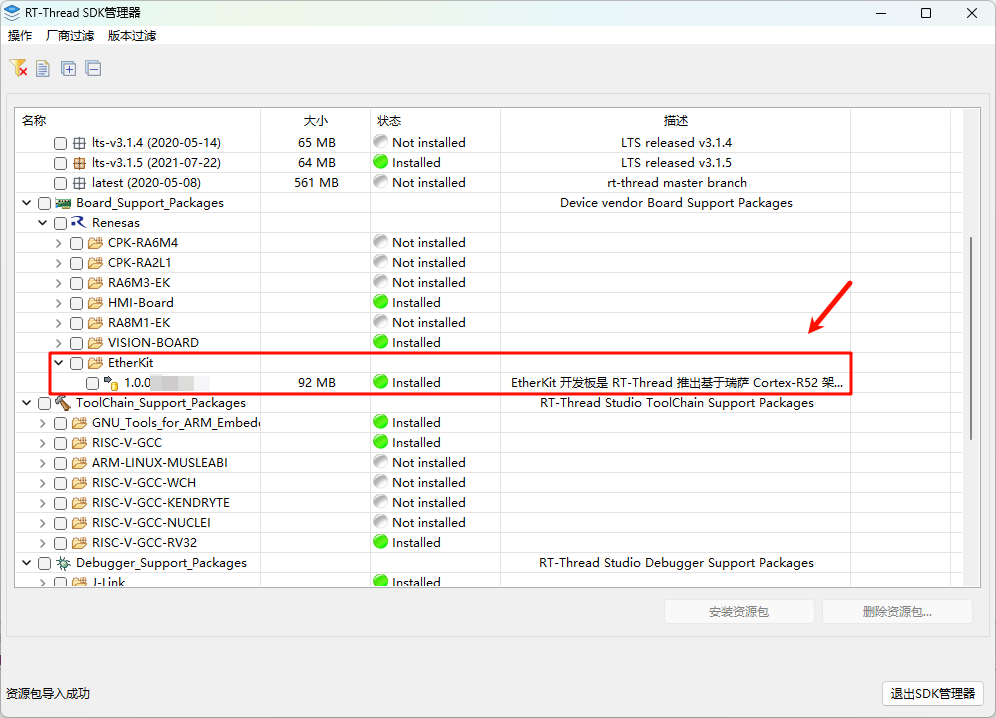
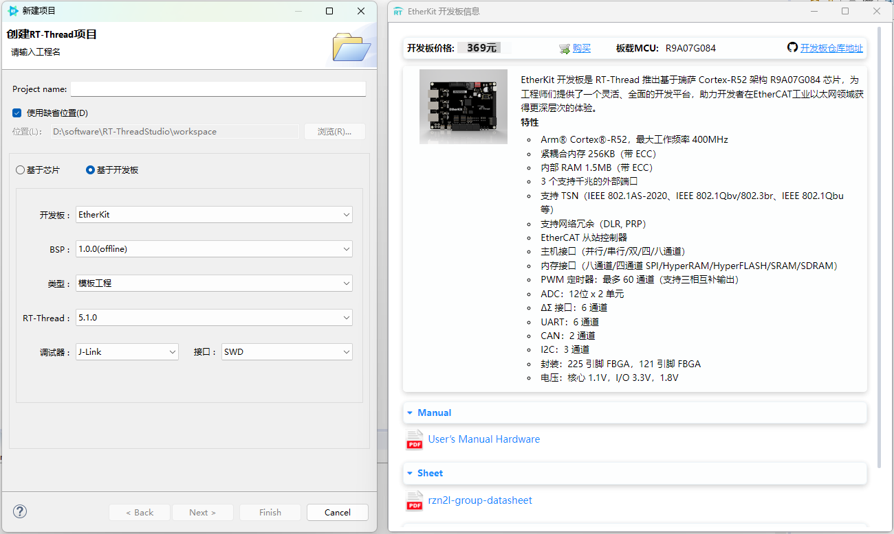
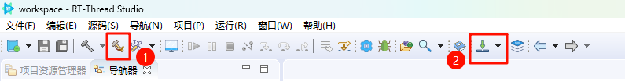
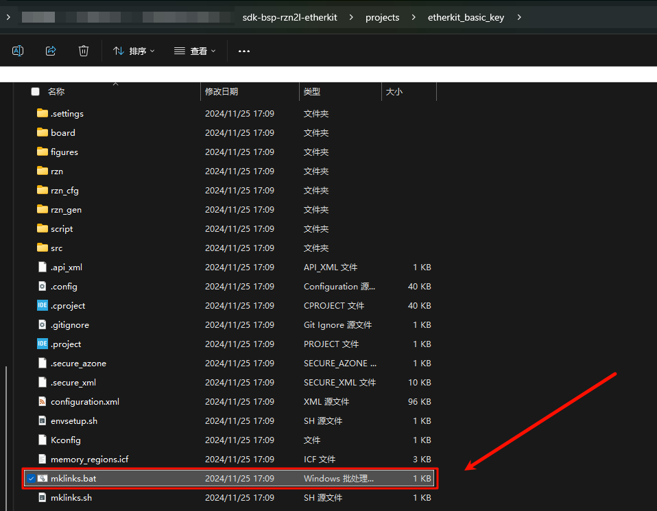
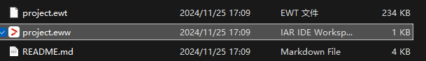
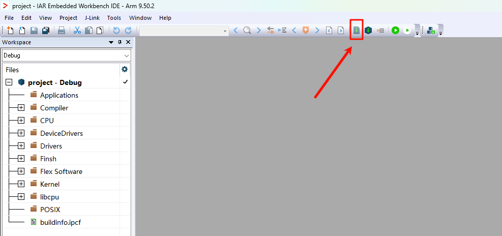
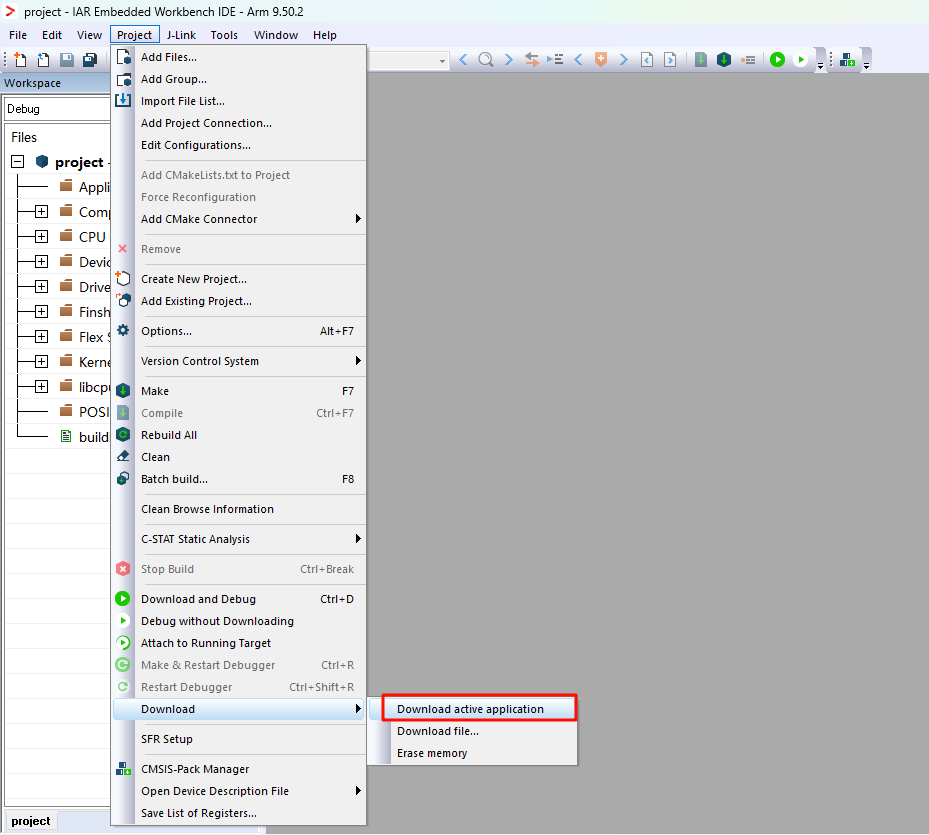

# sdk-bsp-rzn2l-etherkit

**English** | [**中文**](./README_zh.md)

## Introduction

The `sdk-bsp-rzn2l-etherkit` is the support package provided by the RT-Thread team for the `EtherKit` development board. It can also be used as a software SDK for user development, allowing users to more easily and conveniently develop their own applications.

The EtherKit development board is based on the Arm Cortex®-R52 architecture with the R9A07G084M04GBG chip. It offers a flexible and comprehensive development platform for engineers, helping developers gain a deeper experience in the field of machine vision.


## Directory Structure

```
$ sdk-bsp-rzn2l-etherkit
├── README.md
├── sdk-bsp-rzn2l-etherkit.yaml
├── documents
│   ├── rzn2l-group-datasheet.pdf
│   ├── EtherKit_Board_Schematic.pdf
│   ├── User’s Manual Hardware.pdf
│   └── EtherKit用户手册_V0.1.0.pdf
├── libraries
│   ├── HAL_Drivers
├── projects
│   ├── etherkit_basic_key_irq
│   ├── etherkit_basic_rtc
│   ├── etherkit_blink_led
│   ├── etherkit_basic_key
│   ├── etherkit_driver_canfd
│   ├── etherkit_driver_gpt
│   ├── etherkit_driver_i2c
│   ├── etherkit_driver_rs485
│   ├── etherkit_driver_spi
│   ├── etherkit_driver_wdt
│   ├── etherkit_ethercat_eoe
│   ├── etherkit_ethernet
│   ├── etherkit_factory
│   ├── etherkit_modbus_tcpip
│   ├── etherkit_modbus_uart
│   ├── etherkit_usb_pcdc
│   ├── etherkit_usb_pmsc
│   ├── etherkit_component_mqtt
│   └── etherkit_profinet_pnet
└── rt-thread
```

- `sdk-bsp-rzn2l-etherkit.yaml`: Describes the hardware information of the EtherKit.
- `documents`: Schematics, documents, images, datasheets, etc., related to the development board.
- `libraries`: General peripheral drivers for EtherKit.
- `projects`: Example project folder, including factory programs, EtherCAT programs, etc.
- `rt-thread`: Source code of RT-Thread.

## Usage

`sdk-bsp-rzn2l-etherkit` supports **RT-Thread Studio** and **IAR** development methods.

## RT-Thread Studio Development Steps

1. Open RT-Thread Studio and install the EtherKit support package (if a newer version is available, it is recommended to install the latest version; the version shown in the image is for reference only).



2. Create a new EtherKit project by selecting File -> New -> RT-Thread Project -> Based on Development Board. You can create example projects and template projects.



3. Compile and download the project:



## IAR Development Steps

1. Double-click the `mklinks.bat` file. After executing the script, it will generate two folders: `rt-thread` and `libraries`.



*Note:If the `mklinks` script cannot be executed, you will need to manually copy the `rt-thread` and `libraries` folders from the `sdk-bsp-rzn2l-etherkit` directory into your project directory.*

2. Double-click the **project.eww** file to open the IAR project.



3. Click the button below to perform a full project compilation:



4. Click the button below to program the firmware:

