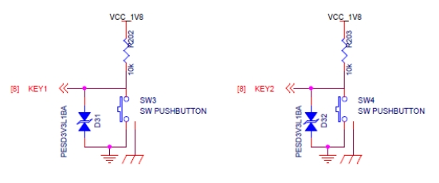
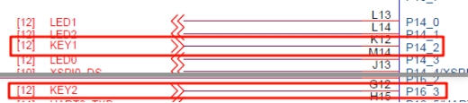
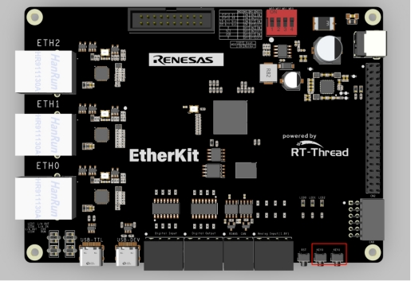
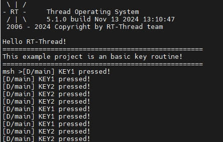

# RZ EtherKit Development Board KEY Usage Instructions

**中文** | [**English**](./README.md)

## Introduction

This example mainly demonstrates how to control the RGB-LED's RGB brightness using the onboard keys.

## Hardware Description



Figure 3-1: Key Circuit Diagram



Figure 3-2: Key Pin Diagram

As shown in the figure above, the KEY1 (LEFT) and KEY2 (RIGHT) pins are connected to the microcontroller pins P14_2 (LEFT) and P16_3 (RIGHT), respectively. When the key is pressed, the signal is high; when released, it is low.

The position of the keys on the development board is shown in the figure below:



Figure 3-3: Key Position

## Software Description

The source code for this example is located in `/projects/etherkit_basic_key`.

The microcontroller pin definitions for KEY1 (LEFT) and KEY2 (RIGHT) are as follows:

```c
/* Configure KEY input pins */

#define PIN_KEY1     BSP_IO_PORT_14_PIN_2    // P14_2 : KEY1
#define PIN_KEY2     BSP_IO_PORT_16_PIN_3    // P16_3 : KEY2
```
The source code for the key input is located in `/projects/etherkit_basic_key/src/hal_entry.c`. To make the experimental effect clear, the onboard RGB blue LED is used as the status indicator for KEY1 (LEFT), and the onboard RGB green LED is used for KEY2 (RIGHT). The mode of the RGB red LED pin is set to output, and the key pins are set to input mode. In the while loop, the state of the key is checked using `rt_pin_read(PIN_KEY)` with a 50ms debounce. If KEY1 is successfully detected as low (pressed), it prints "KEY1 pressed!" and turns on the indicator light; otherwise, the light is turned off.

```c
unsigned int count = 1;

/* Set RGB green LED pin mode to output */
rt_pin_mode(LED_PIN_B, PIN_MODE_OUTPUT);
rt_pin_mode(LED_PIN_G, PIN_MODE_OUTPUT);

/* Set KEY pins mode to input pull-up */
rt_pin_mode(PIN_KEY1, PIN_MODE_INPUT_PULLUP);
rt_pin_mode(PIN_KEY2, PIN_MODE_INPUT_PULLUP);

while (count > 0)
{
    /* Read the state of the KEY pin */
    if (rt_pin_read(PIN_KEY1) == PIN_LOW)
    {
        rt_thread_mdelay(50);
        if (rt_pin_read(PIN_KEY1) == PIN_LOW)
        {
            /* Key has been pressed, output log, turn on LED */
            LOG_D("KEY1 pressed!");
            rt_pin_write(LED_PIN_B, PIN_LOW);
        }
    }
    else if(rt_pin_read(PIN_KEY2) == PIN_LOW)
    {
        rt_thread_mdelay(50);
        if (rt_pin_read(PIN_KEY2) == PIN_LOW)
        {
            /* Key has been pressed, output log, turn on LED */
            LOG_D("KEY2 pressed!");
            rt_pin_write(LED_PIN_G, PIN_LOW);
        }
    }
    else
    {
        /* Key not pressed, turn off LED */
        rt_pin_write(LED_PIN_B, PIN_HIGH);
        rt_pin_write(LED_PIN_G, PIN_HIGH);
    }
    rt_thread_mdelay(10);
    count++;
}

```

## Running

### Compilation & Download

**RT-Thread Studio**: Download the EtherKit resource package in the RT-Thread Studio package manager, then create a new project and compile it.

**IAR**: First, double-click `mklinks.bat` to generate links for the rt-thread and libraries folders; then use Env to generate the IAR project; finally, double-click `project.eww` to open the IAR project and compile it.

After compilation, connect the Jlink interface of the development board to the PC, and download the firmware to the development board.

### Running Effects

After pressing the reset button to restart the development board, the initial state of LED1 and LED2 is off. When KEY1 is pressed, LED1 (Blue) lights up; when KEY2 is pressed, LED2 (Green) lights up.



## Notes

None

## References

Device and Driver: [PIN Device](#/rt-thread-version/rt-thread-standard/programming-manual/device/pin/pin)

