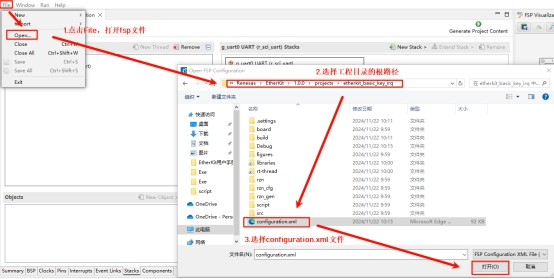
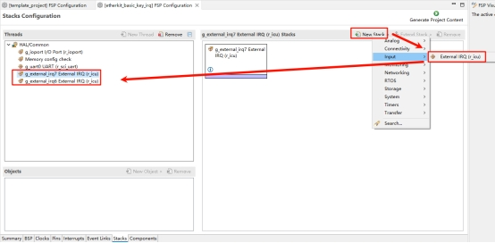
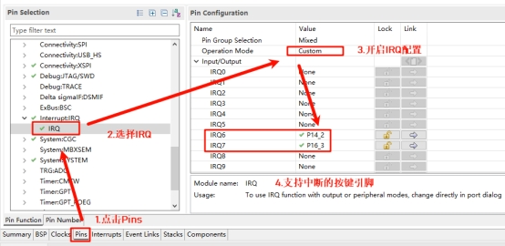
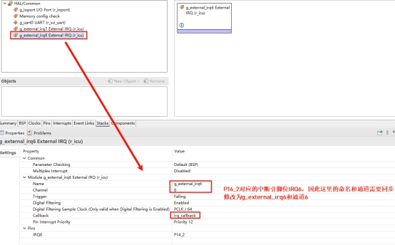

# RZ EtherKit Development Board KEY Usage Guide

**English** | [**Chinese**](./README_zh.md)

## Introduction

This example demonstrates how the onboard KEY buttons control the RGB-LED by toggling the RGB lights.

## Hardware Description

 

Figure 3-1 Key Circuit Diagram

 

Figure 3-2 Key Pinout Diagram

As shown above, the KEY1 (LEFT) and KEY2 (RIGHT) pins are connected to microcontroller pins P14_2 (LEFT) and P16_3 (RIGHT), respectively. When a KEY button is pressed, it outputs a high signal; when released, it outputs a low signal.

The position of the keys on the development board is shown below:

 

Figure 3-3 Key Location

## Software Description

### FSP Configuration

First, download the official FSP code generation tool: [setup_rznfsp_v2_0_0_rzsc_v2024-01.1.exe](https://github.com/renesas/rzn-fsp/releases/download/v2.0.0/setup_rznfsp_v2_0_0_rzsc_v2024-01.1.exe). After installation, double-click `rasc.exe` under Eclipse, and open the project configuration file `configuration.xml` as shown below:

 

Opening the configuration file.

Next, add two stacks: `New Stack` -> `Input` -> `External IRQ (r_icu)`.

 

Adding IRQ Stack.

Then, enable IRQ functionality in the pin configuration. Select the two interrupt pins to enable as shown below: KEY1 (IRQ6) and KEY2 (IRQ7).

 

Enabling IRQ.

Return to the Stacks interface. Configure IRQ6 and IRQ7 with the corresponding interrupt names, channel numbers, and interrupt callback functions.

 

IRQ Configuration.

### Example Code Description

The source code for this example is located in `/projects/etherkit_basic_key_irq`.

The microcontroller pin definitions for KEY1 (LEFT) and KEY2 (RIGHT) are as follows:

```c
/* Configure key IRQ pins */
#define IRQ_TEST_PIN1 BSP_IO_PORT_14_PIN_2
#define IRQ_TEST_PIN2 BSP_IO_PORT_16_PIN_3

/* Configure LED pins */
#define LED_PIN_B   BSP_IO_PORT_14_PIN_0 /* Onboard BLUE LED pin */
#define LED_PIN_G   BSP_IO_PORT_14_PIN_1 /* Onboard GREEN LED pin */
```

The interrupt source code for the buttons is located in `/projects/etherkit_basic_key_irq/src/hal_entry.c`. When the corresponding interrupt button is pressed, it triggers the related print messages.

```c
static void irq_callback_test(void *args)
{
    rt_kprintf("\n IRQ:%d triggered \n", args);
}

void hal_entry(void)
{
    rt_kprintf("\nHello RT-Thread!\n");
    rt_kprintf("==================================================\n");
    rt_kprintf("This example project is a basic key IRQ routine!\n");
    rt_kprintf("==================================================\n");

    /* Initialize */
    rt_err_t err = rt_pin_attach_irq(IRQ_TEST_PIN1, PIN_IRQ_MODE_RISING, irq_callback_test, (void *)1);
    if (RT_EOK != err)
    {
        rt_kprintf("\n Attach IRQ failed. \n");
    }

    err = rt_pin_attach_irq(IRQ_TEST_PIN2, PIN_IRQ_MODE_RISING, irq_callback_test, (void *)2);
    if (RT_EOK != err)
    {
        rt_kprintf("\n Attach IRQ failed. \n");
    }

    err = rt_pin_irq_enable(IRQ_TEST_PIN1, PIN_IRQ_ENABLE);
    if (RT_EOK != err)
    {
        rt_kprintf("\n Enable IRQ failed. \n");
    }

    err = rt_pin_irq_enable(IRQ_TEST_PIN2, PIN_IRQ_ENABLE);
    if (RT_EOK != err)
    {
        rt_kprintf("\n Enable IRQ failed. \n");
    }
}
```

## Execution

### Compilation & Download

- **RT-Thread Studio**: Use the RT-Thread Studio package manager to download the EtherKit resource package. Then create a new project and compile it.  
- **IAR**: First, run `mklinks.bat` to generate symbolic links for the `rt-thread` and `libraries` folders. Then use `Env` to generate the IAR project, and finally, double-click `project.eww` to open the IAR project and compile it.

After compilation, connect the development board's JLink interface to the PC and download the firmware to the board.

### Operation Effect

Press the reset button to restart the development board. Initially, LED1 and LED2 are off. Pressing KEY1 will light up LED1 (Blue), while pressing KEY2 will light up LED2 (Green).

 

## Notes

None at the moment.

## References

- Devices and Drivers: [PIN Device](https://www.rt-thread.org/document/site/#/rt-thread-version/rt-thread-standard/programming-manual/device/pin/pin)