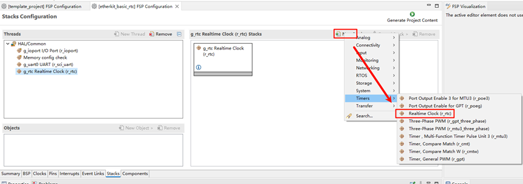
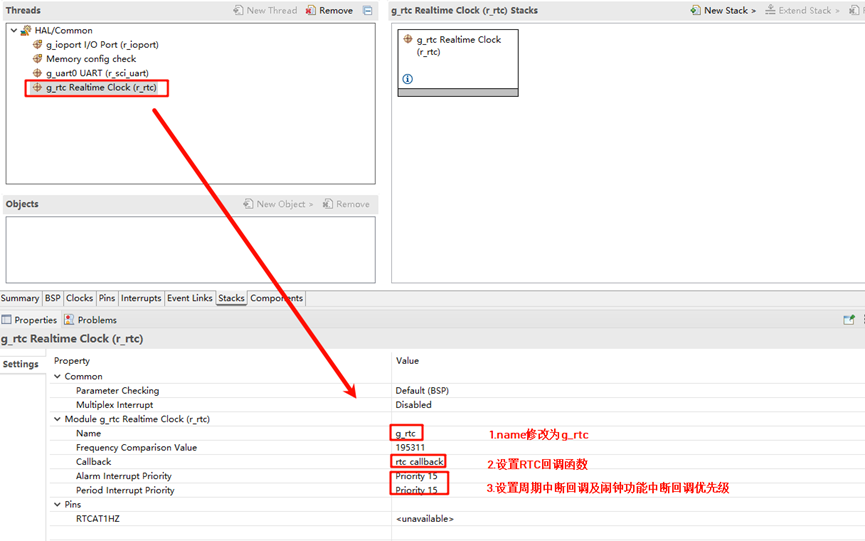
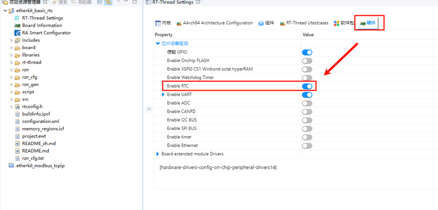
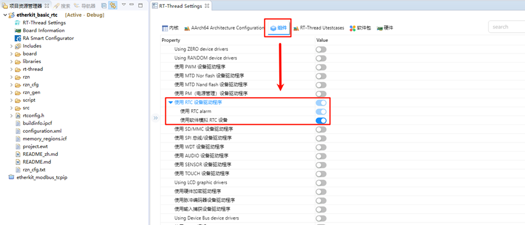

# RTC and Alarm Usage Instructions

**English** | [**中文**](./README_zh.md)

## Introduction

This example demonstrates how to use the RTC (Real-Time Clock) on the EtherKit. RTC provides accurate real-time information, such as the year, month, day, hour, minute, and second. Most real-time clock chips use high-precision crystal oscillators as clock sources. Some RTC chips have a battery backup to keep time information valid when the main power supply is off.

RT-Thread’s RTC device provides foundational services for the operating system’s time system. With the increasing number of IoT scenarios, RTCs have become standard in products, and are even indispensable in secure communication protocols like SSL.

## Hardware Description

The RTC device used in this example relies on the LSE (Low-Speed External) clock. No other special connections are required.

## FSP Configuration Instructions

Open the FSP configuration tool and select the `configuration.xml` file under the corresponding project directory. Add the RTC Stack:



Next, configure the RTC parameters. Set the RTC stack name to `g_rtc`, configure the RTC interrupt callback function to `rtc_callback`, and set the interrupt callback priority:



## RT-Thread Settings Configuration

Open RT-Thread Settings and enable the RTC under the hardware options:



Next, configure the RTC by enabling RT-Thread’s RTC device framework and the software alarm feature. (Note: Currently, the alarm feature in Renesas RZ series has some issues, so the alarm function is simulated with software, but this does not affect its usage):



## Example Code Description

The source code for this example is located at `/projects/etherkit_basic_rtc`. In the `hal_entry()` function, the RTC device is accessed, the system time is set, and then the system time is retrieved to check if it has been set correctly. After a 1-second delay, the system time is retrieved again.

```c
    rt_err_t ret = RT_EOK;
    time_t now;
    rt_device_t device = RT_NULL;

    device = rt_device_find(RTC_NAME);
    if (!device)
    {
      rt_kprintf("find %s failed!\n", RTC_NAME);
    }

    if(rt_device_open(device, 0) != RT_EOK)
    {
      rt_kprintf("open %s failed!\n", RTC_NAME);
    }

    /* Set date */
    ret = set_date(2024, 11, 11);
    rt_kprintf("set RTC date to 2024-11-11\n");
    if (ret != RT_EOK)
    {
        rt_kprintf("set RTC date failed\n");
    }

    /* Set time */
    ret = set_time(15, 00, 00);
    if (ret != RT_EOK)
    {
        rt_kprintf("set RTC time failed\n");
    }

    /* Delay for 3 seconds */
    rt_thread_mdelay(3000);

    /* Get time */
    get_timestamp(&now);
    rt_kprintf("now: %.*s", 25, ctime(&now));
```

The following code creates an RTC alarm and sets it to trigger in 1 second. Finally, the function is exported to the MSH command line.

```c
void user_alarm_callback(rt_alarm_t alarm, time_t timestamp)
{
    rt_kprintf("user alarm callback function.\n");
}

void alarm_sample(void)
{
    rt_device_t dev = rt_device_find("rtc");
    struct rt_alarm_setup setup;
    struct rt_alarm * alarm = RT_NULL;
    static time_t now;
    struct tm p_tm;

    if (alarm != RT_NULL)
        return;

    /* Get the current timestamp and set the alarm to trigger in the next second */
    now = get_timestamp(NULL) + 1;
    gmtime_r(&now,&p_tm);

    setup.flag = RT_ALARM_SECOND;
    setup.wktime.tm_year = p_tm.tm_year;
    setup.wktime.tm_mon = p_tm.tm_mon;
    setup.wktime.tm_mday = p_tm.tm_mday;
    setup.wktime.tm_wday = p_tm.tm_wday;
    setup.wktime.tm_hour = p_tm.tm_hour;
    setup.wktime.tm_min = p_tm.tm_min;
    setup.wktime.tm_sec = p_tm.tm_sec;

    alarm = rt_alarm_create(user_alarm_callback, &setup);
    if(RT_NULL != alarm)
    {
        rt_alarm_start(alarm);
    }
}
/* Export MSH cmd */
MSH_CMD_EXPORT(alarm_sample, alarm sample);
```

## Compilation & Download

* **RT-Thread Studio**: In RT-Thread Studio's package manager, download the EtherKit resource package, create a new project, and compile it.
* **IAR**: First, double-click `mklinks.bat` to create symbolic links between RT-Thread and the libraries folder. Then, use the `Env` tool to generate the IAR project. Finally, double-click `project.eww` to open the IAR project and compile it.

After compilation, connect the development board's JLink interface to the PC and download the firmware to the development board.

## Run Effect

After pressing the reset button to restart the development board, you should see the following printed information on the board:

```c
 \ | /  
- RT -     Thread Operating System  
 / | \     5.1.0 build Nov 13 2024 13:35:43  
 2006 - 2024 Copyright by RT-Thread team  

Hello RT-Thread!  
==================================================  
This example project is an rtc and alarm routine!  
==================================================  
set RTC date to 2024-11-11  
msh >now: Sat Nov 19 07:42:42 3385  
msh >alarm_sample  
user alarm callback function.  
user alarm callback function.  
user alarm callback function.  
user alarm callback function.  
```