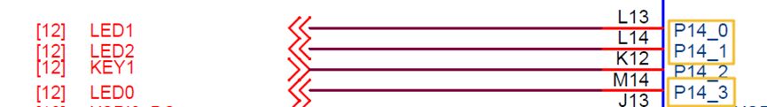
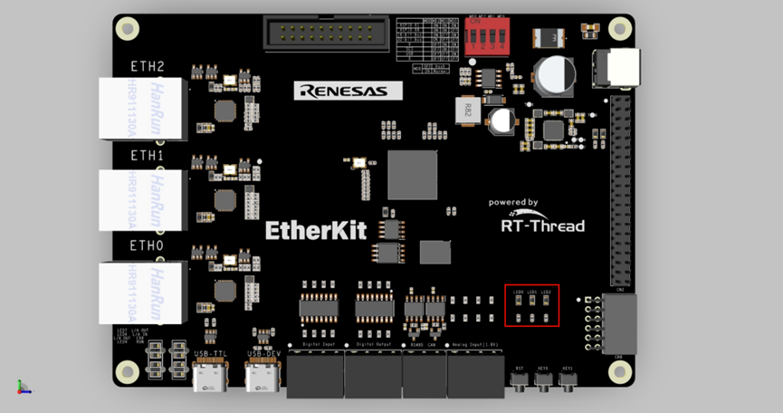

# RGB Usage Instructions

**English** | [**中文**](./README_zh.md)

## Introduction

This example is the first and simplest example in the SDK, similar to the "Hello World" program that programmers encounter as their first program. The main function of this example is to make the onboard RGB-LED blink periodically.

## Hardware Description




As shown in the diagram above, the EtherKit provides three user LEDs: LED0 (RED), LED1 (BLUE), and LED2 (GREEN). The RED LED corresponds to pin P14_3 on the MCU. To turn on the LED, a low level signal is output from the MCU pin, and to turn it off, a high level signal is output.

The positions of the LEDs on the development board are shown in the diagram below:



## Software Description

The source code for this example is located in `/projects/etherkit_blink_led`. The MCU pin definitions for the RGB LEDs and the RGB control logic can be found in `src/hal_data.c`.

```c
/* Configure LED pins */
#define LED_PIN_R    BSP_IO_PORT_14_PIN_3 /* Onboard RED LED pin */
#define LED_PIN_B    BSP_IO_PORT_14_PIN_0 /* Onboard BLUE LED pin */
#define LED_PIN_G    BSP_IO_PORT_14_PIN_1 /* Onboard GREEN LED pin */
    do
    {
        /* Get the group number */
        group_current = count % group_num;

        /* Control RGB LEDs */
        rt_pin_write(LED_PIN_R, _blink_tab[group_current][0]);
        rt_pin_write(LED_PIN_B, _blink_tab[group_current][1]);
        rt_pin_write(LED_PIN_G, _blink_tab[group_current][2]);

        /* Output LOG information */
        LOG_D("group: %d | red led [%-3.3s] | | blue led [%-3.3s] | | green led [%-3.3s]",
            group_current,
            _blink_tab[group_current][0] == LED_ON ? "ON" : "OFF",
            _blink_tab[group_current][1] == LED_ON ? "ON" : "OFF",
            _blink_tab[group_current][2] == LED_ON ? "ON" : "OFF");

        count++;

        /* Delay for a short time */
        rt_thread_mdelay(500);
    } while(count > 0);
```

## Compilation & Download

* **RT-Thread Studio**: In RT-Thread Studio's package manager, download the EtherKit resource package, create a new project, and compile it.

* **IAR**: First, double-click `mklinks.bat` to create symbolic links between RT-Thread and the libraries folder. Then, use the `Env` tool to generate the IAR project. Finally, double-click `project.eww` to open the IAR project and compile it.

After compilation, connect the development board's JLink interface to the PC and download the firmware to the development board.

## Run Effect

After pressing the reset button to restart the development board, observe the actual effect of the RGB-LED on the development board. When the program is running normally, the RGB LEDs will change periodically, as shown in the image below:


At this point, you can also open the default serial port of the development board using a terminal tool on the PC, with the baud rate set to 115200N. The board's runtime log information will be output in real-time.

```c
[D/main] group: 0 | red led [OFF] | | blue led [OFF] | | green led [OFF]
[D/main] group: 1 | red led [ON ] | | blue led [OFF] | | green led [OFF]
[D/main] group: 2 | red led [OFF] | | blue led [ON ] | | green led [OFF]
[D/main] group: 3 | red led [OFF] | | blue led [OFF] | | green led [ON ]
[D/main] group: 4 | red led [ON ] | | blue led [OFF] | | green led [ON ]
[D/main] group: 5 | red led [ON ] | | blue led [ON ] | | green led [OFF]
[D/main] group: 6 | red led [OFF] | | blue led [ON ] | | green led [ON ]
[D/main] group: 7 | red led [ON ] | | blue led [ON ] | | green led [ON ]
```