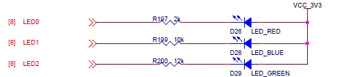
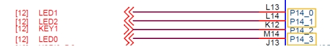
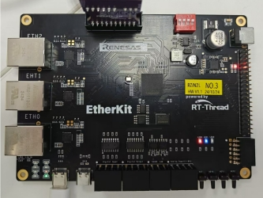

# RZ EtherKit Development Board RGB Usage Instructions

**中文** | [**English**](./README.md)

## Introduction

This example serves as the first and simplest routine in the SDK, akin to a programmer's first "Hello World" program. Its main function is to make the onboard RGB-LED blink periodically.

## Hardware Description

 

**Figure 2.1: LED Circuit Diagram**

 

**Figure 2.2: LED Pin Diagram**

As shown in the figures above, the EtherKit provides three user LEDs: LED0 (RED), LED1 (BLUE), and LED2 (GREEN), where LED_RED corresponds to pin P14_3. The microcontroller outputs a low level to light up the LED, while outputting a high level will turn it off.

The position of the LEDs on the development board is shown below:

 

**Figure 2.3: LED Position**

## Software Description

The source code for this example is located in `/projects/etherkit_blink_led`.

The pin definitions for the RGB-LED corresponding to the microcontroller and the RGB transformation source code can be found in `src/hal_data.c`.

```c
/* Configure LED pins */
#define LED_PIN_R   BSP_IO_PORT_14_PIN_3 /* Onboard RED LED pins */
#define LED_PIN_B   BSP_IO_PORT_14_PIN_0 /* Onboard BLUE LED pins */
#define LED_PIN_G   BSP_IO_PORT_14_PIN_1 /* Onboard GREEN LED pins */

do
{
    /* Get the group number */
    group_current = count % group_num;

    /* Control RGB LED */
    rt_pin_write(LED_PIN_R, _blink_tab[group_current][0]);
    rt_pin_write(LED_PIN_B, _blink_tab[group_current][1]);
    rt_pin_write(LED_PIN_G, _blink_tab[group_current][2]);

    /* Log information */
    LOG_D("group: %d | red led [%-3.3s] | blue led [%-3.3s] | green led [%-3.3s]",
          group_current,
          _blink_tab[group_current][0] == LED_ON ? "ON" : "OFF",
          _blink_tab[group_current][1] == LED_ON ? "ON" : "OFF",
          _blink_tab[group_current][2] == LED_ON ? "ON" : "OFF");

    count++;

    /* Delay for a while */
    rt_thread_mdelay(500);
} while(count > 0);
```
## Running

### Compilation & Download

**RT-Thread Studio**: Download the EtherKit resource package in the RT-Thread Studio package manager, then create a new project and compile it.

**IAR**: First, double-click `mklinks.bat` to generate links for the rt-thread and libraries folders; then use Env to generate the IAR project; finally, double-click `project.eww` to open the IAR project and compile it.

After compilation, connect the Jlink interface of the development board to the PC, and download the firmware to the development board.

### Running Effects

After pressing the reset button to restart the development board, observe the actual effect of the RGB-LED. Under normal operation, the RGB will change periodically, as shown in the figure below:

 

**Figure 2.4: RGB-LED Demonstration**

At this point, you can also use a terminal tool on the PC to open the default-configured serial port of the development board, setting the baud rate to 115200N. The runtime log information from the development board will be output in real time.

[D/main] group: 0 | red led [OFF] | blue led [OFF] | green led [OFF]
 [D/main] group: 1 | red led [ON ] | blue led [OFF] | green led [OFF]
 [D/main] group: 2 | red led [OFF] | blue led [ON ] | green led [OFF]
 [D/main] group: 3 | red led [OFF] | blue led [OFF] | green led [ON ]
 [D/main] group: 4 | red led [ON ] | blue led [OFF] | green led [ON ]
 [D/main] group: 5 | red led [ON ] | blue led [ON ] | green led [OFF]
 [D/main] group: 6 | red led [OFF] | blue led [ON ] | green led [ON ]
 [D/main] group: 7 | red led [ON ] | blue led [ON ] | green led [ON ]

## Notes

None

## References

Device and Driver: [PIN Device](#/rt-thread-version/rt-thread-standard/programming-manual/device/pin/pin)