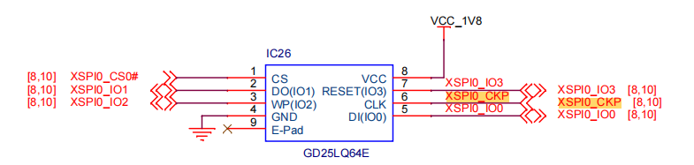

# Filesystem Usage Instructions

**English** | [**中文**](./README_zh.md)

## Introduction

FAL (Flash Abstraction Layer) is an abstraction layer for managing and operating Flash devices and Flash-based partitions. It provides a unified API for upper-layer Flash and partition operations (as shown in the framework diagram below), with the following features:

- Supports a statically configurable partition table, which can be associated with multiple Flash devices.
- The partition table supports **automatic loading**, avoiding the issue of the partition table being repeatedly defined in multi-firmware projects.
- Lightweight code with **no dependency on an operating system**, allowing it to run on bare-metal platforms, such as bootloaders with limited resources.
- A unified operation interface ensures the reusability of underlying Flash drivers for components that rely on Flash, such as file systems, OTA, and NVM (e.g., [EasyFlash](https://github.com/armink-rtt-pkgs/EasyFlash)).
- Built-in Finsh/MSH-based test commands, enabling developers to read, write, and erase Flash or partitions via shell commands with byte-level addressing, which facilitates debugging and testing.


In this example, the EtherKit onboard GD Flash is combined with the RT-Thread FAL component to build a file system using littlefs.

## Hardware Overview



## Software Overview

The source code for file system initialization in this example is located at:  
`../board/ports/filesystem/drv_filesystem.c`

```c
/*
 * Copyright (c) 2006-2021, RT-Thread Development Team
 *
 * SPDX-License-Identifier: Apache-2.0
 *
 * Change Logs:
 * Date           Author                Notes
 * 2025-02-07     newflydd@gmail.com    the first version
 */
#define DBG_TAG "drv.fs"
#define DBG_LVL DBG_LOG
#include <rtdbg.h>

#include <rtthread.h>
#include <fal.h>
#include <dfs_fs.h>

int initFileSystem()
{
    fal_init();

    // register onchip flash tail area as littlefs
    struct rt_device* flashDev = fal_mtd_nor_device_create("param");
    if (RT_NULL == flashDev)
    {
        LOG_W("create fal device failed");
        return RT_ERROR;
    }

    if (RT_EOK != dfs_mount("param", "/", "lfs", 0, RT_NULL))
    {
        LOG_W("mount lfs failed once, try to format it");
        if (RT_EOK != dfs_mkfs("lfs", "param"))
        {
            LOG_W("mkfs lfs failed");
            return RT_ERROR;
        }
        LOG_I("mkfs lfs success");

        if (RT_EOK != dfs_mount("param", "/", "lfs", 0, RT_NULL))
        {
            LOG_W("mount lfs failed");
            return RT_ERROR;
        }
    }
    LOG_I("mount lfs success");
    return RT_EOK;
}
INIT_ENV_EXPORT(initFileSystem);
```

## Build & Download

* **RT-Thread Studio:** Download the EtherKit resource pack from the RT-Thread Studio package manager, then create a new project and compile it.

* **IAR:** First, double-click `mklinks.bat` to generate links for the `rt-thread` and `libraries` folders. Then, use Env to generate the IAR project. Finally, double-click `project.eww` to open the IAR project and compile it.

Once compiled, connect the development board’s JLink interface to the PC, and download the firmware to the development board.

## Running Result

Press the reset button to restart the development board and observe the terminal logs from the board.


Run the following commands to start the FAL read/write test:

```c
> fal probe param param
> fal bench 4096 yes  
```
