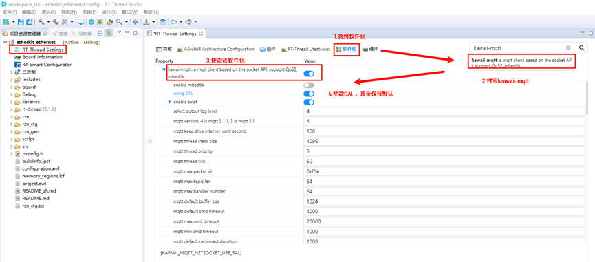
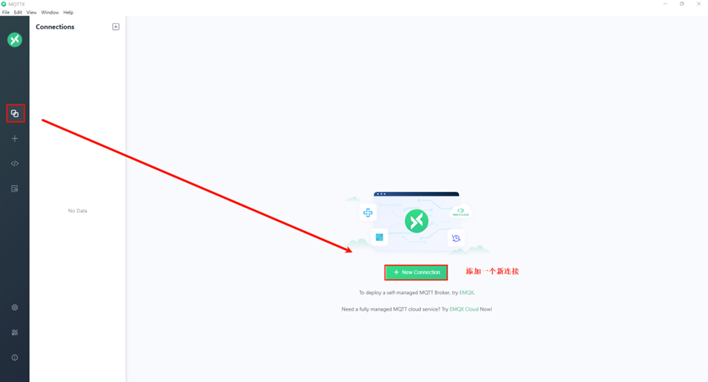
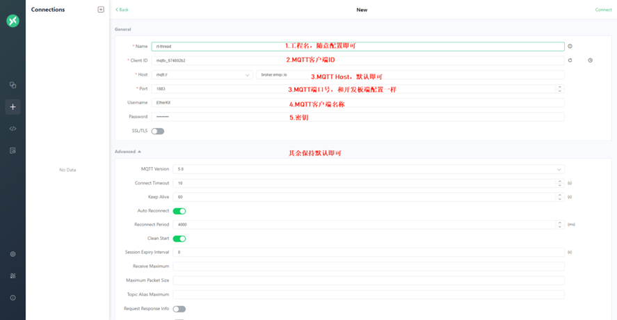
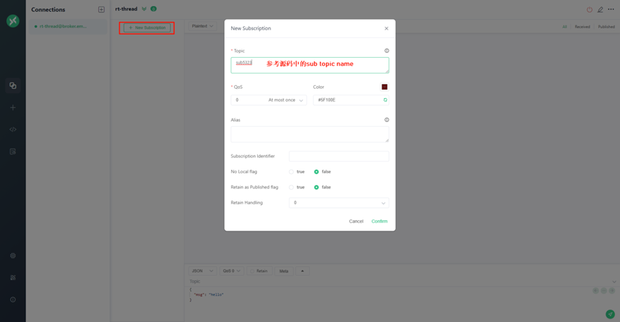
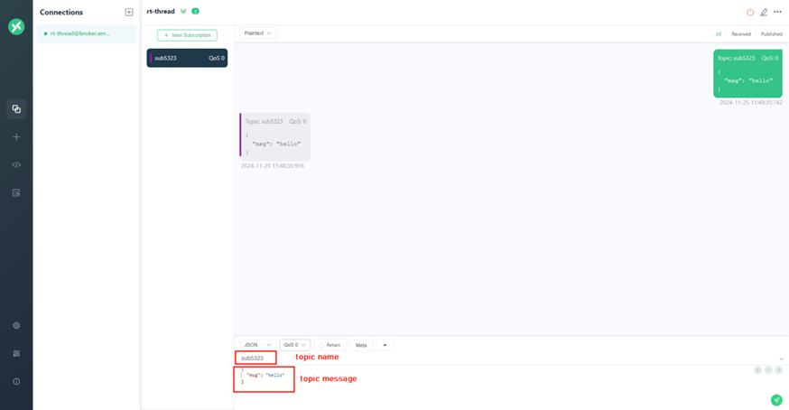
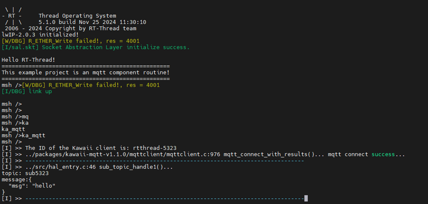

# MQTT 例程

**中文** | [**English**](./README.md)

## 简介

本例程基于kawaii-mqtt软件包，展示了通过MQTTX软件向服务器订阅主题和向指定主题发布消息的功能。

## 硬件说明

本例程需要依赖EtherKit板卡上的以太网模块完成网络通信，因此请确保硬件平台上的以太网模组可以正常工作。

## FSP配置说明

打开工程配置文件configuration.xml，新增r_gamc Stack：


点击g_ether0 Ethernet，配置中断回调函数为user_ether0_callback：


下面配置phy信息，选择g_ether_phy0，Common配置为User Own Target；修改PHY LSI地址为1（根据原理图查询具体地址）；设置phy初始化回调函数为ether_phy_targets_initialize_rtl8211_rgmii()；同时设置MDIO为GMAC。


配置g_ether_selector0，选择以太网模式为交换机模式，PHY link设置为默认active-low，PHY接口模式设置为RGMII。


网卡引脚参数配置，选择操作模式为RGMII：


ETHER_GMAC配置：


## RT-Thread Studio配置

回到Studio工程，配置RT-Thread Settings，点击选择硬件选项，找到芯片设备驱动，使能以太网；


找到软件包界面，我们搜索kawaii-mqtt软件包，并使能SAL选项：



## 示例代码说明

这段代码实现了一个基于Kawaii MQTT客户端库的MQTT通信演示程序，用于连接到MQTT代理服务器（broker），订阅主题，并周期性发布消息。

```c
static void sub_topic_handle1(void* client, message_data_t* msg)
{
    (void) client;
    KAWAII_MQTT_LOG_I("-----------------------------------------------------------------------------------");
    KAWAII_MQTT_LOG_I("%s:%d %s()...\ntopic: %s\nmessage:%s", __FILE__, __LINE__, __FUNCTION__, msg->topic_name, (char*)msg->message->payload);
    KAWAII_MQTT_LOG_I("-----------------------------------------------------------------------------------");
}
static int mqtt_publish_handle1(mqtt_client_t *client)
{
    mqtt_message_t msg;
    memset(&msg, 0, sizeof(msg));
    msg.qos = QOS0;
    msg.payload = (void *)"this is a kawaii mqtt test ...";
    return mqtt_publish(client, "pub5323", &msg);
}
static char cid[64] = { 0 };
static void kawaii_mqtt_demo(void *parameter)
{
    mqtt_client_t *client = NULL;
    rt_thread_delay(6000);
    mqtt_log_init();
    client = mqtt_lease();
    rt_snprintf(cid, sizeof(cid), "rtthread-5323", rt_tick_get());
    mqtt_set_host(client, "broker.emqx.io");
    mqtt_set_port(client, "1883");
    mqtt_set_user_name(client, "RT-Thread");
    mqtt_set_password(client, "012345678");
    mqtt_set_client_id(client, cid);
    mqtt_set_clean_session(client, 1);
    KAWAII_MQTT_LOG_I("The ID of the Kawaii client is: %s ",cid);
    mqtt_connect(client);
    mqtt_subscribe(client, "sub5323", QOS0, sub_topic_handle1);
    while (1) {
        mqtt_publish_handle1(client);
        mqtt_sleep_ms(4 * 1000);
    }
}
int ka_mqtt(void)
{
    rt_thread_t tid_mqtt;
    tid_mqtt = rt_thread_create("kawaii_demo", kawaii_mqtt_demo, RT_NULL, 2048, 17, 10);
    if (tid_mqtt == RT_NULL) {
        return -RT_ERROR;
    }
    rt_thread_startup(tid_mqtt);
    return RT_EOK;
}
MSH_CMD_EXPORT(ka_mqtt, Kawaii MQTT client test program);
```

## 编译&下载

* RT-Thread Studio：在RT-Thread Studio 的包管理器中下载EtherKit 资源包，然后创建新工程，执行编译。
* IAR：首先双击mklinks.bat，生成rt-thread与libraries 文件夹链接；再使用Env 生成IAR工程；最后双击project.eww打开IAR工程，执行编译。

编译完成后，将开发板的Jlink接口与PC 机连接，然后将固件下载至开发板。

## MQTTX配置

安装并运行MQTTX，来到主界面，我们点击New Connection新增一个新连接；



配置MQTT客户端信息，注意Client ID不要和开发板端一致，点击后面的重置按钮随意生成一个id即可，其他配置参考下述说明，配置结束后，点击右上角的Connect；



点击 + New Subscription，修改Topic name为sub5323并确认；



在下方功能框中编写订阅主题名称为sub5323，订阅信息按自己需求配置；



## 运行效果

打开串口工具，运行ka_mqtt命令后查看：



## 其他说明

> MQTTX下载链接：https://packages.emqx.net/MQTTX/v1.9.6/MQTTX-Setup-1.9.6-x64.exe