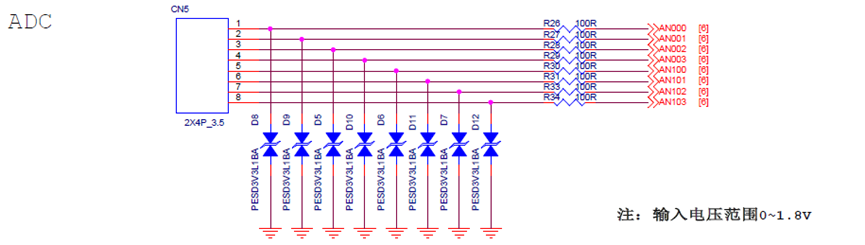
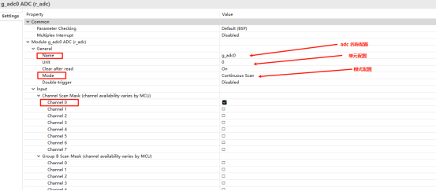
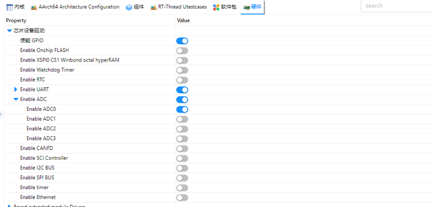
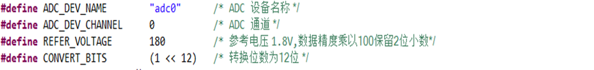
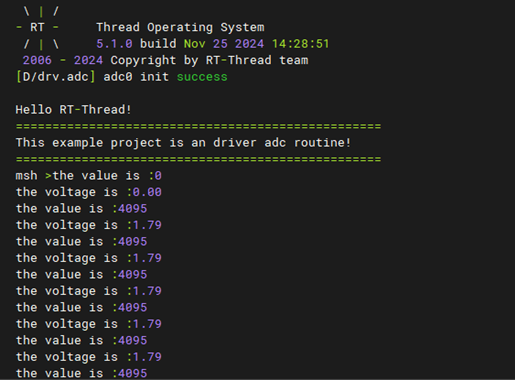

# ADC Driver Usage Instructions

**English** | [**中文**](./README_zh.md)

## Introduction

This example demonstrates how to use the RT-Thread ADC framework on the EtherKit to collect analog signals via ADC and perform digital signal conversion. The main content includes the following:

## Hardware Description



As shown in the schematic above, the EtherKit provides an 8-channel analog input interface, which is connected to the MCU's ADC channels 0, 1, 2, and 3 for ADC0 and ADC1. (Note: The voltage range for the Analog Input is 0 to 1.8V.)

## FSP Configuration Instructions

* Step 1: Open FSP and import the XML configuration file (or directly click the FSP link file in RT-Thread Studio).
* Step 2: Create a new `r_adc` stack, configure the ADC device, and select the channels to be used.



* Step 3: Save and click "Generate Project". The generated code will be saved in `hal_data.c`.

## ENV Configuration

Use the `env` tool to enable ADC0 peripheral:



## Example Code Description

The ADC source code is located in `/projects/etherkit_driver_adc/src/hal_entry.c`. The macros used are defined as follows:



The specific function is to sample the analog voltage from ADC0 channel 0 every 1000ms and perform a conversion. The code is as follows:

```c
static int adc_vol_sample()
{
    rt_adc_device_t adc_dev;
    rt_uint32_t value, vol;
    rt_err_t ret = RT_EOK;
    /* Find the device */
    adc_dev = (rt_adc_device_t)rt_device_find(ADC_DEV_NAME);
    if (adc_dev == RT_NULL)
    {
        rt_kprintf("adc sample run failed! can't find %s device!\n", ADC_DEV_NAME);
        return RT_ERROR;
    }
    /* Enable the device */
    ret = rt_adc_enable(adc_dev, ADC_DEV_CHANNEL);
    /* Read the sampled value */
    value = rt_adc_read(adc_dev, ADC_DEV_CHANNEL);
    rt_kprintf("The value is :%d \n", value);
    /* Convert to corresponding voltage */
    vol = value * REFER_VOLTAGE / CONVERT_BITS;
    rt_kprintf("The voltage is :%d.%02d \n", vol / 100, vol % 100);
    /* Disable the channel */
    ret = rt_adc_disable(adc_dev, ADC_DEV_CHANNEL);
    return ret;
}
```

In the example, the `while` loop calls `adc_vol_sample` every 1000ms.

## Compilation & Download

* **RT-Thread Studio**: In RT-Thread Studio’s package manager, download the EtherKit resource package, create a new project, and compile it.
* **IAR**: First, double-click `mklinks.bat` to create symbolic links between RT-Thread and the libraries folder. Then, use the `Env` tool to generate the IAR project. Finally, double-click `project.eww` to open the IAR project and compile it.

After compilation, connect the development board’s JLink interface to the PC and download the firmware to the development board.

## Run Effect

The effect when using ADC0 channel 0 to sample a 1.8V voltage is shown below:



## Notes

> The ADC voltage input tolerance for the R9A07G084M08GBG chip is 1.8V.
