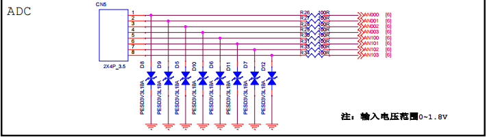
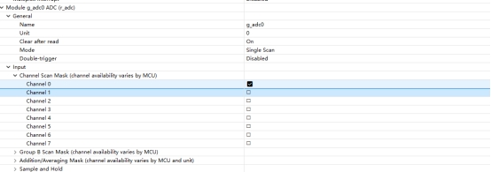
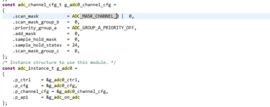
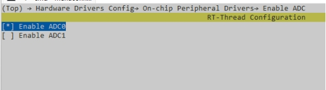
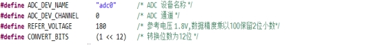
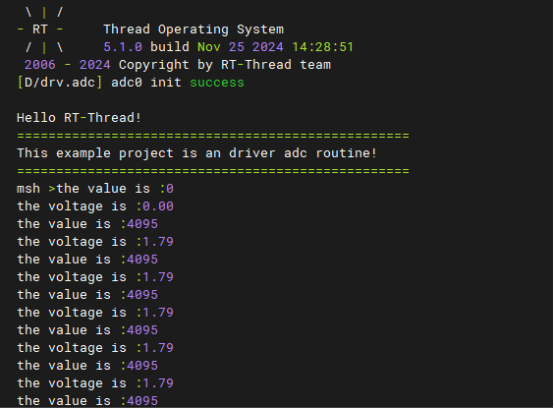

# Etherkit ADC Application Example Description

**English** | **[Chinese](./README_zh.md)**

## Introduction

This example mainly illustrates how to use the ADC framework of rtthread on EtherKit to complete the analog signal acquisition through ADC and the conversion of digital signals. The main contents are as follows:

## Hardware Description



As shown in the above schematic diagram: There are 8-channel Analog Input interfaces on EtherKit, which are respectively connected to channels 0, 1, 2, and 3 of adc0 and adc1 of the single-chip microcomputer; (Note that the withstand voltage range of Analog Input is 0~1.8v).

## Software Description

## FSP Configuration Description

Step 1: Open FSP and import the xml configuration file; (or directly click the FSP link file in Rtthread Studio).
Step 2: Create a new r_adc Stack to configure the adc device and the used channels.



Step 3: Save and click Generate Project; the generated code is saved in hal_data.c.

​                                                                    

The source code of this example is located in /projects/etherkit_driver_adc.

## env Configuration

Use the env tool to enable the adc0 peripheral.



### Project Example Description

The source code of ADC is located in /projects/etherkit_driver_adc/src/hal_entry.c.
The used macro definitions are as follows:：

​                                                                     

The specific function is to sample the analog voltage of channel 0 of ADC0 and perform a conversion every 1000ms.
The specific code is as follows:

```
static int adc_vol_sample()

{

  rt_adc_device_t adc_dev;

  rt_uint32_t value, vol;

  rt_err_t ret = RT_EOK;

  /* 查找设备 */

  adc_dev = (rt_adc_device_t)rt_device_find(ADC_DEV_NAME);

  if (adc_dev == RT_NULL)

  {

​    rt_kprintf("adc sample run failed! can't find %s device!\n", ADC_DEV_NAME);

​    return RT_ERROR;

  }

  /* 使能设备 */

  ret = rt_adc_enable(adc_dev, ADC_DEV_CHANNEL);

  /* 读取采样值 */

  value = rt_adc_read(adc_dev, ADC_DEV_CHANNEL);

  rt_kprintf("the value is :%d \n", value);

  /* 转换为对应电压值 */

  vol = value * REFER_VOLTAGE / CONVERT_BITS;

  rt_kprintf("the voltage is :%d.%02d \n", vol / 100, vol % 100);

  /* 关闭通道 */

  ret = rt_adc_disable(adc_dev, ADC_DEV_CHANNEL);

  return ret;

}
```


 

In the example, the While loop calls adc_vol_sample every 1000ms.

 

## Operation

### Compilation & Download

RT-Thread Studio: Download the EtherKit resource package in the package manager of RT-Thread Studio, then create a new project and perform compilation.
IAR: First double-click mklinks.bat to generate the links of the rt-thread and libraries folders; then use Env to generate the IAR project; finally double-click project.eww to open the IAR project and perform compilation.
After compilation, connect the Jlink interface of the development board to the PC, and then download the firmware to the development board.

### Operation Effect

The effect of collecting 1.8v voltage using channel 0 of adc0 is as follows:



## Precautions

​	The ADC sampling voltage withstand voltage of the R9A07G084M08GBG chip is 1.8v!

## Citation References

Devices and Drivers：[ADC Device](https://www.rt-thread.org/document/site/#/rt-thread-version/rt-thread-standard/programming-manual/device/adc/adc)

 
