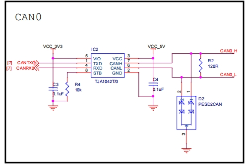
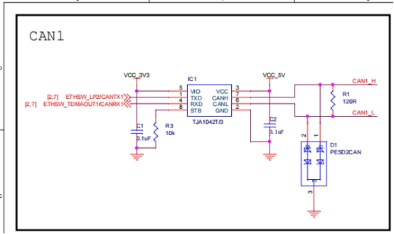
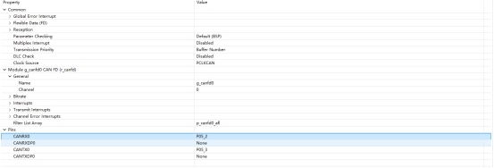
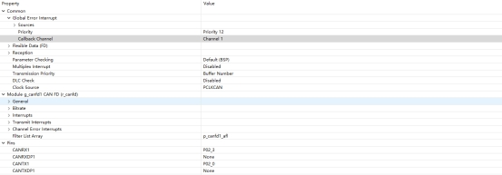
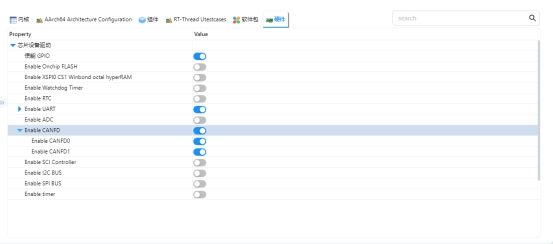
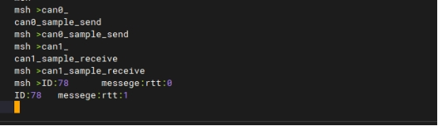

# RZ EtherKit Development Board CANFD Usage Instructions

**中文** | [**English**](./README.md)

## Introduction

This example mainly introduces how to use the CANFD device on the EtherKit.

## Hardware Description

 

 

## Software Description

### FSP Configuration Instructions

 

 

### RT-Thread Settings Configuration

 

### Project Example Description

The project sends messages via `canfd0` and receives them on `canfd1`, printing the output using a serial port.

#### Sending Code Example:

```c
int can0_sample_send(int argc, char *argv[])
{
    rt_err_t res;
    rt_thread_t thread;
    char can_name[RT_NAME_MAX];

    if (argc == 2)
    {
        rt_strncpy(can_name, argv[1], RT_NAME_MAX);
    }
    else
    {
        rt_strncpy(can_name, CAN0_DEV_NAME, RT_NAME_MAX);
    }

    /* Find CAN device */
    can0_dev = rt_device_find(can_name);
    if (!can0_dev)
    {
        rt_kprintf("find %s failed!\n", can_name);
        return RT_ERROR;
    }

    /* Open CAN device in interrupt mode for TX and RX */
    res = rt_device_open(can0_dev, RT_DEVICE_FLAG_INT_TX | RT_DEVICE_FLAG_INT_RX);
    RT_ASSERT(res == RT_EOK);

    /* Create data receiving thread */
    thread = rt_thread_create("can0_tx", can0_tx_thread, RT_NULL, 1024, 25, 10);
    if (thread != RT_NULL)
    {
        rt_thread_startup(thread);
    }
    else
    {
        rt_kprintf("create can_rx thread failed!\n");
    }

    return res;
}

/* Export to msh command list */
MSH_CMD_EXPORT(can0_sample_send, can device sample);
```

CANFD1 Receive Example:

    int can1_sample_receive(int argc, char *argv[])
    {
        rt_err_t res;
        rt_thread_t thread;
        char can_name[RT_NAME_MAX];
    if (argc == 2)
    {
        rt_strncpy(can_name, argv[1], RT_NAME_MAX);
    }
    else
    {
        rt_strncpy(can_name, CAN1_DEV_NAME, RT_NAME_MAX);
    }
    
    /* Find CAN device */
    can1_dev = rt_device_find(can_name);
    if (!can1_dev)
    {
        rt_kprintf("find %s failed!\n", can_name);
        return RT_ERROR;
    }
    
    /* Initialize CAN reception semaphore */
    rt_sem_init(&rx_sem, "rx_sem", 0, RT_IPC_FLAG_FIFO);
    
    /* Open CAN device in interrupt mode for TX and RX */
    res = rt_device_open(can1_dev, RT_DEVICE_FLAG_INT_TX | RT_DEVICE_FLAG_INT_RX);
    RT_ASSERT(res == RT_EOK);
    
    /* Create data receiving thread */
    thread = rt_thread_create("can1_rx", can1_rx_thread, RT_NULL, 1024, 25, 10);
    if (thread != RT_NULL)
    {
        rt_thread_startup(thread);
    }
    else
    {
        rt_kprintf("create can_rx thread failed!\n");
    }
    
    return res;
    }
## Running

### Compilation & Download

**RT-Thread Studio**: Download the EtherKit resource package in the RT-Thread Studio package manager, then create a new project and compile it.

**IAR**: First, double-click `mklinks.bat` to generate links for the rt-thread and libraries folders; then use Env to generate the IAR project; finally, double-click `project.eww` to open the IAR project and compile it.

After compilation, connect the Jlink interface of the development board to the PC, and download the firmware to the development board.

### Running Effects

Use the serial port to send the `can0_sample_send` and `can1_sample_receive` commands.

 

## Notes

None

## References