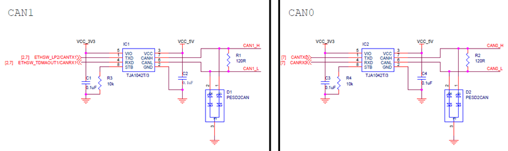
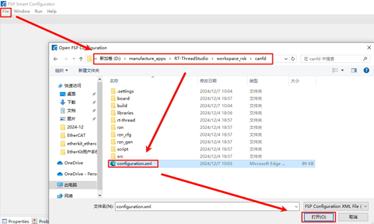
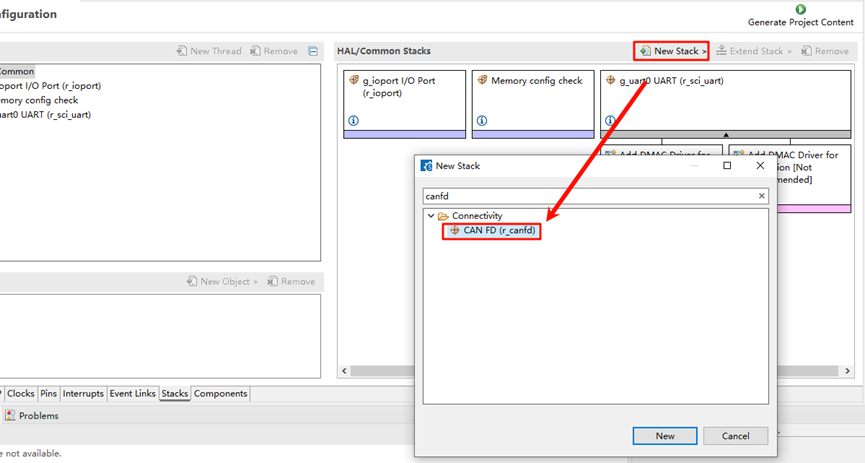
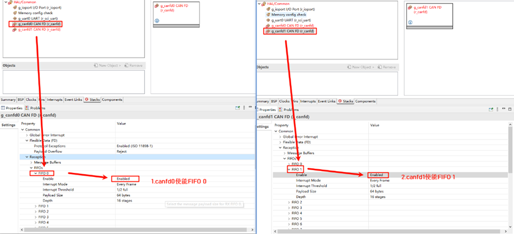
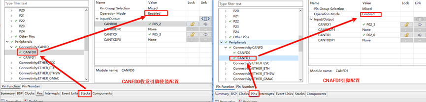
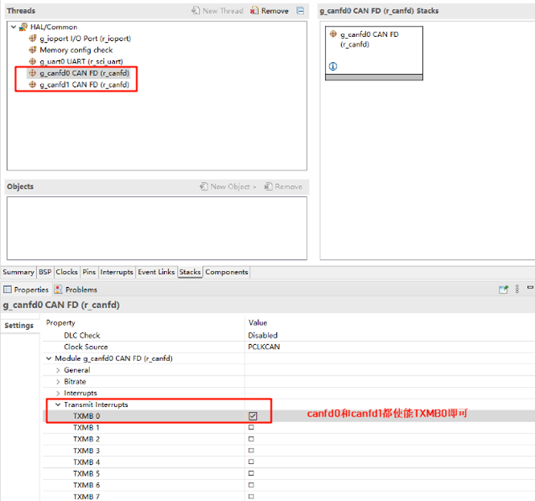
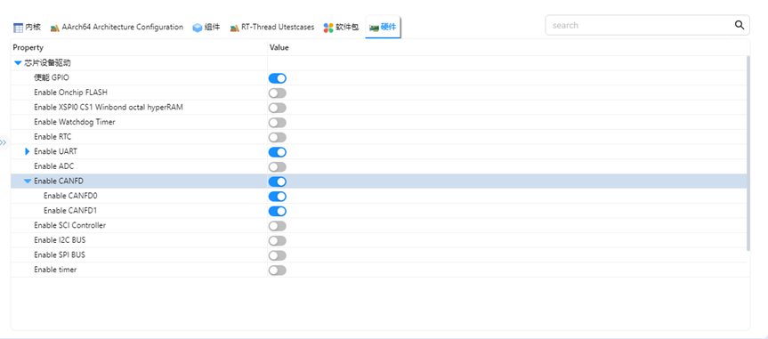
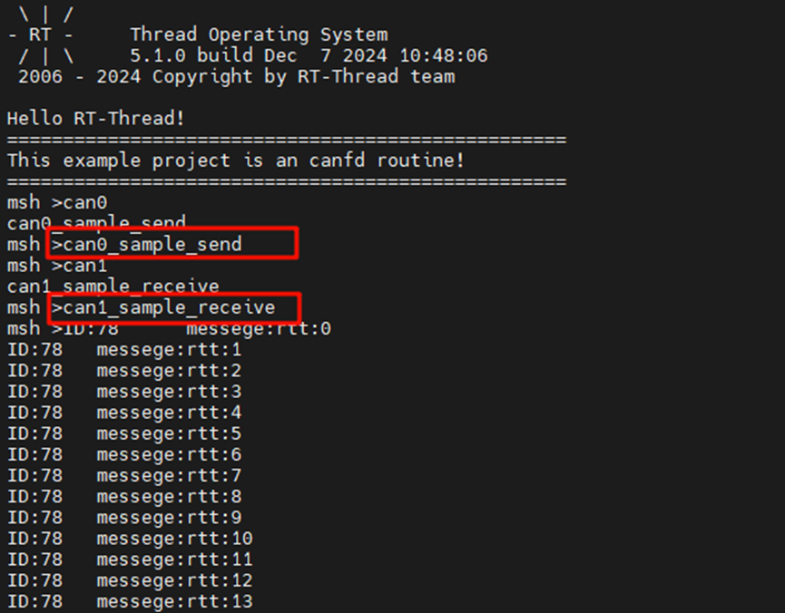

# RZ EtherKit 开发板 CANFD使用说明

**中文** | [**English**](./README.md)

## 简介

本例程主要介绍了如何在EtherKit上使用canfd设备；

## 硬件说明



## 软件说明

### FSP配置说明

选择新建工程下的configuration.xml文件，在rzn-fsp中打开；



点击添加New Stack，搜索canfd并添加r_canfd，这里我们需要添加两个canfd_stack；



 在基本配置中我们为canfd0和canfd1分别使能接收FIFO中断，依次选择Common->Reception->FIFOs->FIFO 0 / FIFO 1->Enable，其中为canfd0使能FIFO 0中断，canfd1使能FIFO 1中断：



接下来我们需要为CANFD分别设置通道、中断回调函数及过滤器数组；


对CANFD的引脚进行配置和使能；



接下来还需要使能发送消息缓冲区中断配置，这能决定当传输完成时应该是哪个消息缓冲区触发中断：



### RT-Thread Settings配置

打开RT-Thread Settings，使能canfd配置；



### 工程示例说明

工程通过canfd0发送报文canfd1接收报文并将其使用串口打印

发送代码示例：

```c
int can0_sample_send(int argc, char *argv[])
{
    rt_err_t res;
    rt_thread_t thread;
    char can_name[RT_NAME_MAX];
    if (argc == 2)
    {
        rt_strncpy(can_name, argv[1], RT_NAME_MAX);
    }
    else
    {
        rt_strncpy(can_name, CAN0_DEV_NAME, RT_NAME_MAX);
    }
    /* 查找 CAN 设备 */
    can0_dev = rt_device_find(can_name);
    if (!can0_dev)
    {
        rt_kprintf("find %s failed!\n", can_name);
        return RT_ERROR;
    }
    /* 以中断接收及发送方式打开 CAN 设备 */
    res = rt_device_open(can0_dev, RT_DEVICE_FLAG_INT_TX | RT_DEVICE_FLAG_INT_RX);
    RT_ASSERT(res == RT_EOK);
    /* 创建数据接收线程 */
    thread = rt_thread_create("can0_tx", can0_tx_thread, RT_NULL, 1024, 25, 10);
    if (thread != RT_NULL)
    {
        rt_thread_startup(thread);
    }
    else
    {
        rt_kprintf("create can_rx thread failed!\n");
    }
    return res;
}
/* 导出到 msh 命令列表中 */
MSH_CMD_EXPORT(can0_sample_send, can device sample);
int can1_sample_receive(int argc, char *argv[])
{
    rt_err_t res;
    rt_thread_t thread;
    char can_name[RT_NAME_MAX];
    if (argc == 2)
    {
        rt_strncpy(can_name, argv[1], RT_NAME_MAX);
    }
    else
    {
        rt_strncpy(can_name, CAN1_DEV_NAME, RT_NAME_MAX);
    }
    /* 查找 CAN 设备 */
    can1_dev = rt_device_find(can_name);
    if (!can1_dev)
    {
        rt_kprintf("find %s failed!\n", can_name);
        return RT_ERROR;
    }
    /* 初始化 CAN 接收信号量 */
    rt_sem_init(&rx_sem, "rx_sem", 0, RT_IPC_FLAG_FIFO);

    /* 以中断接收及发送方式打开 CAN 设备 */
    res = rt_device_open(can1_dev, RT_DEVICE_FLAG_INT_TX | RT_DEVICE_FLAG_INT_RX);
    RT_ASSERT(res == RT_EOK);
    /* 创建数据接收线程 */
    thread = rt_thread_create("can1_rx", can1_rx_thread, RT_NULL, 1024, 25, 10);
    if (thread != RT_NULL)
    {
        rt_thread_startup(thread);
    }
    else
    {
        rt_kprintf("create can_rx thread failed!\n");
    }
    return res;
}
```

## 运行

### 编译&下载

* RT-Thread Studio：在RT-Thread Studio 的包管理器中下载EtherKit 资源包，然后创建新工程，执行编译。
* IAR：首先双击mklinks.bat，生成rt-thread与libraries 文件夹链接；再使用Env 生成IAR工程；最后双击project.eww打开IAR工程，执行编译。

编译完成后，将开发板的Jlink接口与PC 机连接，然后将固件下载至开发板。

### 运行效果

将CAN0_L与CAN1_L对接，CAN0_H与CAN1_H对接，如下图所示；


使用串口分别发送can0_sample_send和can1_sample_receive命令进行回环测试；


