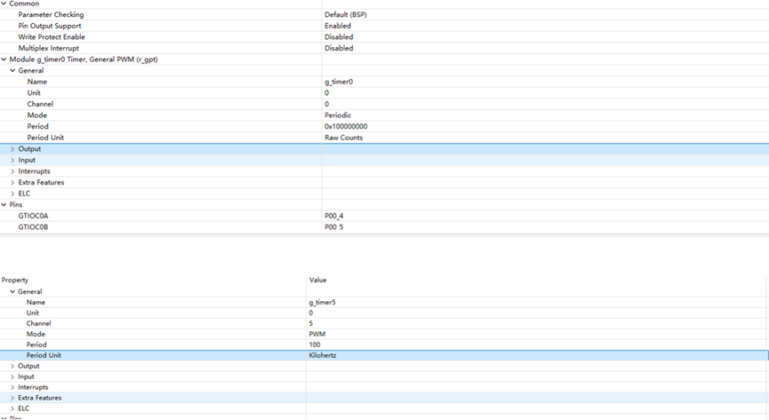
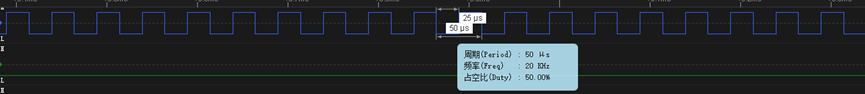

# RZ EtherKit Development Board GPT Usage Instructions

**English** | [**中文**](./README_zh.md)

## Introduction

In many practical applications, the use of timers is essential. This example demonstrates how to use the GPT (General Purpose Timer) device on the EtherKit, including the basic timer functionality and PWM (Pulse Width Modulation) usage.

## FSP Configuration Instructions

FSP configuration enables GPT0 in basic timer mode and GPT5 in PWM mode:



Additionally, configure the pins to enable GPT0 and GPT5:


### RT-Thread Settings Configuration

In the RT-Thread configuration, enable timer0:


### Example Project Description

The source code for this example is located in `/projects/etherkit_driver_gpt`:

```c
int hwtimer_sample(void)
{
    rt_err_t ret = RT_EOK;
    rt_hwtimerval_t timeout_s;
    rt_device_t hw_dev = RT_NULL;
    rt_hwtimer_mode_t mode;
    rt_uint32_t freq = 400000000; /* 1Mhz */
    hw_dev = rt_device_find(HWTIMER_DEV_NAME);
    if (hw_dev == RT_NULL)
    {
        rt_kprintf("hwtimer sample run failed! can't find %s device!\n", HWTIMER_DEV_NAME);
        return -RT_ERROR;
    }
    ret = rt_device_open(hw_dev, RT_DEVICE_OFLAG_RDWR);
    if (ret != RT_EOK)
    {
        rt_kprintf("open %s device failed!\n", HWTIMER_DEV_NAME);
        return ret;
    }
    rt_device_set_rx_indicate(hw_dev, timeout_cb);
    rt_device_control(hw_dev, HWTIMER_CTRL_FREQ_SET, &freq);
    mode = HWTIMER_MODE_PERIOD;
    ret = rt_device_control(hw_dev, HWTIMER_CTRL_MODE_SET, &mode);
    if (ret != RT_EOK)
    {
        rt_kprintf("set mode failed! ret is :%d\n", ret);
        return ret;
    }
    /* Example: Set the timeout period of the timer */
    timeout_s.sec = 1;  /* seconds */
    timeout_s.usec = 0; /* microseconds */
    if (rt_device_write(hw_dev, 0, &timeout_s, sizeof(timeout_s)) != sizeof(timeout_s))
    {
        rt_kprintf("set timeout value failed\n");
        return -RT_ERROR;
    }
    /* Read hwtimer value */
    rt_device_read(hw_dev, 0, &timeout_s, sizeof(timeout_s));
    rt_kprintf("Read: Sec = %d, Usec = %d\n", timeout_s.sec, timeout_s.usec);
    return ret;
}
MSH_CMD_EXPORT(hwtimer_sample, hwtimer sample);
```

This example triggers an interrupt callback function every 1 second and prints the output. Below is the code to enable PWM configuration:

```c
void GPT_PWM_Init(void)
{
    R_GPT_Open(&g_timer5_ctrl, &g_timer5_cfg);
    R_GPT_Start(&g_timer5_ctrl);
}
```

## Compilation & Download

* **RT-Thread Studio**: In RT-Thread Studio’s package manager, download the EtherKit resource package, create a new project, and compile it.
* **IAR**: First, double-click `mklinks.bat` to create symbolic links between RT-Thread and the libraries folder. Then, use the `Env` tool to generate the IAR project. Finally, double-click `project.eww` to open the IAR project and compile it.

After compilation, connect the development board’s JLink interface to the PC and download the firmware to the development board.

## Run Effect

The callback function is triggered every 1 second and prints the output:


Using a logic analyzer, the measured PWM output waveform is shown below:

