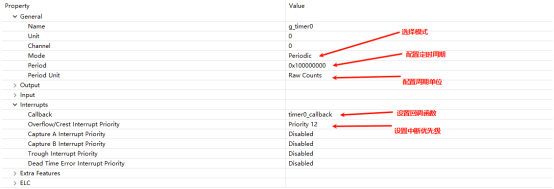
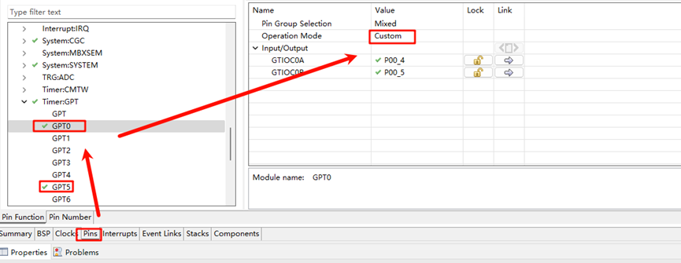
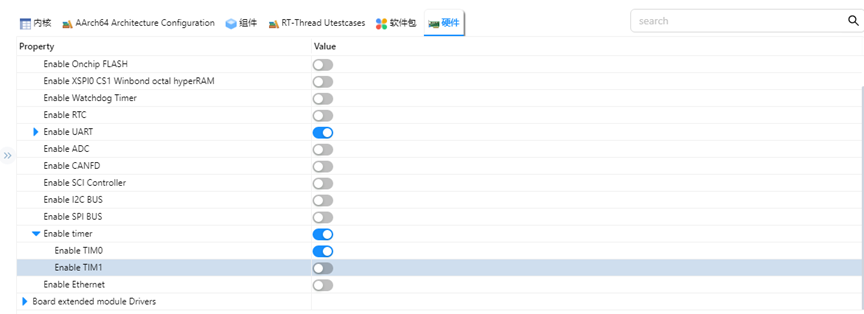
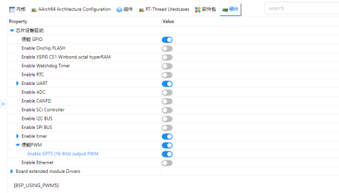
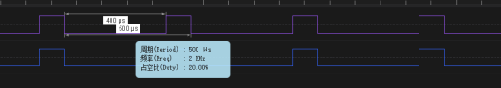

# GPT 驱动例程

**中文** | [**English**](./README.md)

## 简介

在我们具体的应用场合中往往都离不开timer的使用，本例程主要介绍了如何在EtherKit上使用GPT设备，包括基本定时器的使用和PWM的使用。

## FSP配置说明

FSP 分别配置使能GPT0为基本定时器模式，GPT5为PWM 模式：




并配置pins 使能GPT0 GPT5：



### RT-Thread Settings配置

在配置中打开timer0使能与PWM使能：






### 示例工程说明

本例程的源码位于/projects/etherkit_driver_gpt：

```c
int hwtimer_sample(void)
{
    rt_err_t ret = RT_EOK;
    rt_hwtimerval_t timeout_s;
    rt_device_t hw_dev = RT_NULL;
    rt_hwtimer_mode_t mode;
    rt_uint32_t freq = 400000000; /* 1Mhz */
    hw_dev = rt_device_find(HWTIMER_DEV_NAME);
    if (hw_dev == RT_NULL)
    {
        rt_kprintf("hwtimer sample run failed! can't find %s device!\n", HWTIMER_DEV_NAME);
        return -RT_ERROR;
    }
    ret = rt_device_open(hw_dev, RT_DEVICE_OFLAG_RDWR);
    if (ret != RT_EOK)
    {
        rt_kprintf("open %s device failed!\n", HWTIMER_DEV_NAME);
        return ret;
    }
    rt_device_set_rx_indicate(hw_dev, timeout_cb);
    rt_device_control(hw_dev, HWTIMER_CTRL_FREQ_SET, &freq);
    mode = HWTIMER_MODE_PERIOD;
    ret = rt_device_control(hw_dev, HWTIMER_CTRL_MODE_SET, &mode);
    if (ret != RT_EOK)
    {
        rt_kprintf("set mode failed! ret is :%d\n", ret);
        return ret;
    }
    /* Example Set the timeout period of the timer */
    timeout_s.sec = 1;  /* secend */
    timeout_s.usec = 0; /* microsecend */
    if (rt_device_write(hw_dev, 0, &timeout_s, sizeof(timeout_s)) != sizeof(timeout_s))
    {
        rt_kprintf("set timeout value failed\n");
        return -RT_ERROR;
    }
    /* read hwtimer value */
    rt_device_read(hw_dev, 0, &timeout_s, sizeof(timeout_s));
    rt_kprintf("Read: Sec = %d, Usec = %d\n", timeout_s.sec, timeout_s.usec);
    return ret;
}
MSH_CMD_EXPORT(hwtimer_sample, hwtimer sample);
```
每隔1s 中触发一次中断回调函数打印输出，下面是PWM 配置使能：

PWM相关宏定义：

当前版本的 PWM 驱动将每个通道都看做一个单独的 PWM 设备，每个设备都只有一个通道0。使用PWM5设备，注意此处通道选择为0通道；

```c
#define PWM_DEV_NAME        "pwm5"  /* PWM设备名称 */
#define PWM_DEV_CHANNEL      0      /* PWM通道 */
struct rt_device_pwm *pwm_dev;      /* PWM设备句柄 */
```

配置PWM周期以及占空比：

```
static int pwm_sample(int argc, char *argv[])
{
    rt_uint32_t period, pulse, dir;
    period = 500000;    /* 周期为0.5ms，单位为纳秒ns */
    dir = 1;            /* PWM脉冲宽度值的增减方向 */
    pulse = 100000;          /* PWM脉冲宽度值，单位为纳秒ns */
    /* 查找设备 */
    pwm_dev = (struct rt_device_pwm *)rt_device_find(PWM_DEV_NAME);
    if (pwm_dev == RT_NULL)
    {
        rt_kprintf("pwm sample run failed! can't find %s device!\n", PWM_DEV_NAME);
        return RT_ERROR;
    }
    /* 设置PWM周期和脉冲宽度默认值 */
    rt_pwm_set(pwm_dev, PWM_DEV_CHANNEL, period, pulse);
    /* 使能设备 */
    rt_pwm_enable(pwm_dev, PWM_DEV_CHANNEL);
}
/* 导出到 msh 命令列表中 */
MSH_CMD_EXPORT(pwm_sample, pwm sample);
```


##  编译&下载

* RT-Thread Studio：在RT-Thread Studio 的包管理器中下载EtherKit 资源包，然后创建新工程，执行编译。

* IAR：首先双击mklinks.bat，生成rt-thread与libraries 文件夹链接；再使用Env 生成IAR工程；最后双击project.eww打开IAR工程，执行编译。

编译完成后，将开发板的Jlink接口与PC 机连接，然后将固件下载至开发板。

## 运行效果

在串口终端分别输入pwm_sample、hwtimer_sample查看具体效果；

每隔1s触发回调函数并打印输出：


使用逻辑分析仪量取Pwm 输出波形如下所示：


