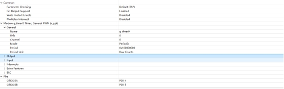
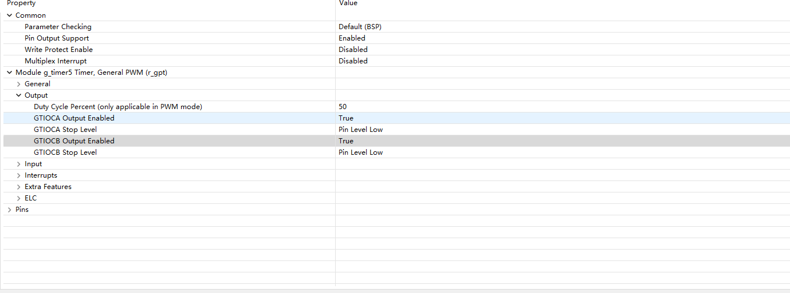
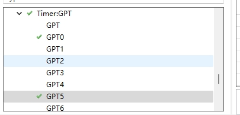
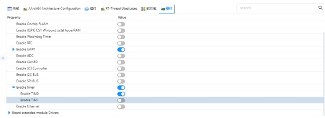
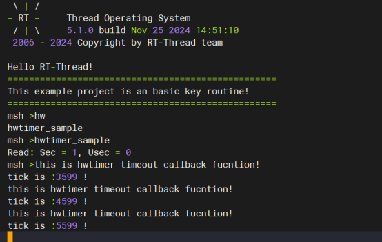
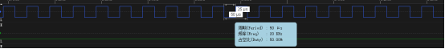

# RZ EtherKit 开发板 GPT使用 说明

**中文** | [**English**](./README.md)

## 简介

在我们具体的应用场合中往往都离不开timer的使用，本例程主要介绍了如何在EtherKit上使用GPT设备;包括基本定时器的使用和PWM的使用；


## 硬件说明

无

##  软件说明

### FSP配置说明

FSP 分别配置使能GPT0为基本定时器模式，GPT5为PWM 模式：

 

 

并配置pins 使能GPT0 GPT5

 

### RT-Thread Settings配置

在配置 中打开timer0使能

 

### 示例工程说明

```
int hwtimer_sample(void)

{

  rt_err_t ret = RT_EOK;

  rt_hwtimerval_t timeout_s;

  rt_device_t hw_dev = RT_NULL;

  rt_hwtimer_mode_t mode;

  rt_uint32_t freq = 400000000; /* 1Mhz */

  hw_dev = rt_device_find(HWTIMER_DEV_NAME);

  if (hw_dev == RT_NULL)

  {

​    rt_kprintf("hwtimer sample run failed! can't find %s device!\n", HWTIMER_DEV_NAME);

​    return -RT_ERROR;

  }

  ret = rt_device_open(hw_dev, RT_DEVICE_OFLAG_RDWR);

  if (ret != RT_EOK)

  {

​    rt_kprintf("open %s device failed!\n", HWTIMER_DEV_NAME);

​    return ret;

  }

  rt_device_set_rx_indicate(hw_dev, timeout_cb);

  rt_device_control(hw_dev, HWTIMER_CTRL_FREQ_SET, &freq);

  mode = HWTIMER_MODE_PERIOD;

  ret = rt_device_control(hw_dev, HWTIMER_CTRL_MODE_SET, &mode);

  if (ret != RT_EOK)

  {

​    rt_kprintf("set mode failed! ret is :%d\n", ret);

​    return ret;

  }

  /* Example Set the timeout period of the timer */

  timeout_s.sec = 1; /* secend */

  timeout_s.usec = 0; /* microsecend */

  if (rt_device_write(hw_dev, 0, &timeout_s, sizeof(timeout_s)) != sizeof(timeout_s))

  {

​    rt_kprintf("set timeout value failed\n");

​    return -RT_ERROR;

  }

  /* read hwtimer value */

  rt_device_read(hw_dev, 0, &timeout_s, sizeof(timeout_s));

  rt_kprintf("Read: Sec = %d, Usec = %d\n", timeout_s.sec, timeout_s.usec);

  return ret;

}

MSH_CMD_EXPORT(hwtimer_sample, hwtimer sample);
```
##  运行

###  编译&下载

 RT-Thread Studio：在RT-Thread Studio 的包管理器中下载EtherKit 资源包，然后创建新工程，执行编译。

 IAR：首先双击mklinks.bat，生成rt-thread与libraries 文件夹链接；再使用Env 生成IAR工程；最后双击project.eww打开IAR工程，执行编译。

编译完成后，将开发板的Jlink接口与PC 机连接，然后将固件下载至开发板。

### 运行效果

每隔1s触发回调函数并打印输出

 

使用逻辑分析仪量取Pwm 输出波形如下所示：



## 注意事项

​	暂无

## 引用参考

 设备与驱动：[HWTIMER 设备](https://www.rt-thread.org/document/site/#/rt-thread-version/rt-thread-standard/programming-manual/device/hwtimer/hwtimer)

