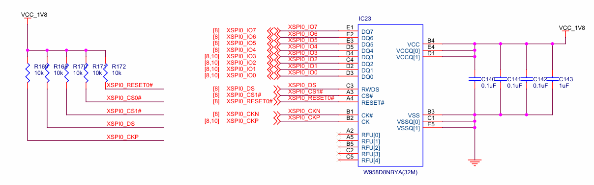
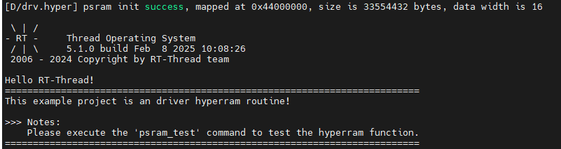

# HyperRAM 驱动例程

**中文** | [**English**](./README.md)

## 简介

HyperRAM 是一种高性能、低延迟的外部存储器，主要用于嵌入式系统中，提供额外的存储容量和快速的数据访问。其主要功能和原理如下：

* 功能
  * **高速数据存取**：HyperRAM 提供较高的数据传输速率，适合需要快速读写操作的应用，如图像处理和实时数据处理。
  * **低功耗**：相较于其他类型的存储器，HyperRAM 设计上注重低功耗，适合电池供电的嵌入式设备。
  * **扩展存储**：HyperRAM 可以为微控制器或其他处理器提供额外的存储空间，解决内置RAM不足的问题。
  * **简化设计**：HyperRAM 通常使用简单的接口，简化了硬件设计和系统集成。

* 原理
  * **串行接口**：HyperRAM 通常采用 SPI 或类似的串行接口进行通信，这使得连接和数据传输变得高效。
  * **动态随机存取存储器（DRAM）**：HyperRAM 基于 DRAM 技术，使用电容器存储数据，具有较高的密度和存储能力。
  * **内存控制器**：通过内存控制器，微控制器能够管理与 HyperRAM 的数据传输，控制读写操作。
  * **页面模式**：HyperRAM 支持页面模式操作，这允许更高效的数据传输，减少访问延迟。

在嵌入式系统中，HyperRAM 的应用广泛，尤其是在对存储速度和能效有较高要求的场合。

本例程主要介绍了如何在EtherKit上使用 Hyperram 驱动进行读写测试。

## 硬件说明



## 软件说明

本例程的源码驱动位于 ../library/HAL_Drivers/drv_hyperram.c 中：

```c
/*
 * Copyright (c) 2006-2024, RT-Thread Development Team
 *
 * SPDX-License-Identifier: Apache-2.0
 *
 * Change Logs:
 * Date           Author       Notes
 * 2024-10-28     yuanjie      first version
 */

#include <rtthread.h>
#include "hal_data.h"
#ifdef BSP_USING_HYPERRAM


#define DRV_DEBUG
#define LOG_TAG             "drv.hyper"
#include <drv_log.h>

#define PSRAM_BANK_ADDR                 ((uint32_t)0x44000000UL)    // XSPI0 CS1
#define PSRAM_SIZE                      ((uint32_t)0x2000000UL)     // 32MBytes
#define PSRAM_DATA_WIDTH                16

#ifdef RT_USING_MEMHEAP_AS_HEAP
static struct rt_memheap system_heap;
#endif


static int HYPERRAM_Init(void)
{
    int result = RT_EOK;
    /* XSPI initial settings */
    /* Initialize the PSRAM controller */
    if (R_XSPI_HYPER_Open(&g_hyperbus0_ctrl, &g_hyperbus0_cfg) != FSP_SUCCESS)
    {
        LOG_E("HYPER RAM init failed!");
        result = -RT_ERROR;
    }
    else
    {
        LOG_D("psram init success, mapped at 0x%X, size is %d bytes, data width is %d", PSRAM_BANK_ADDR, PSRAM_SIZE, PSRAM_DATA_WIDTH);
#ifdef RT_USING_MEMHEAP_AS_HEAP
        /* If RT_USING_MEMHEAP_AS_HEAP is enabled, PSRAM is initialized to the heap */
        rt_memheap_init(&system_heap, "psram", (void *)PSRAM_BANK_ADDR, PSRAM_SIZE);
#endif
    }

    return result;
}
INIT_BOARD_EXPORT(HYPERRAM_Init);

#ifdef DRV_DEBUG
#ifdef FINSH_USING_MSH
int psram_test(void)
{
    int i = 0;
    uint32_t start_time = 0, time_cast = 0;
#if PSRAM_DATA_WIDTH == 8
    char data_width = 1;
    uint8_t data = 0;
#elif PSRAM_DATA_WIDTH == 16
    char data_width = 2;
    uint16_t data = 0;
#else
    char data_width = 4;
    uint32_t data = 0;
#endif

    /* write data */
    LOG_D("Writing the %ld bytes data, waiting....", PSRAM_SIZE);
    start_time = rt_tick_get();
    for (i = 0; i < PSRAM_SIZE / data_width; i++)
    {
#if PSRAM_DATA_WIDTH == 8
        *(__IO uint8_t *)(PSRAM_BANK_ADDR + i * data_width) = (uint8_t)0x55;
#elif PSRAM_DATA_WIDTH == 16
        *(__IO uint16_t *)(PSRAM_BANK_ADDR + i * data_width) = (uint16_t)0x5555;
#else
        *(__IO uint32_t *)(PSRAM_BANK_ADDR + i * data_width) = (uint32_t)0x55555555;
#endif
    }
    time_cast = rt_tick_get() - start_time;
    LOG_D("Write data success, total time: %d.%03dS.", time_cast / RT_TICK_PER_SECOND,
          time_cast % RT_TICK_PER_SECOND / ((RT_TICK_PER_SECOND * 1 + 999) / 1000));

    /* read data */
    LOG_D("start Reading and verifying data, waiting....");
    for (i = 0; i < PSRAM_SIZE / data_width; i++)
    {
#if PSRAM_DATA_WIDTH == 8
        data = *(__IO uint8_t *)(PSRAM_BANK_ADDR + i * data_width);
        if (data != 0x55)
        {
            LOG_E("PSRAM test failed!");
            break;
        }
#elif PSRAM_DATA_WIDTH == 16
        data = *(__IO uint16_t *)(PSRAM_BANK_ADDR + i * data_width);
        if (data != 0x5555)
        {
            LOG_E("PSRAM test failed!");
            break;
        }
#else
        data = *(__IO uint32_t *)(PSRAM_BANK_ADDR + i * data_width);
        if (data != 0x55555555)
        {
            LOG_E("PSRAM test failed!");
            break;
        }
#endif
    }

    if (i >= PSRAM_SIZE / data_width)
    {
        LOG_D("PSRAM test success!");
    }

    return RT_EOK;
}
MSH_CMD_EXPORT(psram_test, XSPI XIP hyper ram test)
#endif /* FINSH_USING_MSH */
#endif /* DRV_DEBUG */
#endif /* BSP_USING_HYPERRAM */
```

## 编译&下载

* RT-Thread Studio：在RT-Thread Studio 的包管理器中下载EtherKit 资源包，然后创建新工程，执行编译。

* IAR：首先双击mklinks.bat，生成rt-thread 与libraries 文件夹链接；再使用Env 生成IAR 工程；最后双击project.eww打开IAR工程，执行编译。

编译完成后，将开发板的Jlink接口与PC 机连接，然后将固件下载至开发板。

## 运行效果

按下复位按键重启开发板，观察开发板终端日志。



执行 psram_test 指令开始 hyperram 读写测试：

```c
msh >psram_test
[D/drv.hyper] Writing the 33554432 bytes data, waiting....
[D/drv.hyper] Write data success, total time: 0.866S.
[D/drv.hyper] start Reading and verifying data, waiting....
[D/drv.hyper] PSRAM test success!
```
