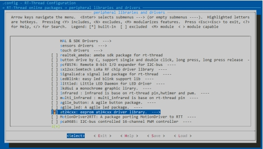

# RZ EtherKit Development Board EEROM Example Description

**English** | **[Chinese](./README_zh.md)**

## Introduction

This example mainly illustrates how to use the IIC framework of RT-Thread on EtherKit to complete the read and write functions of the EEROM on the board.

## Hardware Description

The EEROM on EtherKit uses AT24C16 and is connected to the IIC0 of the R9A07G084M08GBG chip.

 

## Software Description

### FSP Configuration Description

Create new stacks, select r_iic_master and configure the IIC0 configuration information as follows:

 

 

### env Configuration

Configure and open the IIC driver framework of RT-Thread and the driver software package of AT24C16 in Env:

 

 

### Example Project Description

Write and read to the addresses 0x00 and 0x20 of EEROM based on the driver software package of AT24C16.

```
#ifdef PKG_USING_AT24CXX
#include "at24cxx.h"
#define EEPROM_I2C_NAME "i2c0"

static at24cxx_device_t at24c02_dev;

static void eeprom_test(void)

{

  char str1[] = "test string-hello rtthread\n";

  char str2[] = "test string-rzt2m eeprom testcase\n";

  uint8_t read_buffer1[50];

  uint8_t read_buffer2[50];

  at24c02_dev = at24cxx_init(EEPROM_I2C_NAME, 0x0);

  if (at24c02_dev == RT_NULL)

  {

​    rt_kprintf("eeprom init failed\n");

​    return;

  }

  rt_memset(read_buffer1, 0x0, sizeof(read_buffer1));

  rt_memset(read_buffer2, 0x0, sizeof(read_buffer2));

  at24cxx_write(at24c02_dev, 0x0, (uint8_t *)str1, (sizeof(str1) - 1));

  rt_kprintf("write eeprom data to 0x0: %s\n", str1);

  rt_thread_mdelay(1000);

  at24cxx_read(at24c02_dev, 0x0, read_buffer1, (sizeof(str1) - 1));

  rt_kprintf("read eeprom data from 0x0: %s\n", read_buffer1);

  at24cxx_write(at24c02_dev, 0x20, (uint8_t *)str2, (sizeof(str2) - 1));

  rt_kprintf("write eeprom data to 0x20: %s\n", str2);

  rt_thread_mdelay(1000);

  at24cxx_read(at24c02_dev, 0x20, read_buffer2, (sizeof(str2) - 1));

  rt_kprintf("read eeprom data from 0x20: %s\n", read_buffer2);

  if (rt_strcmp((const char *)str1, (const char *)read_buffer1) != 0 && rt_strcmp((const char *)str2, (const char *)read_buffer2) != 0)

​    rt_kprintf("eeprom test fail\n");

  else

​    rt_kprintf("eeprom test success\n");

  at24cxx_deinit(at24c02_dev);

}

MSH_CMD_EXPORT(eeprom_test, eeprom test sample);

#endif
```

## Operation

### Compilation & Download

RT-Thread Studio: Download the EtherKit resource package in the package manager of RT-Thread Studio, then create a new project and perform compilation.
IAR: First double-click mklinks.bat to generate the links of the rt-thread and libraries folders; then use Env to generate the IAR project; finally double-click project.eww to open the IAR project and perform compilation.
After compilation, connect the Jlink interface of the development board to the PC, and then download the firmware to the development board.

### Operation Effect

Input the eeprom_test command in the serial port terminal:


## Precautions

 None for now.

## Citation References

 设备与驱动：[I2C Devices](https://www.rt-thread.org/document/site/#/rt-thread-version/rt-thread-standard/programming-manual/device/i2c/i2c)：

