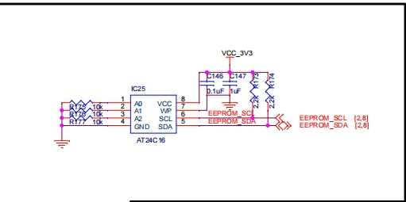
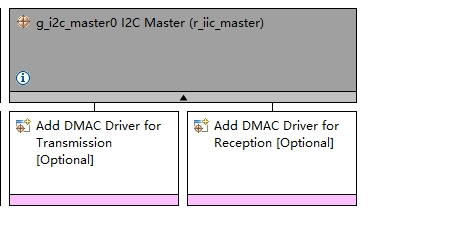
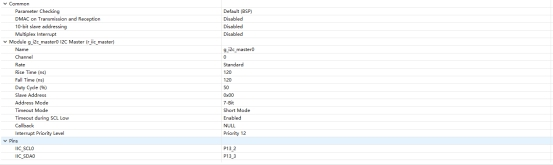
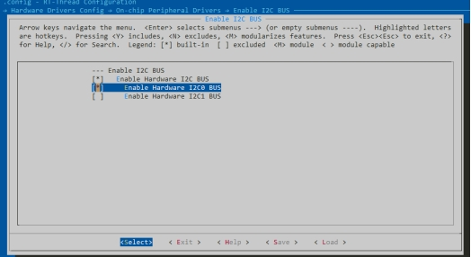
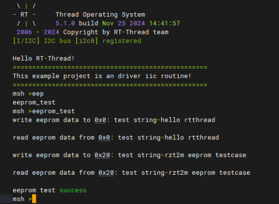

# RZ EtherKit 开发板  EEROM  示例说明

**中文** | [**English**](./README.md)

## 简介

本例程主要介绍了如何在EtherKit上使用RT-Thread的IIC框架完成通过对板子上的EEROM的读写功能；

 

## 硬件说明

EtherKit 上的EEROM 使用为AT24C16连接R9A07G084M08GBG 芯片的IIC0

 

##  软件说明

## FSP配置说明

新建stacks 选择r_iic_master 并配置IIC0配置信息如下

 

 

## env配置

Env 配置打开 RT-Thread的IIC 驱动框架与AT24C16的驱动软件包：

 

 

## 示例工程说明

基于AT24C16的驱动软件包实现对EEROM的0x00,0x20地址写入与读出；

```
#ifdef PKG_USING_AT24CXX
#include "at24cxx.h"
#define EEPROM_I2C_NAME "i2c0"

static at24cxx_device_t at24c02_dev;

static void eeprom_test(void)

{

  char str1[] = "test string-hello rtthread\n";

  char str2[] = "test string-rzt2m eeprom testcase\n";

  uint8_t read_buffer1[50];

  uint8_t read_buffer2[50];

  at24c02_dev = at24cxx_init(EEPROM_I2C_NAME, 0x0);

  if (at24c02_dev == RT_NULL)

  {

​    rt_kprintf("eeprom init failed\n");

​    return;

  }

  rt_memset(read_buffer1, 0x0, sizeof(read_buffer1));

  rt_memset(read_buffer2, 0x0, sizeof(read_buffer2));

  at24cxx_write(at24c02_dev, 0x0, (uint8_t *)str1, (sizeof(str1) - 1));

  rt_kprintf("write eeprom data to 0x0: %s\n", str1);

  rt_thread_mdelay(1000);

  at24cxx_read(at24c02_dev, 0x0, read_buffer1, (sizeof(str1) - 1));

  rt_kprintf("read eeprom data from 0x0: %s\n", read_buffer1);

  at24cxx_write(at24c02_dev, 0x20, (uint8_t *)str2, (sizeof(str2) - 1));

  rt_kprintf("write eeprom data to 0x20: %s\n", str2);

  rt_thread_mdelay(1000);

  at24cxx_read(at24c02_dev, 0x20, read_buffer2, (sizeof(str2) - 1));

  rt_kprintf("read eeprom data from 0x20: %s\n", read_buffer2);

  if (rt_strcmp((const char *)str1, (const char *)read_buffer1) != 0 && rt_strcmp((const char *)str2, (const char *)read_buffer2) != 0)

​    rt_kprintf("eeprom test fail\n");

  else

​    rt_kprintf("eeprom test success\n");

  at24cxx_deinit(at24c02_dev);

}

MSH_CMD_EXPORT(eeprom_test, eeprom test sample);

#endif
```

##  运行

### 编译&下载

 RT-Thread Studio：在RT-Thread Studio 的包管理器中下载EtherKit 资源包，然后创建新工程，执行编译。

 IAR：首先双击mklinks.bat，生成rt-thread与libraries 文件夹链接；再使用Env 生成IAR工程；最后双击project.eww打开IAR工程，执行编译。

编译完成后，将开发板的Jlink接口与PC 机连接，然后将固件下载至开发板。

###  运行效果

写串口终端输入 eeprom_test指令： 

 

##  注意事项

​	暂无

## 引用参考

 设备与驱动：[I2C 设备](https://www.rt-thread.org/document/site/#/rt-thread-version/rt-thread-standard/programming-manual/device/i2c/i2c)：

