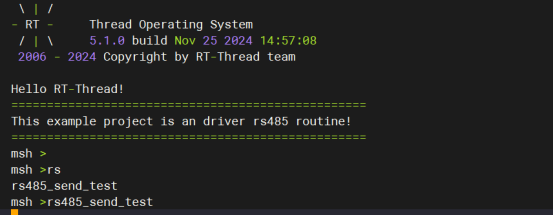

# RZ EtherKit Development Board RS485 Usage Instructions

**English** | **[Chinese](./README_zh.md)**

## Introduction

This example mainly introduces how to use the RS485 device on the EtherKit.

## Hardware Description

 

## Software Description

### FSP Configuration Instructions

Open the FSP tool and create a new stack, selecting `r_sci_uart5`.

The specific configuration information is as follows:


### RT-Thread Settings Configuration

None

### Project Example Description

The project is developed using FSP library functions.

RS485 sending function: send data once every 1 second, for a total of 10 times, with each transmission being 1 byte.

```
int rs485_send_test(void)
{
   static uint8_t i;

   for(i =1; i <= 10; i++)
   {
       /*发送数据*/
       RS485_Send_Example(i);
       rt_thread_delay(1000);
   }
   return 0;
}
```

RS485 receive interrupt function (the receive interrupt name needs to be configured in FSP in advance):

```
/*RS485_1中断回调函数*/
void rs485_callback(uart_callback_args_t * p_args)
{
    rt_interrupt_enter();

    switch(p_args->event)
    {
        /*接收数据时将数据打印出来*/
        case UART_EVENT_RX_CHAR:
          {
            rt_kprintf("%d\n", p_args->data);
            break;
          }
        default:
            break;
    }
```

## Running

### Compilation & Download

**RT-Thread Studio**: Download the EtherKit resource package in the RT-Thread Studio package manager, then create a new project and compile it.

**IAR**: First, double-click `mklinks.bat` to generate links for the rt-thread and libraries folders; then use Env to generate the IAR project; finally, double-click `project.eww` to open the IAR project and compile it.

After compilation, connect the Jlink interface of the development board to the PC, and download the firmware to the development board.

### Running Effects

Output the command `rs485_send` through the serial port and open another terminal on a different serial port to view the received data.




## Notes

None

## References

Device and Driver: [UART_V2 Device](https://www.rt-thread.org/document/site/#/rt-thread-version/rt-thread-standard/programming-manual/device/uart/uart_v2/uart)