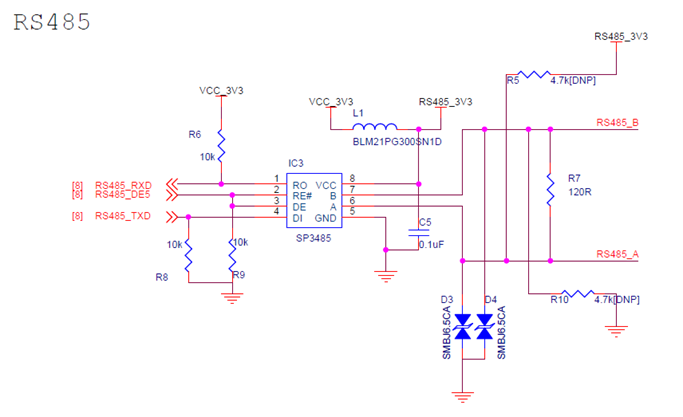
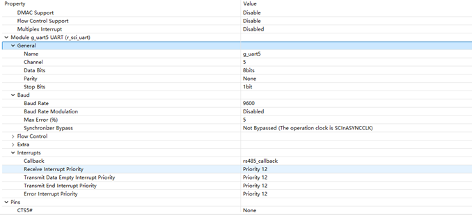
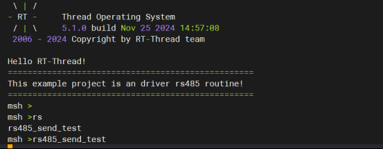
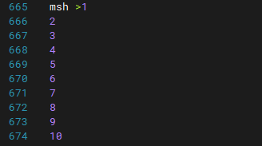

# RZ EtherKit 开发板 RS485使用 说明

**中文** | [**English**](./README.md)

## 简介

本例程主要介绍了如何在EtherKit上使用RS485设备;

## 硬件说明



## FSP配置说明

打开FSP工具，新建Stacks并选择r_sci_uart5，具体配置信息如下：



## 工程示例说明

rs485发送函数：每隔1s发送一次，总共发送10次数据，每次发送为1个字节；

```c
int rs485_send_test(void)
{
   static uint8_t i;

   for(i =1; i <= 10; i++)
   {
       /*发送数据*/
       RS485_Send_Example(i);
       rt_thread_delay(1000);
   }
   return 0;
}
```

rs485接收中断函数（需要在FSP里提前配置接收中断名称）：

```c
/*RS485_1中断回调函数*/
void rs485_callback(uart_callback_args_t * p_args)
{
    rt_interrupt_enter();

    switch(p_args->event)
    {
        /*接收数据时将数据打印出来*/
        case UART_EVENT_RX_CHAR:
          {
            rt_kprintf("%d\n", p_args->data);
            break;
          }
        default:
            break;
    }
```

##  编译&下载

* RT-Thread Studio：在RT-Thread Studio 的包管理器中下载EtherKit 资源包，然后创建新工程，执行编译。
* IAR：首先双击mklinks.bat，生成rt-thread与libraries 文件夹链接；再使用Env 生成IAR工程；最后双击project.eww打开IAR工程，执行编译。

编译完成后，将开发板的Jlink接口与PC 机连接，然后将固件下载至开发板。

### 运行效果

串口输出指令rs485_send指令，打开另一个串口的终端查看收到的数据：




