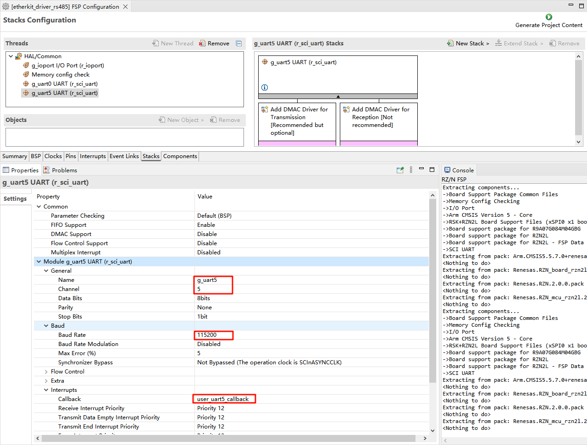
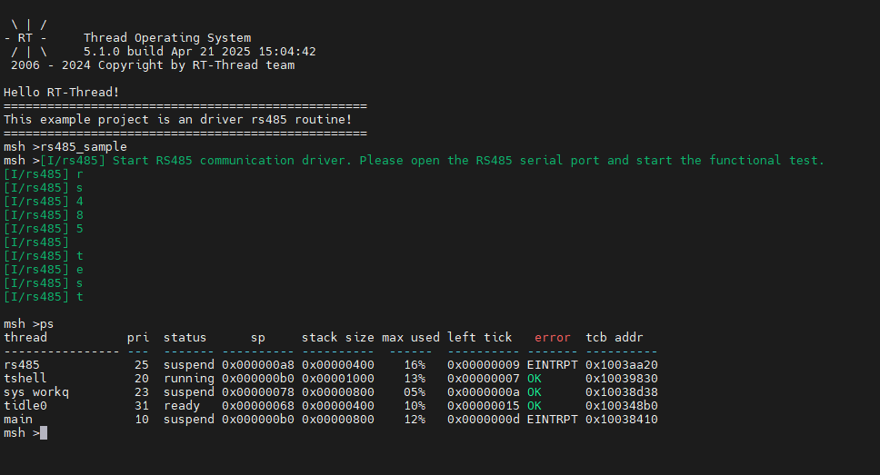
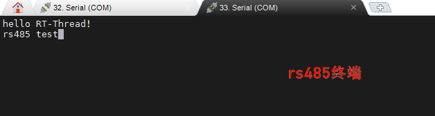

# RS485 驱动例程

**中文** | [**English**](./README.md)

## 简介

本例程主要介绍了如何在EtherKit上使用RS485设备;

## 硬件说明

## FSP配置说明

打开FSP工具，新建Stacks并选择r_sci_uart5，具体配置信息如下：

## 工程示例说明

初始化 RS485 驱动，在 Finsh 终端打印从 rs485 串口终端来的字符，并且回显在 rs485 终端。

##  编译&下载

* RT-Thread Studio：在RT-Thread Studio 的包管理器中下载EtherKit 资源包，然后创建新工程，执行编译。
* IAR：首先双击mklinks.bat，生成rt-thread与libraries 文件夹链接；再使用Env 生成IAR工程；最后双击project.eww打开IAR工程，执行编译。

编译完成后，将开发板的Jlink接口与PC 机连接，然后将固件下载至开发板。

### 运行效果

串口输出指令 rs485_sample 指令，打开 rs485 串口终端查看收到的数据：

