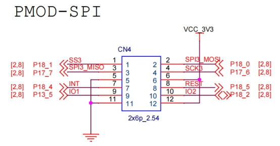
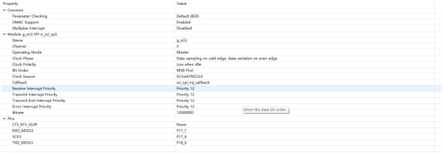
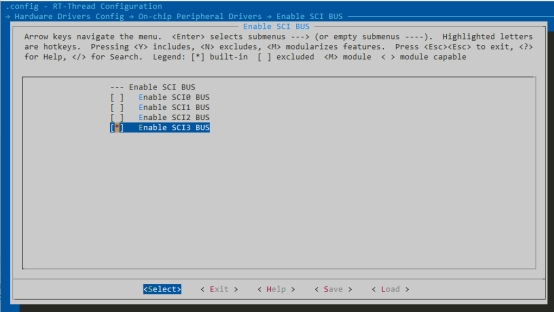
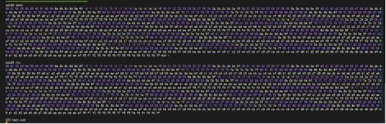

# RZ EtherKit Development Board SCI_SPI Usage Guide

**English** | **[Chinese](./README_zh.md)**

## Introduction

This guide provides an example of using the SCI_SPI framework on the EtherKit development board with RT-Thread.

---

## Hardware Overview

The EtherKit development board features a PMOD interface connected to the SCI_SPI3 peripheral of the R9A07G084M08GBG chip.



---

## Software Overview


### FSP Configuration Instructions

Open the FSP tool, create a new stack, and select **r_sci_spi3**.



### Env Configuration Instructions



---

## Example Project Overview

This example demonstrates a loopback test on the PMOD interface using the RT-Thread SCI driver framework. The test connects **SPI3_MOSI** to **SPI3_MISO** on the PMOD interface.

### Example Code

```c
void spi_loop_test(void)
{
#define TEXT_NUMBER_SIZE 1024
#define SPI_BUS_NAME "sci3s"
#define SPI_NAME "spi30"

    static uint8_t sendbuf[TEXT_NUMBER_SIZE] = {0};
    static uint8_t readbuf[TEXT_NUMBER_SIZE] = {0};

    for (int i = 0; i < sizeof(readbuf); i++)
    {
        sendbuf[i] = i;
    }

    static struct rt_spi_device *spi_dev = RT_NULL;
    struct rt_spi_configuration cfg;

    rt_hw_sci_spi_device_attach(SPI_BUS_NAME, SPI_NAME, NULL);

    cfg.data_width = 8;
    cfg.mode = RT_SPI_MASTER | RT_SPI_MODE_0 | RT_SPI_MSB | RT_SPI_NO_CS;
    cfg.max_hz = 1 * 1000 * 1000;

    spi_dev = (struct rt_spi_device *)rt_device_find(SPI_NAME);

    if (RT_NULL == spi_dev)
    {
        rt_kprintf("SPI sample run failed! Can't find %s device!\n", SPI_NAME);
        return;
    }

    rt_spi_configure(spi_dev, &cfg);

    rt_kprintf("%s send:\n", SPI_NAME);
    for (int i = 0; i < sizeof(sendbuf); i++)
    {
        rt_kprintf("%02x ", sendbuf[i]);
    }

    rt_spi_transfer(spi_dev, sendbuf, readbuf, sizeof(sendbuf));

    rt_kprintf("\n\n%s received:\n", SPI_NAME);
    for (int i = 0; i < sizeof(readbuf); i++)
    {
        if (readbuf[i] != sendbuf[i])
        {
            rt_kprintf("SPI test failed!!!\n");
            break;
        }
        else
        {
            rt_kprintf("%02x ", readbuf[i]);
        }
    }

    rt_kprintf("\n\n");
    rt_kprintf("SPI test completed\n");
}
```

### Function Integration

Call the `spi_loop_test` function from the main function.

---

## Execution

### Compilation & Download

- **RT-Thread Studio**: Use the package manager in RT-Thread Studio to download the EtherKit resource package, create a new project, and compile it.
- **IAR**: First, double-click `mklinks.bat` to generate symbolic links for the `rt-thread` and `libraries` folders. Then, use Env to generate the IAR project. Finally, double-click `project.eww` to open the IAR project and compile it.

After compilation, connect the J-Link interface of the development board to the PC and download the firmware to the board.

---

### Execution Results



---

## Notes

No additional notes at this time.

---

## References

- Device and Driver: [SPI Devices](#/rt-thread-version/rt-thread-standard/programming-manual/device/spi/spi)