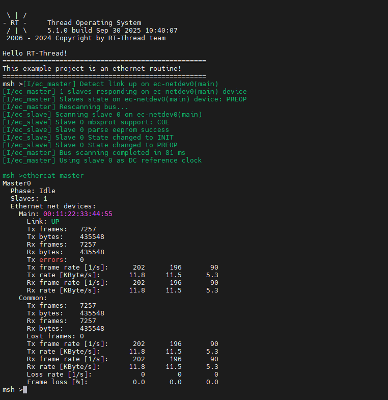
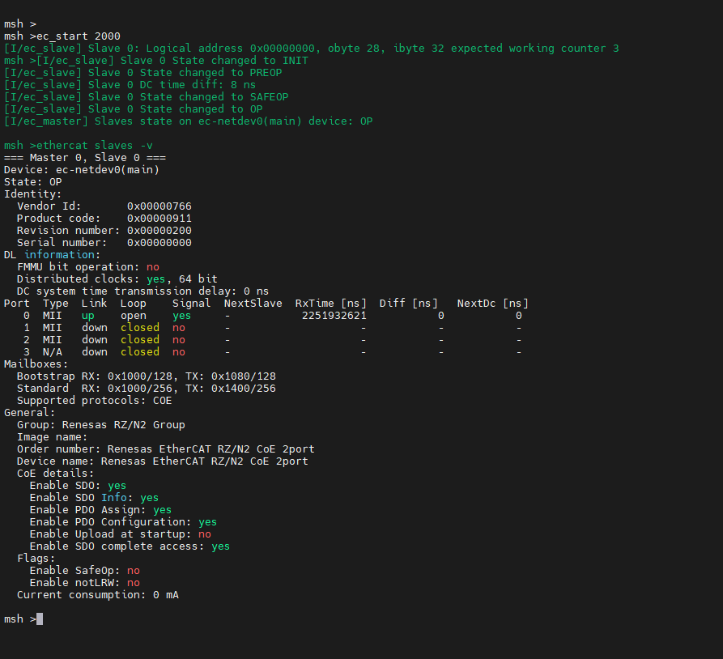
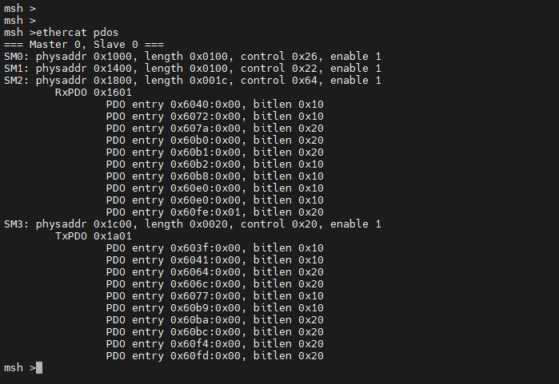
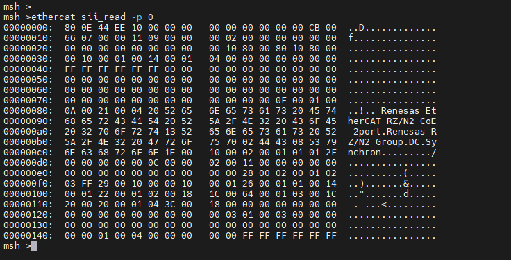
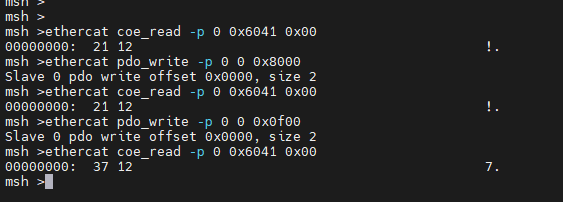

# CherryECAT Driver Usage Instructions

**English** | [**中文**](./README_zh.md)

## Introduction

This project provides cherryecat demo.

## Hardware Connection

To use Ethernet, connect the development board to any one of the three network ports using an Ethernet cable, and the other end should be connected to a network switch that has internet access.

## FSP Configuration Instructions

Open the project configuration file `configuration.xml` and add the `r_gamc` stack:

Next, click on `g_ether0 Ethernet`, and configure the interrupt callback function to `user_ether0_callback`:

Now configure the PHY settings. Select `g_ether_phy0`, set the common configuration to "User Own Target", change the PHY LSI address to `1` (refer to the schematic for the exact address), and set the PHY initialization callback function to `ether_phy_targets_initialize_rtl8211_rgmii()`. Also, set the MDIO to GMAC.

Next, configure `g_ether_selector0`, set the Ethernet mode to "Switch Mode", set the PHY link to "Default Active-Low", and choose "RGMII" for the PHY interface mode.

Configure the Ethernet pin parameters and select the operating mode to RGMII:

Finally, configure `ETHER_GMAC`:

## RT-Thread Studio Configuration

Return to the Studio project, and configure RT-Thread Settings. Click on "Hardware", find the chip device driver, and enable Ethernet:

## Running Results

