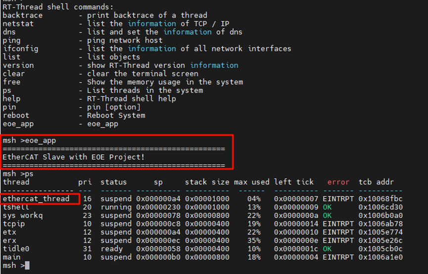
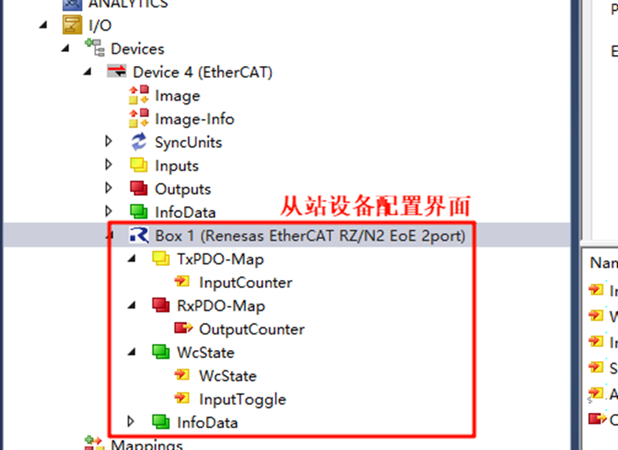
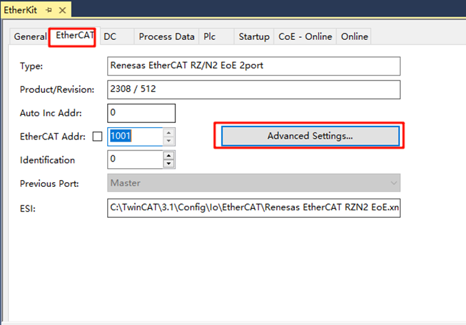
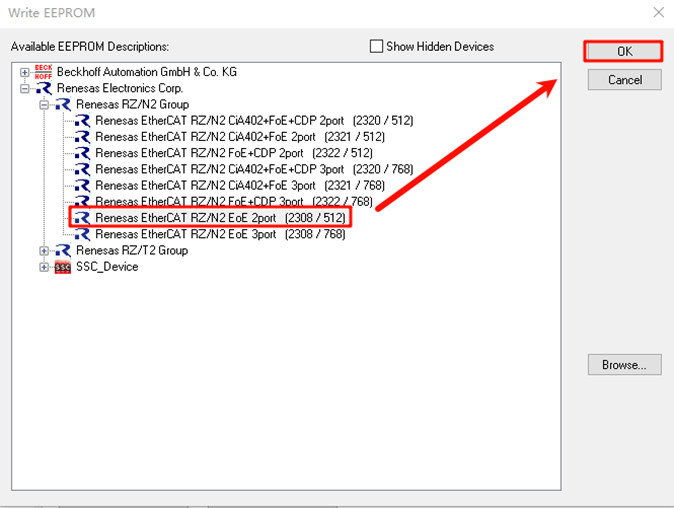

# EtherKit EtherCAT-EOE Example

**English** | [**中文**](./README_zh.md)

## Introduction

EtherCAT EoE (**Ethernet over EtherCAT**) is a communication protocol in the EtherCAT standard used for transmitting standard Ethernet frames over an EtherCAT network. It allows non-real-time Ethernet communication to coexist with real-time EtherCAT communication, providing flexible network integration capabilities for industrial automation systems.

Key features and functionalities of EoE include:

1. **Ethernet Tunnel Transmission**:
   - EoE encapsulates standard Ethernet frames in EtherCAT communication frames, allowing protocols like TCP/IP, UDP, HTTP, etc., to be transmitted over an EtherCAT network.

2. **Extended Network Functionality**:
   - Allows EtherCAT slaves to act as virtual Ethernet devices in a TCP/IP network.
   - Enables remote access to standard Ethernet devices through the EtherCAT communication link.

3. **Efficient Integration**:
   - The implementation of EoE does not affect the real-time performance of EtherCAT.
   - Non-real-time Ethernet communication and real-time EtherCAT data exchange can coexist, each handling its specific tasks.

4. **Use Cases**:
   - **Device Management**: Access EtherCAT slave devices via IP for remote configuration, diagnostics, and firmware updates.
   - **Mixed Networks**: Integrate devices requiring standard Ethernet communication, such as cameras, sensors, or industrial PCs.

5. **Simplified Network Cabling**:
   - EoE allows Ethernet devices to be accessed over the EtherCAT network, reducing the need for independent Ethernet cabling in industrial automation scenarios.

6. **Typical Applications**:
   - Remote monitoring and diagnostics in factory automation systems.
   - Communication bridge between industrial robots, production equipment, and external IT systems.

This section demonstrates how to implement EtherCAT EOE master-slave communication using Beckhoff TwinCAT3 and the EtherKit development board.

## Prerequisites

**Software Environment**:
- [RT-Thread Studio](https://download-redirect.rt-thread.org/download/studio/RT-Thread Studio_2.2.8-setup-x86_64_202405200930.exe)
- [RZN-FSP v2.0.0](https://github.com/renesas/rzn-fsp/releases/download/v2.0.0/setup_rznfsp_v2_0_0_rzsc_v2024-01.1.exe)
- [Beckhoff Automation TwinCAT3](https://www.beckhoff.com/en-us/support/download-finder/search-result/?c-1=26782567)

**Hardware Environment**:
- EtherKit development board
- Ethernet cable
- Jlink debugger

## TwinCAT3 Configuration

> Before launching TwinCAT3, a few configuration steps are required:

### Installing the ESI File

Before starting TwinCAT, copy the ESI file from the provided folder to the TwinCAT target location: `..\TwinCAT\3.x\Config\IO\EtherCAT`.

> Note: The ESI file is located at: `..\board\ports\ethercat\ESI_File\Renesas EtherCAT RZT2 EoE.xml`

### Adding TwinCAT Ethernet Driver

Add the TwinCAT Ethernet driver (only required for first-time configuration). From the Start menu, select [TwinCAT] → [Show Realtime Ethernet Compatible Device...], select the connected Ethernet port from the communication port, and install it.

Here, you can see all Ethernet adapters available on the PC. Select the port you will use for testing and click install:

Check the network adapter to confirm installation was successful:

## FSP Configuration Instructions

Next, we configure the pin initialization. Open the installed RZN-FSP 2.0.0 and select the root directory of your project:

Now configure the peripherals and pins. Click **New Stack** and add the `ethercat_ssc_port` peripheral:

Configure `ethercat_ssc_port`: Change Reset Port to `P13_4` and set the EEPROM size to **Under 32Kbits**:

Enable the Ethernet interface and configure the network parameters. Add two PHYs (`phy0` and `phy1`). Note that EtherKit uses the `rtl8211` Ethernet card, which is not supported by the Renesas FSP, but Renesas provides a user-defined Ethernet interface. Follow the settings below and set the MDIO type to **GMAC**. Set the network initialization callback function to `ether_phy_targets_initialize_rtl8211_rgmii()`:

Configure the network card pin parameters to operate in **RGMII mode**:

EtherCAT ESC Configuration:

ETHER_GMAC Configuration:

Add the CMT timer for `ethercat_ssc_port` and configure the interrupt priority:

Add Ethernet peripherals:

Set Ethernet interrupt callback to `user_ether0_callback`:

Finally, click **Generate Project Content** to generate the low-level driver source code.

## RT-Thread Studio Configuration

After completing the FSP configuration, the pin and peripheral initialization is complete. Now enable the EtherCAT EOE example in Studio. Open RT-Thread Studio, click **RT-Thread Settings**, and enable the **EOE Example**:

After enabling, save the settings, synchronize the `scons` configuration, compile the program, and download it. After resetting the development board, check the serial logs:

## EtherCAT EOE Configuration

### Create a New TwinCAT Project

Open TwinCAT, click **File** → **New** → **New Project**, choose **TwinCAT Projects**, and create a **TwinCAT XAR Project (XML format)**:

### Start EOE App on the Slave

Once the EtherKit development board is powered on, open the serial device, and enter the `eoe_app` command to start the EtherCAT slave app. After the program runs, you can see the EtherCAT thread running:

### Scan for Slave Devices

After creating the project, find **Devices** in the left navigation bar, right-click, and choose **Scan Devices**. If the slave device is detected successfully, you should see **Device x[EtherCAT]**; if the scan fails, it will display **Device x[EtherCAT Automation Protocol]**, indicating a failure to initialize the slave.

Click **OK**, and a window will pop up: **Scan for boxes**. Click **Confirm**, and another window will pop up: **Activate Free Run**. Since this is the first time using EOE, you need to update the EEPROM firmware, so don't activate it yet.

### Update the EEPROM Firmware

Back in TwinCAT, in the left navigation bar, you can see the master-slave configuration interface after successfully scanning the slave device:

Click **Box 1** (it may show **Renesas EtherCAT RZ/N2 EOE 2port** if the ESI firmware has been updated before). If it's your first time, it may display **Box 1 (0xFFFF FFFF)**. Double-click **Box 1**, and in the upper navigation bar of the middle interface, click **EtherCAT** and select **Advanced Settings**:

Click **Download from List** as shown in the diagram:

Write the ESI firmware to the EEPROM. Since we configured dual Ethernet ports, select **Renesas EtherCAT RZ/N2 EOE 2port**. If you have three Ethernet ports, select the 3port version of the ESI file:

After downloading, right-click **Device x(EtherCAT)** to remove the device, rescan, and add the device again. Then, activate it (refer to the steps above).

## EtherCAT EOE Communication

After downloading the ESI firmware to the EEPROM and rescanning the device, you will observe two green LEDs lighting up on the board (indicating normal communication). One LED will blink rapidly, and the other will stay on continuously, indicating that the master-slave communication is established.

### EIO Test

The provided EOE example includes the EIO protocol, so you can perform EIO testing. In this example, three USER LEDs are used as EIO inputs. Go back to TwinCAT, click **Device x(EtherCAT)** → **Box 1 (Renesas EtherCAT RZ/N2 EOE 2port)** → **RxPD0-Map** → **OutputCounter**:

Initially, the three USER LEDs on the development board are off. Click **Online** and **Write Value: 1** in the top left corner:

You will see LED0 (red) light up on the slave board, indicating the EIO test is successful. You can try other value combinations for different LED behaviors.

### EOE Test

Open the Ethernet adapter and choose the adapter used by the master, then set a static IP:

Go back to TwinCAT, click **Box 1**, select **EtherCAT** → **Advanced Settings** → **MailBox** → **EOE**, and set the slave IP information:

After these configurations, you can test the EtherCAT EOE communication between the master and slave using a **ping** test:

- Master IP: `192.168.10.99`
- Slave IP: `192.168.10.100`

