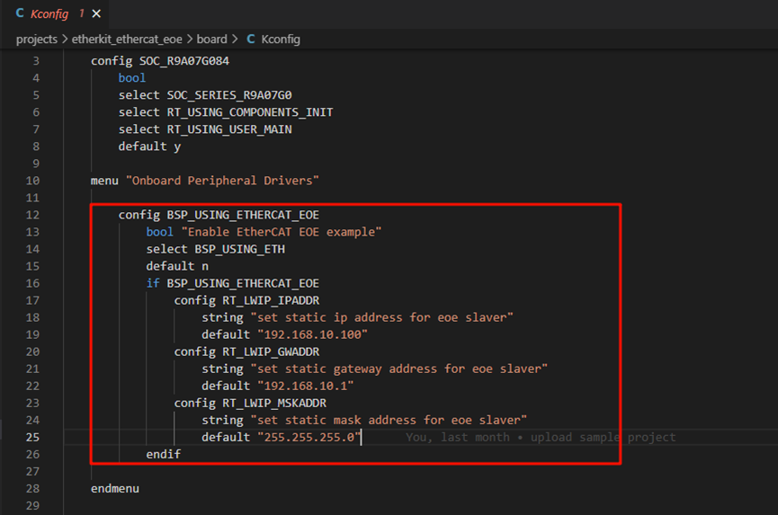
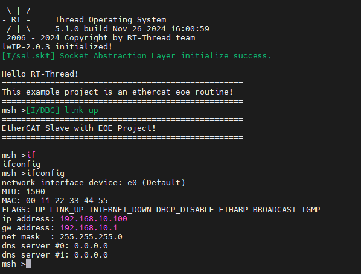
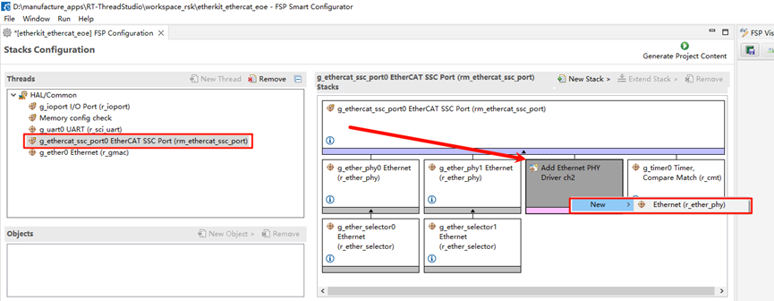
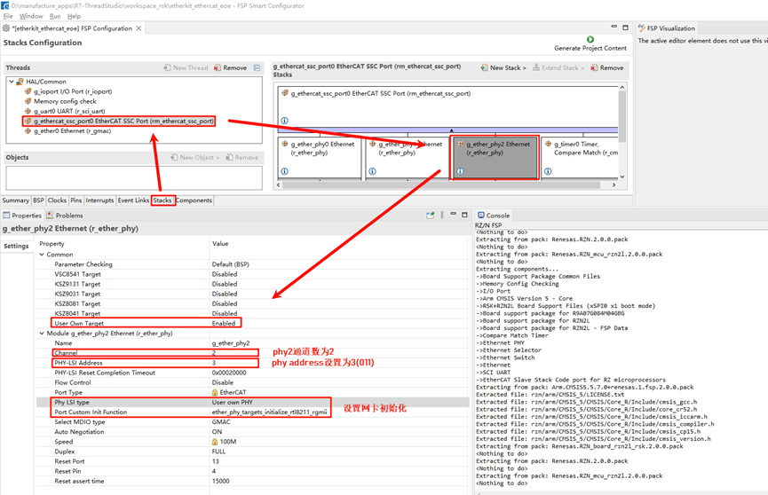
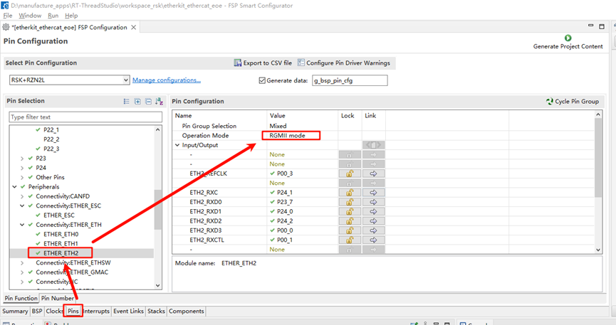
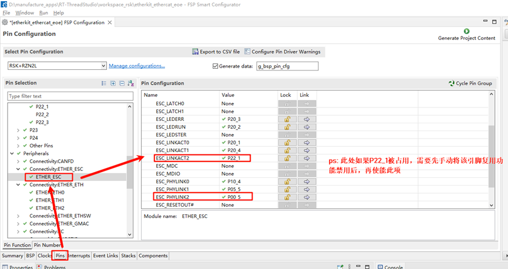
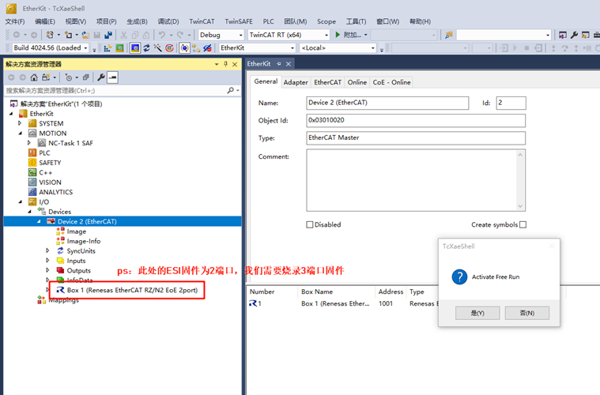
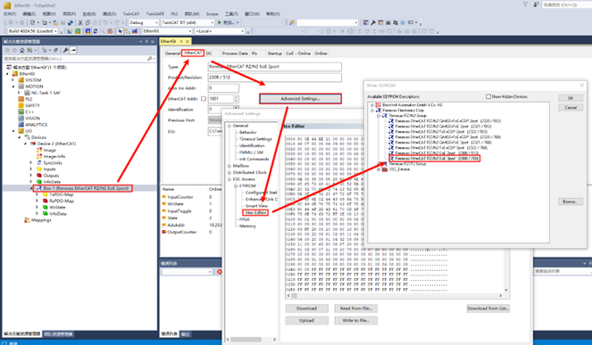
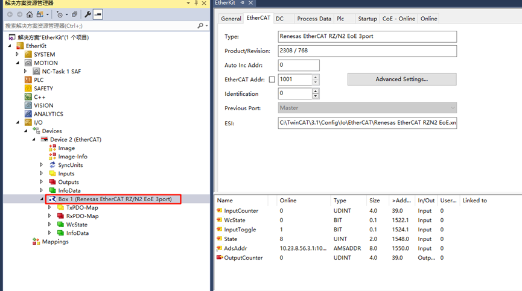

# EtherCAT EOE Usage Instructions

**English** | [**中文**](./README_zh.md)

## Introduction

EtherCAT EoE (**Ethernet over EtherCAT**) is a communication protocol in the EtherCAT standard, designed to transfer standard Ethernet packets over an EtherCAT network. It allows non-real-time Ethernet communication to coexist with real-time EtherCAT communication, providing flexible network integration for industrial automation systems.

The main features and functions of EoE are as follows:

1. **Ethernet Tunnel Transmission**:

   - EoE encapsulates standard Ethernet packets within EtherCAT communication frames, enabling standard Ethernet protocols (such as TCP/IP, UDP, HTTP, etc.) to be transmitted over an EtherCAT network.

2. **Extended Network Functionality**:

   - EoE allows EtherCAT slaves to function as virtual Ethernet devices within a TCP/IP network.
   - It enables remote standard Ethernet devices to be accessed via the EtherCAT communication link.

3. **Efficient Integration**:

   - The implementation of EoE does not affect the real-time performance of EtherCAT.
   - Non-real-time Ethernet communication and real-time EtherCAT data exchange can coexist, each serving its respective purpose.

4. **Usage Scenarios**:

   - **Device Management**: Access EtherCAT slave devices via IP for remote configuration, diagnostics, and firmware updates.
   - **Hybrid Networks**: Integrate devices that require standard Ethernet communication (such as cameras, sensors, or industrial PCs).

5. **Simplified Network Wiring**:

   - In industrial automation scenarios, EoE allows Ethernet devices to be accessed over the EtherCAT network, reducing the need for separate Ethernet cabling.

6. **Typical Applications**:

   - Remote monitoring and diagnostics in factory automation systems.
   - Communication bridging between industrial robots or production equipment and external IT systems.

This section demonstrates how to implement EtherCAT EoE master-slave communication using Beckhoff TwinCAT3 and the EtherKit development board.

## Prerequisites

### Software Environment:

- [RT-Thread Studio](https://download-redirect.rt-thread.org/download/studio/RT-Thread Studio_2.2.8-setup-x86_64_202405200930.exe)
- [RZN-FSP v2.0.0](https://github.com/renesas/rzn-fsp/releases/download/v2.0.0/setup_rznfsp_v2_0_0_rzsc_v2024-01.1.exe)
- [Beckhoff Automation TwinCAT3](https://www.beckhoff.com/en-us/support/download-finder/search-result/?c-1=26782567)

### Hardware Environment:

- EtherKit development board
- One Ethernet cable
- Jlink debugger

## TwinCAT3 Configuration

> Before launching TwinCAT3, some configuration steps are necessary:

### Install the ESI File

Before launching TwinCAT, copy the ESI file included in the release folder to the TwinCAT target directory: `..\TwinCAT\3.x\Config\IO\EtherCAT`

> Note: The current version of the ESI file is located at: `..\board\ports\ethercat\ESI_File\Renesas EtherCAT RZT2 EoE.xml`


### Add TwinCAT Ethernet Driver

Add the TwinCAT Ethernet driver (only required for initial configuration). From the Start menu, select [TwinCAT] → [Show Realtime Ethernet Compatible Device…], choose the connected Ethernet port from the communication ports and install it.


Here, we can see all the Ethernet adapters on the PC. After selecting the port we are testing, click Install:


Check the network adapter to see that it has been successfully installed:


## FSP Configuration Instructions

Next, configure the pin initialization. Open the installed RZN-FSP 2.0.0 and select the root directory of your project:


We will configure the following peripherals and pins: Click New Stack and add the `ethercat_ssc_port` peripheral:


Configure `ethercat_ssc_port`: Change the Reset Port to `P13_4` and set the EEPROM size to "Under 32Kbits":


Enable the Ethernet card type and configure the network card device parameters. Here we add two PHYs (`phy0` and `phy1`). Note that EtherKit uses the RTL8211 Ethernet card, which is not supported by Renesas FSP. However, Renesas provides an interface for user-defined network cards, so we configure the card accordingly, setting the MDIO type to GMAC and the network card initialization callback function to `ether_phy_targets_initialize_rtl8211_rgmii()`:


Configure the Ethernet pin parameters, setting the operation mode to RGMII:


ETHER_ESC Settings:


ETHER_GMAC Configuration:


Add a CMT timer to `ethercat_ssc_port` and configure the interrupt priority:


Add the Ethernet peripheral:


Set the Ethernet interrupt callback to: `user_ether0_callback`


Finally, click Generate Project Content to generate the underlying driver source code.

## Build Configuration

1. **Modify SConscript**: Navigate to the project and locate the file at the specified path: `.\rzn\SConscript`. Replace the file content with the following:

```python
Import('RTT_ROOT')
Import('rtconfig')
from building import *
from gcc import *

cwd = GetCurrentDir()
src = []
group = []
CPPPATH = []

if rtconfig.PLATFORM in ['iccarm'] + GetGCCLikePLATFORM():
    if rtconfig.PLATFORM == 'iccarm' or GetOption('target') != 'mdk5':
        src += Glob('./fsp/src/bsp/mcu/all/*.c')
        src += Glob('./fsp/src/bsp/mcu/all/cr/*.c')
        src += Glob('./fsp/src/bsp/mcu/r*/*.c')
        src += Glob('./fsp/src/bsp/cmsis/Device/RENESAS/Source/*.c')
        src += Glob('./fsp/src/bsp/cmsis/Device/RENESAS/Source/cr/*.c')
        src += Glob('./fsp/src/r_*/*.c')
        CPPPATH = [ cwd + '/arm/CMSIS_5/CMSIS/Core_R/Include',
                    cwd + '/fsp/inc',
                    cwd + '/fsp/inc/api',
                    cwd + '/fsp/inc/instances',]

if GetDepend('BSP_USING_ETHERCAT_EOE'):
    src += Glob('./fsp/src/rm_ethercat_ssc_port/*.c')
    CPPPATH += [cwd + '/fsp/src/rm_ethercat_ssc_port']

group = DefineGroup('rzn', src, depend = [''], CPPPATH = CPPPATH)
Return('group')
```

2. **Modify Kconfig**: Open the file located at `projects\etherkit_ethercat_eoe\board\Kconfig`. Add the EOE configuration under the *Onboard Peripheral Drivers* section:

```c
        config BSP_USING_ETHERCAT_EOE
            bool "Enable EtherCAT EOE example"
            select BSP_USING_ETH
            default n
            if BSP_USING_ETHERCAT_EOE
                config RT_LWIP_IPADDR
                    string "set static ip address for eoe slaver"
                    default "192.168.10.100"
                config RT_LWIP_GWADDR
                    string "set static gateway address for eoe slaver"
                    default "192.168.10.1"
                config RT_LWIP_MSKADDR
                    string "set static mask address for eoe slaver"
                    default "255.255.255.0"
            endif
```

As shown in the following figure:



3. **Development Environment**:  
   - If you are using Studio for development, right-click the project and select **Sync SCons Configuration to Project**.  
   - If you are using IAR for development, right-click in the current project directory to open the environment and execute:  
     ```bash
     scons --target=iar
     ```
     to regenerate the configuration.

## RT-Thread Studio Configuration

After completing the FSP configuration, pin and peripheral initialization is done. Now, we need to enable the EtherCAT EOE example. Open Studio, click RT-Thread Settings, and enable the EOE example:


Next, we need to configure the system to disable DHCP and use a static IP. Click on the component -> enable the lwip stack, and select to disable DHCP:


Once enabled, save the settings and synchronize the scons configuration. Then compile and download the program. After resetting the development board, observe the serial log:



## EtherCAT EOE Configuration

### Create a New TwinCAT Project

Open TwinCAT software, click File → New → New Project, select TwinCAT Projects, and create a TwinCAT XAR Project (XML format):


### Start the EOE App on the Slave

After powering on the EtherKit development board, connect the Ethernet cable to the ETH0 port. EtherCAT will run by default.


### Scan for Slave Devices

After creating the project, find Devices in the left sidebar, right-click, and select Scan Devices. Normally, if the slave device is scanned successfully, it will display: Device x [EtherCAT]. If the scan fails, it will show: Device x [EtherCAT Automation Protocol], indicating that the slave initialization failed.


Click OK, and a window will appear: Scan for Boxes. Click Confirm, and another window will pop up: Activate Free Run. Since we are using EOE for the first time and need to update the EEPROM firmware, do not activate it yet.

### Update EEPROM Firmware

Back in TwinCAT, in the left sidebar, we can see the slave device after successfully scanning it, so we can access the master-slave configuration interface:


Double-click Box 1, then click EtherCAT in the top navigation bar and select Advanced Settings…:


Click Download from List… as shown:


Write the ESI firmware to the EEPROM. Since we are configuring a dual-port setup, select `Renesas EtherCAT RZ/N2 EOE 2port`. If you are configuring a three-port setup, select the ESI file with the `3port` suffix.


After downloading, right-click Device x (EtherCAT), remove the device, re-scan, add the device again, and activate it (as described above).


## EtherCAT EOE Communication

After downloading the EEPROM ESI firmware and re-scanning and adding the device, we can activate the device. We will observe two green LEDs on the board (indicating normal communication). One LED flashes at a high frequency, while the other stays steady. At

 this point, double-click the EOE tab on the TwinCAT device page to access the EOE communication configuration.


### Enable DHCP or Assign an IP Address

At this point, you can use DHCP to configure an automatic IP or manually assign a static IP address to the EtherCAT slave node.


Once configured, the EOE App will work, allowing communication over EtherCAT!

## Extension Explanation: 3-Port Ethernet EOE Communication

The example project currently defaults to a 2-port Ethernet EOE configuration. If you need to use a 3-port EOE communication setup, please follow the instructions in this chapter for configuration.

### FSP Configuration

First, open the FSP configuration file in the project. We will add a third PHY for the SSC stack.



Next, configure the channel count for PHY2 to 2, and set the PHY address to 3 (as referenced from the schematic manual). Also, configure the network card model as user-defined and set the Ethernet initialization callback function.



Then, configure the pins to enable ETH2.



Next, configure the ESC corresponding to the ETH2 LINK pins, setting ESC_LINKACT2 (P22_1) and ESC_PHYLINK2 (P00_5). Note: **If P22_1 is already in use, you must first manually disable its multiplexing function before enabling this option**.



After completing the above configurations, you can click to generate the source code, return to the project, compile it, and download the program to the development board.

### ESI Firmware Update

Similarly, we need to wait for the development board's EOE slave to successfully run. Then, open the TwinCAT 3 software to scan for devices. Once the EtherCAT device is found, do not activate it immediately. In the pop-up window, click "No."



Refer to the **"Update EEPROM Firmware"** section. Follow the same steps, but this time, select the firmware to be updated as: Renesas EtherCAT RZ/N2 EoE 3port [2308 / 768], and click to flash the firmware.



Once the flashing is complete, we need to delete the device again and scan it once more. You should see that the slave device description has been updated to "Box 1 (Renesas EtherCAT RZ/N2 EoE 3port)."



For further EOE development, please refer to the previous chapters.