# EtherKit EtherCAT-EOE例程

**中文** | [**English**](./README.md)

## 简介

EtherCAT EoE（**Ethernet over EtherCAT**）是 EtherCAT 协议中的一种通信协议，用于在 EtherCAT 网络上传输标准以太网数据包。它允许非实时的以太网通信与实时的 EtherCAT 通信共存，为工业自动化系统提供了灵活的网络集成能力。

以下是 EoE 的主要特点和功能：

1. **以太网隧道传输**：

2. - EoE 在 EtherCAT 通信帧中封装标准的以太网数据包，使标准以太网通信协议（如 TCP/IP、UDP、HTTP      等）可以通过 EtherCAT 网络传输。

3. **扩展网络功能**：

4. - 支持将 EtherCAT 从站作为虚拟以太网设备加入到 TCP/IP 网络中。
   - 允许通过 EtherCAT 通信链路访问远程的标准以太网设备。

5. **高效整合**：

6. - EoE 的实现不会影响 EtherCAT 的实时性能。
   - 非实时的以太网通信与实时的 EtherCAT 数据交换能够共存，各司其职。

7. **使用场景**：

8. - **设备管理**：通过 IP 协议访问 EtherCAT 从站设备（如远程配置、诊断和固件更新）。
   - **混合网络**：集成需要标准以太网通信的设备（如摄像头、传感器或工控机）。

9. **简化网络布线**：

10. - 在工业自动化场景中，EoE 允许通过 EtherCAT 网络访问以太网设备，从而减少了独立以太网布线的需求。

11. **典型应用**：

12. - 工厂自动化系统中的远程监控和诊断。
    - 工业机器人或生产设备与外部 IT 系统的通信桥接。

本节将演示如何使用Beckhoff TwinCAT3和EtherKit开发板实现EtherCAT EOE主从站通信。

## 前期准备

软件环境：

- [RT-Thread Studio](https://download-redirect.rt-thread.org/download/studio/RT-Thread Studio_2.2.8-setup-x86_64_202405200930.exe)
- [RZN-FSP v2.0.0](https://github.com/renesas/rzn-fsp/releases/download/v2.0.0/setup_rznfsp_v2_0_0_rzsc_v2024-01.1.exe)
- [Beckhoff Automation TwinCAT3](https://www.beckhoff.com/en-us/support/download-finder/search-result/?c-1=26782567)

硬件环境：

- EtherKit开发板
- 网线一根
- Jlink调试器

## TwinCAT3配置

> 在启动TwinCAT3之前，我们还需要做一些配置操作：

### 安装ESI文件

启动TwinCAT之前，将发布文件夹中包含的ESI文件复制到TwinCAT目标位置：“..\TwinCAT\3.x\Config\IO\EtherCAT”

> 注意：当前版本的 ESI 文件位于：..\board\ports\ethercat\ESI_File\Renesas EtherCAT RZT2 EoE.xml”

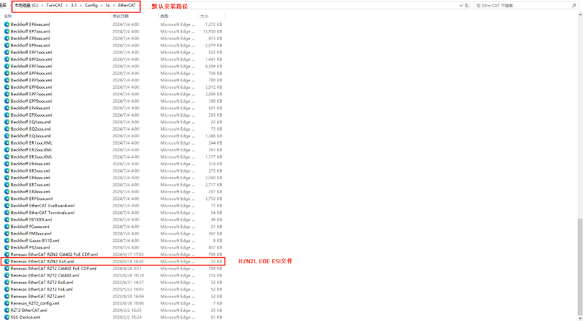

### 添加TwinCAT网卡驱动

添加 TwinCAT 的以太网驱动程序（仅限首次使用配置即可）；从开始菜单中，选择 [TwinCAT] → [Show Realtime Ethernet Compatible Devise…]，从通信端口中选择连接的以太网端口并安装。

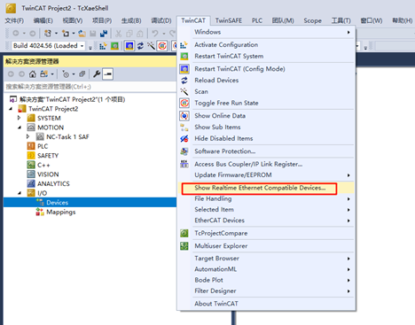

在这里我们能看到目前PC端的所有以太网适配器信息，选择我们测试要用的端口后，点击安装：

检查网络适配器，可以看到已经成功安装了：

## FSP配置说明

接下来就是引脚初始化配置了，打开安装的RZN-FSP 2.0.0，选择我们工程的根目录：

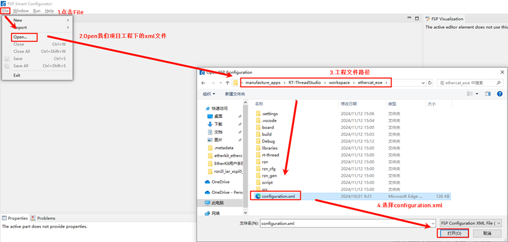

我们进行以下外设及引脚的配置：点击New Stack，并添加 ethercat_ssc_port 外设：

配置ethercat_ssc_port：修改Reset Port为P13_4，同时EEPROM_Size大小设置为Under 32Kbits；

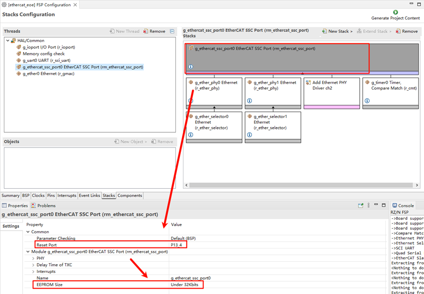

使能网卡类型、配置网卡设备参数，这里我们添加两个phy（phy0和phy1），其中需要注意的是，EtherKit使用的是rtl8211网卡，并不在瑞萨FSP的支持范围内，但好在瑞萨预留了用户自定义网卡接口，因此按照如下设置来配置网卡，同时设置MDIO类型为GMAC，设置网卡初始化回调函数ether_phy_targets_initialize_rtl8211_rgmii()；

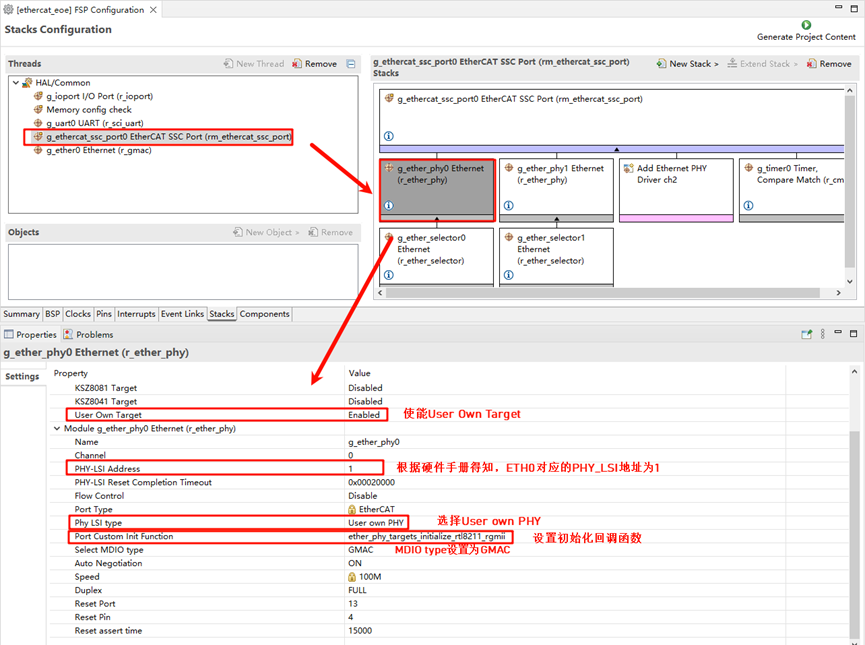

网卡引脚参数配置，选择操作模式为RGMII：

ETHER_ESC设置：

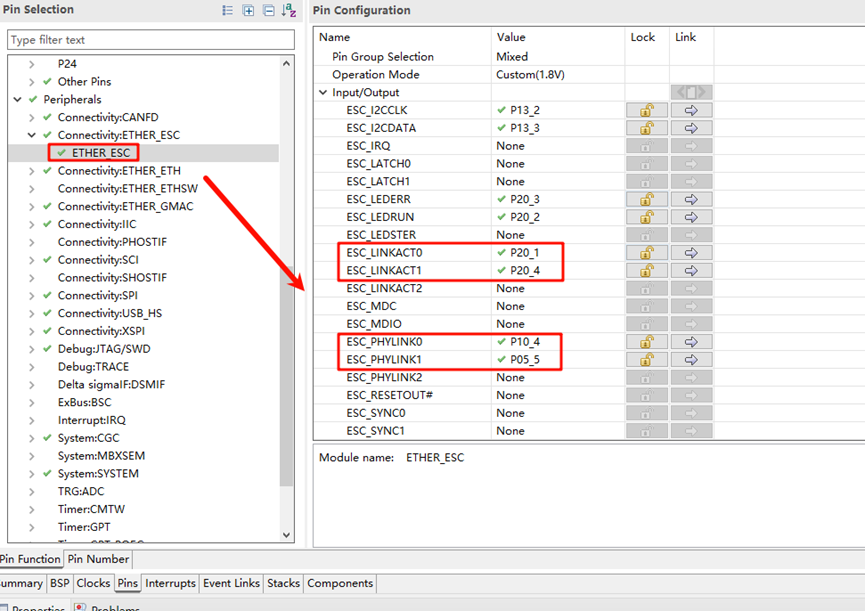

ETHER_GMAC配置：

为ethercat_ssc_port添加cmt定时器并配置中断优先级：

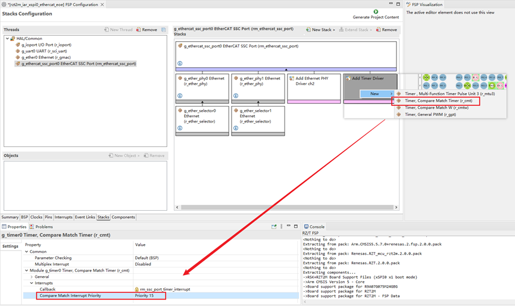

添加Ethernet外设：

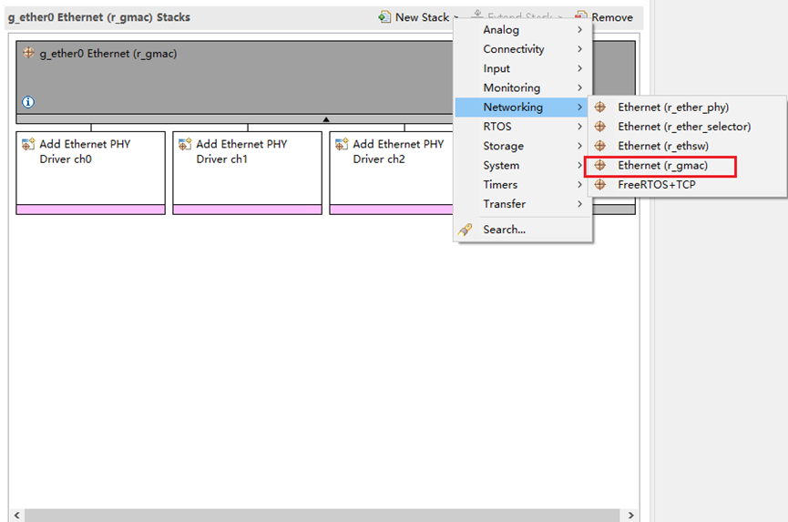

ethernet中断触发回调设置为：user_ether0_callback

最后点击Generate Project Content生成底层驱动源码。

## RT-Thread Studio配置

完成FSP配置之后，引脚及外设的初始化就暂告一段落了，接下来需要我们使能EtherCAT EOE示例，打开Studio，点击 RT-Thread Settings，使能EOE示例：

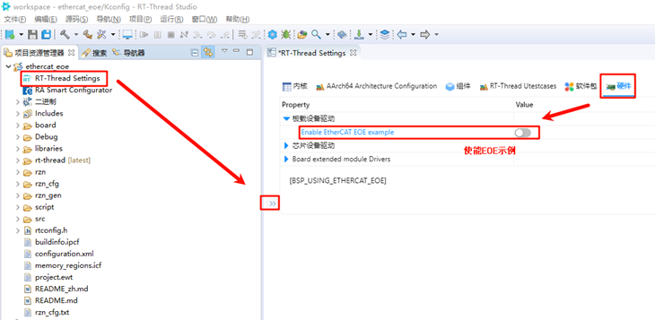

使能完毕后我们保存settings配置并同步scons配置，同时编译并下载程序，复位开发板后观察串口日志：

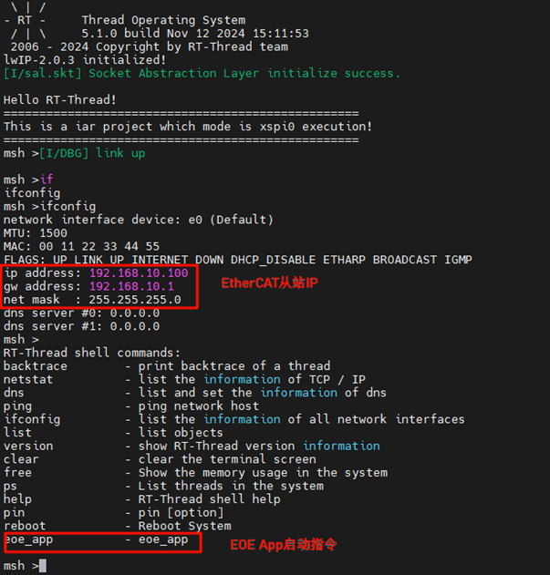

## EtherCAT EOE配置

### 新建TwinCAT工程

打开TwinCAT软件，点击文件->新建->新建项目，选择TwinCAT Projects，创建TwinCAT XAR Project(XML format)工程：

### 从站启动EOE App

将EtherKit开发板上电后，需要使用网线连接ETH0网口，ethercat会默认运行。

### 从站设备扫描

新建工程之后，在左侧导航栏找到Devices，右键选择扫描设备。正常来说如果扫描从站设备成功的话是会显示：Device x[EtherCAT]；而扫描失败则显示的是：Device x[EtherCAT Automation Protocol]，此时就代表从站初始化失败。

点击Ok后会弹出一个窗口：Scan for boxes，点击确认后，会再次弹出窗口：Activate Free Run，由于我们首次使用EOE还需要更新EEPROM固件，所以暂时先不激活。

### 更新EEPROM固件

回到TwinCAT，在左侧导航栏中，由于我们已经成功扫描到从站设备，因此可以看到主从站的配置界面：

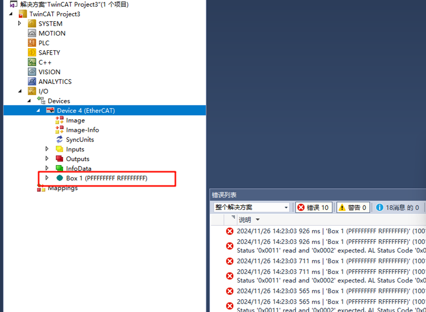

我们双击Box 1，在中间界面的上方导航栏中单击EtherCAT，并点击Advanced Settings…：

这里按图示点击Download from List…：

我们写入ESI固件到EEPROM中，这里由于我们配置的是双网口，所以选择Renesas EtherCAT RZ/N2 EOE 2port，如果你配置的是三网口的话则选择3port后缀的ESI文件进行下载。

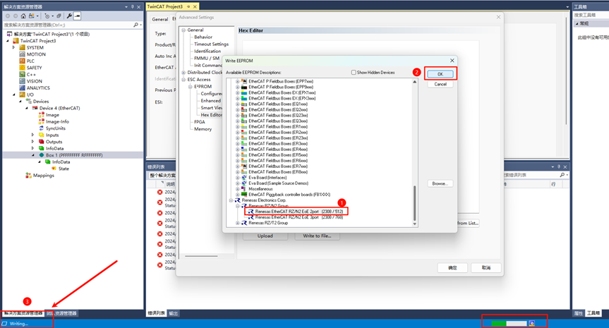

下载完成之后，我们右键Device x(EtherCAT)移除设备后重新扫描并添加设备，并完成激活工作（参考上文）。

## EtherCAT EOE通信

在完成EEPROM下载ESI固件并重新扫描添加设备后，激活Device我们可以观察到，板载有两颗绿色LED亮起（通信正常），并且其中一颗保持高频率闪烁一颗保持常亮，此时主从站就可以建立起正常的通信了。

### EIO测试

由于我们提供的EOE工程集成了EIO协议，因此可直接进行EIO测试，在本例程中，我们提供三个USER LED作为EIO的输入，回到TwinCAT，依次点击Device x(EtherCAT)->Box 1(Renesas EtherCAT RZ/N2 EOE 2port)->RxPD0-Map->OutputCounter：

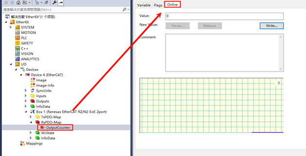

此时的开发板默认的三颗USER LED还处于灭灯状态，这里我们点击左上角的Online，并且 Write Value：1

此时可以发现从站开发板同时亮起LED0（红灯），EIO测试正常，当然也可以随意尝试其他value组合，会有不同的LED阵列亮暗行为。

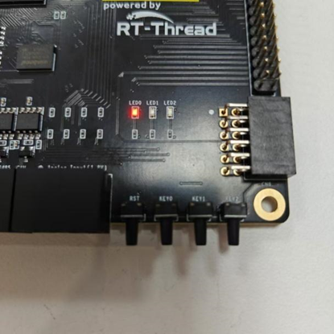

### EOE测试

打开以太网适配器，选择主站所使用的适配器并设置静态IP：

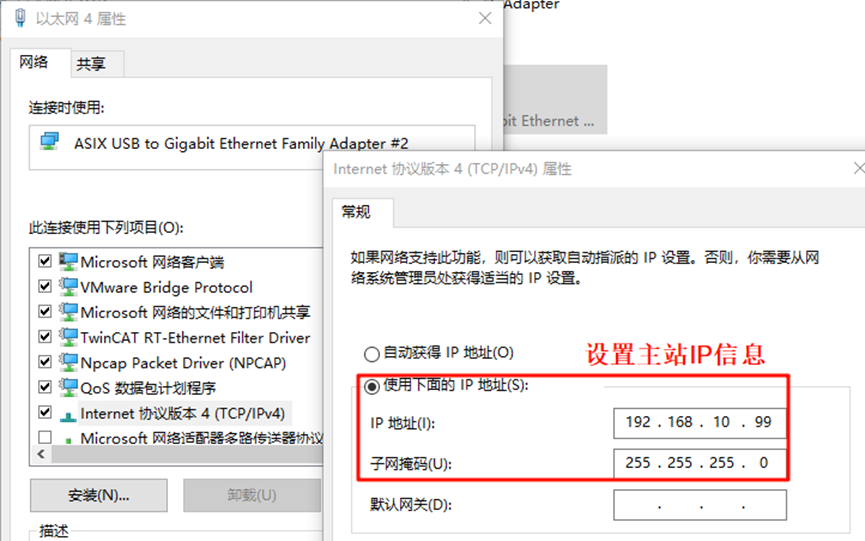

回到TwinCAT，我们点击Box 1，选择EtherCAT->Advanced Settings…->MailBox->EOE->设置IP Port，设置从站IP信息：

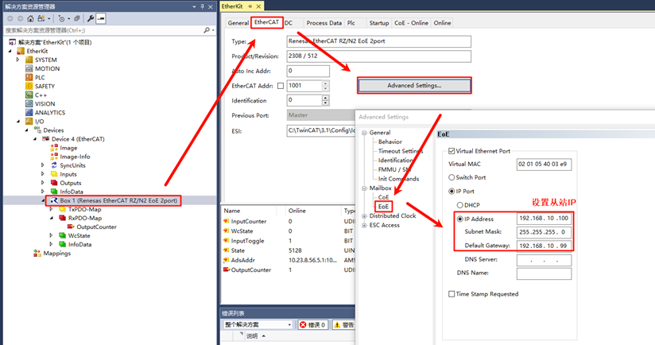

完成这些配置后，我们就能测试使用EtherCAT EOE对主从站进行ping测试了：

* 主站IP：192.168.10.99
* 从站IP：192.168.10.100

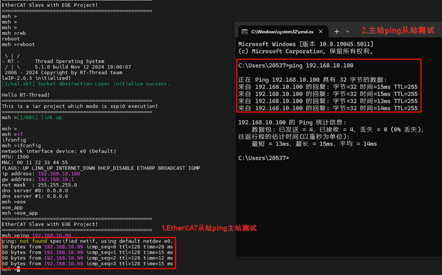