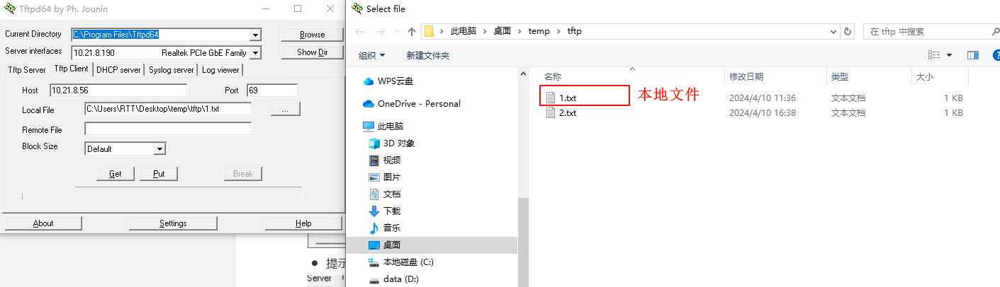
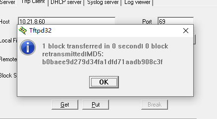
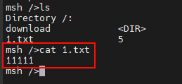
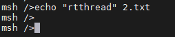
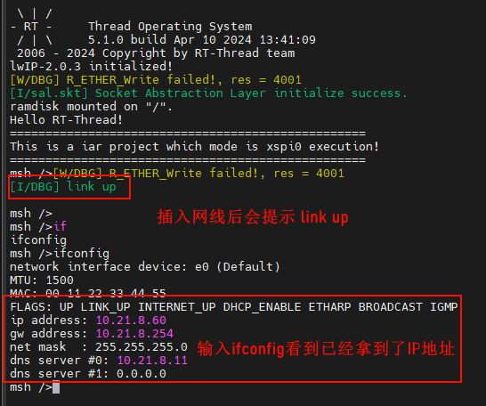
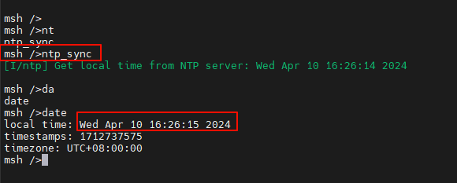

# EtherKit Development Board BSP Documentation

English|[**Chinese** ](./README_zh.md)

## Introduction

This project provides basic Ethernet functionalities, including `ping`, `tftp`, `ntp`, and `iperf`.

## Hardware Connection

Connect an Ethernet cable to any of the three network ports on the development board, and connect the other end to a switch that is connected to the internet.

## Experimental Phenomenon

Burn the code onto the development board and open the serial terminal to view the logs:

## **TFTP Server Send Test**

1. Install the Tftpd64-4.60-setup software from netutils-v1.3.3\tools

2. Go back to the development board's serial terminal and input the `tftp_server` command to start the TFTP server service

3. Open the installed Tftpd64-4.60 software

   ● Host is the IP address of the development board;

   ● Port is the TFTP server port number, default: 69;                      

   ● Local File is the storage path for the file sent by the client (including the filename);

   ● Click the Put button to send the file to the device.

4. After clicking Put, you will receive a confirmation message:

5. Return to the development board terminal, input `ls` to see the received 1.txt file from the computer; you can also input `cat 1.txt` to check if the content matches what was sent;

   ● Note: Since ramfs is enabled, do not transfer files larger than 128KB! This is only for testing purposes

## **TFTP Receive Test**

1. Go back to the development board's serial terminal and input `echo "rtthread" 2.txt` to create and write custom content to the file:

2. Verify whether the file has been created and written successfully:

3. Open the installed Tftpd64-4.60 software:

   ● Local File is the storage path for the file received by the client (including the filename);

   ● Remote File is the path of the file sent by the server (including the filename), enter the name of the file we want to receive;

   ● Enter the TFTP server port number, default: 69;

   ● Click the Get button;

   ● You can see that 2.txt has been received successfully, and the content is also the content of the file in the development board's file system

## NTP Network Time Synchronization

> NTP (Network Time Protocol) is a protocol used to synchronize computer time. It ensures that the computer clock remains synchronized with global time standards.

### Experimental Phenomenon

Burn the code onto the development board and open the serial terminal to view the logs:

After entering the `ntp_sync` command, you will see that the network time has been obtained. Entering the `date` command will show that the RTC time has been synchronized.

