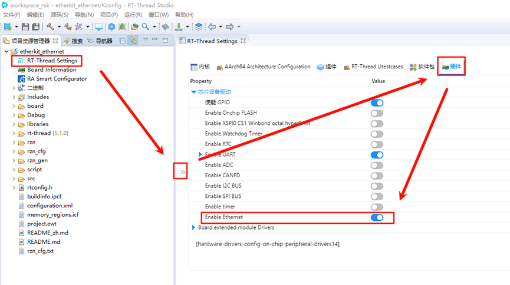

# EtherKit 开发板 BSP 说明

**中文** | [**English**](./README.md)

## 简介

本工程提供 ethernet 的基础功能，比如 `ping `功能。

## 硬件连接

需要使用网线连接到开发板的三网口其中任意一个网口，另一头连接到可以联网的交换机上。

## FSP配置说明

打开工程配置文件configuration.xml，新增r_gamc Stack：

点击g_ether0 Ethernet，配置中断回调函数为user_ether0_callback：

下面配置phy信息，选择g_ether_phy0，Common配置为User Own Target；修改PHY LSI地址为1（根据原理图查询具体地址）；设置phy初始化回调函数为ether_phy_targets_initialize_rtl8211_rgmii()；同时设置MDIO为GMAC。

配置g_ether_selector0，选择以太网模式为交换机模式，PHY link设置为默认active-low，PHY接口模式设置为RGMII。

网卡引脚参数配置，选择操作模式为RGMII：

ETHER_GMAC配置：

## RT-Thread Studio配置

回到Studio工程，配置RT-Thread Settings，点击选择硬件选项，找到芯片设备驱动，使能以太网；

## 以太网IP实验现象

烧录代码到开发板，打开串口终端查看日志：

