# Ethernet/IP 例程

**中文** | [**English**](./README.md)

## 简介

Ethernet/IP（以太网工业协议）是一种基于标准以太网架构的工业通信协议，广泛应用于自动化和控制系统中。它结合了TCP/IP协议和CIP（通用工业协议）标准，提供高速、可靠的数据传输，支持各种工业设备之间的实时通信。由于Ethernet/IP兼容现有的以太网硬件和网络，企业能够在不需要专用硬件的情况下，实现工业设备间的互联互通，提升生产效率和系统可靠性。

OpENer 是用于 I/O 适配器设备的 EtherNet/IP™ 堆栈；支持多个 I/O 和显式连接；包括用于制作符合以太网/IP 规范中定义并由 [ODVA](http://www.odva.org/) 发布的 EtherNet/IP™ 兼容产品的对象和服务。

在本示例中将使用已经适配的OpENer软件包来实现Ethernet/IP通讯。

## 前期准备

软件环境：

- [CODESYS](https://us.store.codesys.com/)（Ethernet/IP通信模拟）
- - CODESYS
  - CODESYS Gateway（网关设备）
  - CODESYS Control Win SysTray（软PLC设备）
- [Npcap](https://npcap.com/dist/npcap-1.80.exe)（该软件是运行CODESYS必须的，需要提前安装好！）

硬件环境：

- EtherKit开发板

## FSP配置

打开工程配置文件configuration.xml，新增r_gamc Stack：


点击g_ether0 Ethernet，配置中断回调函数为user_ether0_callback：


下面配置phy信息，选择g_ether_phy0，Common配置为User Own Target；修改PHY LSI地址为1（根据原理图查询具体地址）；设置phy初始化回调函数为ether_phy_targets_initialize_rtl8211_rgmii()；同时设置MDIO为GMAC。


配置g_ether_selector0，选择以太网模式为交换机模式，PHY link设置为默认active-low，PHY接口模式设置为RGMII。


网卡引脚参数配置，选择操作模式为RGMII：


ETHER_GMAC配置：


## RT-Thread Settings 配置

双击打开 RT-Thread Settings，在搜索栏检索OpENer软件包并使能，下面是相关用户配置信息说明；

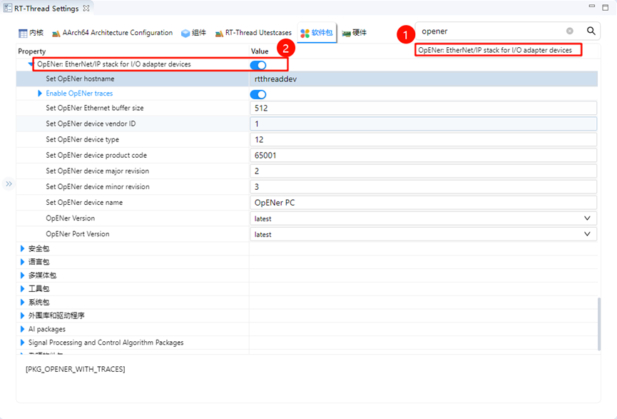

下面我们还需要配置禁用dhcp功能并使用静态IP，点击组件->使能lwip堆栈，选择禁用DHCP；

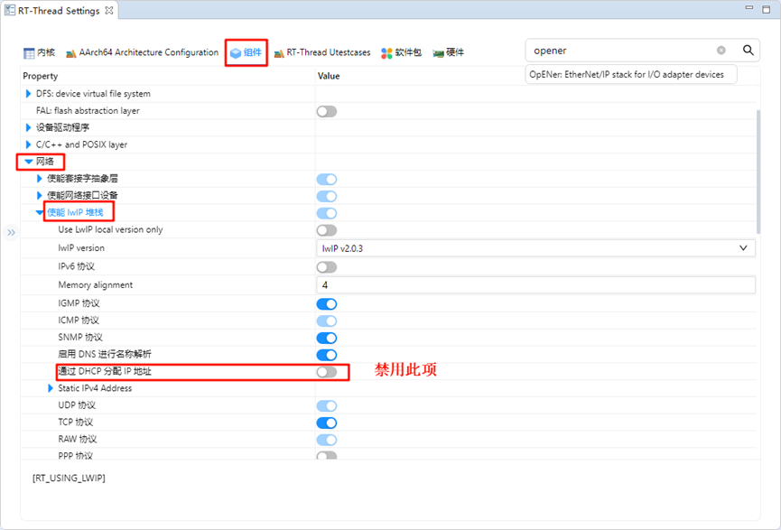

完成上述配置后，将程序编译下载至开发板。

## 网络配置

我们使用一根网线连接开发板与PC，同时在PC端配置静态IP：

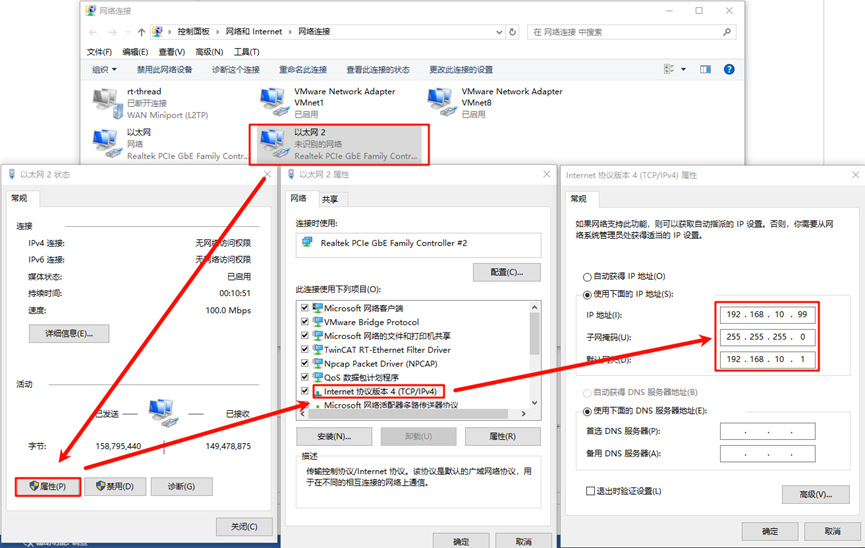

## 软PLC启动

CODESYS简介：CODESYS是德国3S公司开发的PLC软件，集成了PLC逻辑、运动控制、组态显示等功能。CODESYS，全称为“Controller Development System”，是一种基于 IEC 61131-3 标准的工业自动化编程工具。它不仅支持多种编程语言（如梯形图、结构化文本、功能块图等），还提供了丰富的库和功能模块，帮助工程师快速开发和调试 PLC（可编程逻辑控制器）和工业控制系统。CODESYS 的灵活性和强大功能使其成为工业自动化领域广泛使用的开发平台。

### CODESYS创建标准工程

请确保已安装CODESYS软件，安装之后下面这三个是我们需要用到的软件：


- CODESYS V3.5 SP20 Patch 3：Ethernet/IP通信模拟
- CODESYS Gateway V3：网关设备
- CODESYS Control Win V3 -x64 SysTray：软PLC设备

首先打开 **CODESYS V3.5 SP20 Patch 3**，依次选择 -> 新建工程 -> Projects -> Standard project ，配置工程名称及位置后点击确定：


弹出下面这个弹窗后保持默认配置(CODESYS Control Win V3 (CODESYS) / x64 (CODESYS))点击确定：

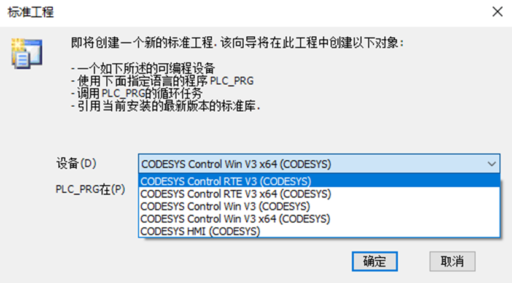

> 注意：如果您购买了[**CODESYS Control RTE SL**](http://store.codesys.cn/codesys/store/detail.html?productId=58)，可选择设备：CODESYS Control RTE V3 (CODESYS) / x64 (CODESYS)，正常评估用途可选择不安装此扩展包，选择 CODESYS Control Win V3 (CODESYS) / x64 (CODESYS) 设备创建即可。

创建成功后就可以看到主界面了：


### Gateway 及 软PLC 启动

依次打开下面两个软件：

- CODESYS Gateway V3（右键 Start Gateway）
- CODESYS Control Win V3 -x64 SysTray（右键 Start PLC）


回到 CODESYS 主站软件，双击 Device(CODESYS Control Win V3 x64) -> 通信设置 -> 扫描网络：


弹出设备用户登录窗口后，配置用户名和密码（用户自定义）：


检查网关设备及软PLC设备是否在线：


### Ethernet/IP EDS文件添加

**EDS** **文件**（Electronic Data Sheet）是 **Ethernet/IP** 中用于描述设备特性和通信参数的标准文件格式。它包含了有关设备的详细信息，包括设备类型、支持的服务、输入输出的定义、参数设置、设备的状态和配置选项等。

本项目的EDS文件位于如下路径：

- ..\packages\OpENer_port-latest\eds_file

选择设备存储库安装描述文件，选择上述路径下的 **opener_sample_app.eds** 文件。

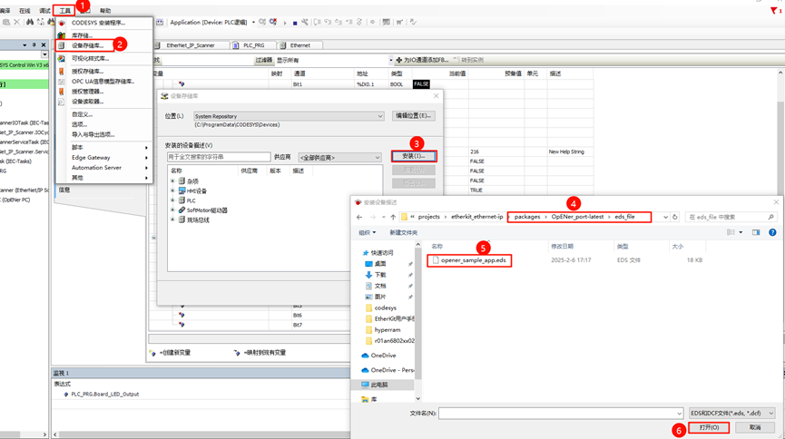

安装成功后可以看到 OpENer PC 从站描述文件：


### 设备添加

- Ethernet添加：左侧导航栏点击Device并右键添加设备，选择以太网适配器；

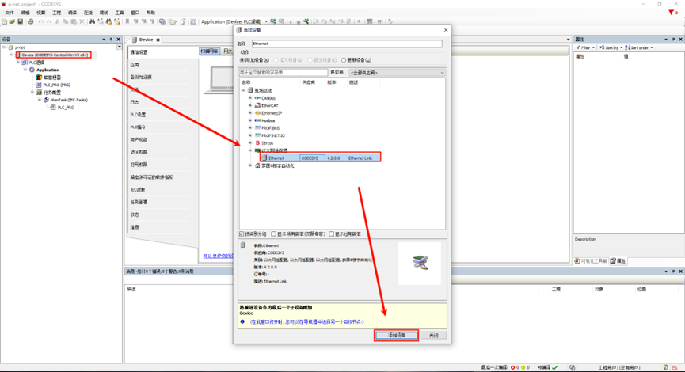

- EtherNet/IP扫描器添加：右键左侧导航栏中的Ethernet，选择EtherNet/IP Scanner

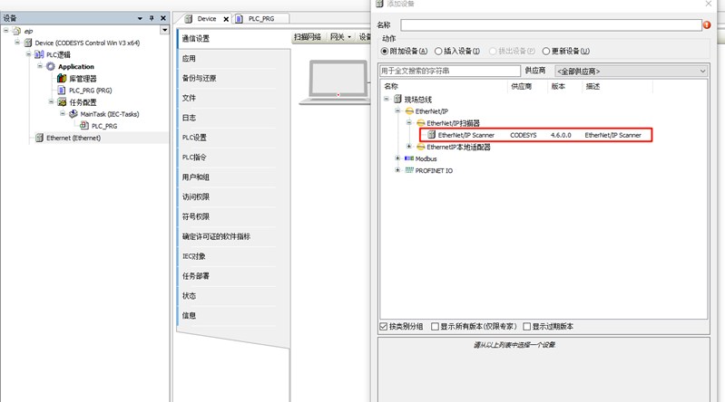

- EtherNet/IP总线设备添加：右键左侧导航栏中的 EtherNet/IP Scanner，选择  OpENer PC

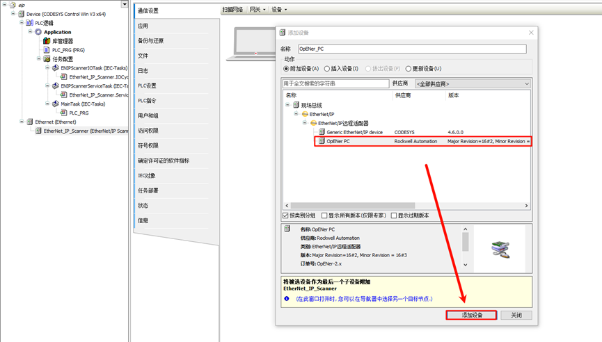

### 任务响应

保持默认配置即可。

### 网络配置

- Ethernet 配置：双击左侧导航栏中的Ethernet(Ethernet) -> 通用，修改网络接口为连接到开发板的以太网端口；

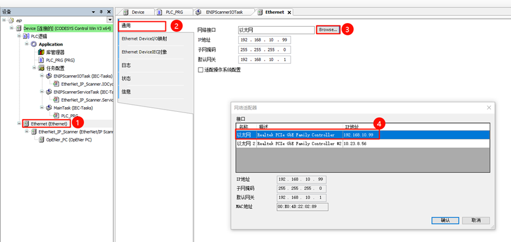

- EtherNet/IP总线设备网络配置：双击左侧导航栏 OpENer_PC(OpENer     PC) -> 通用->地址设置， 修改IP参数为开发板IP。

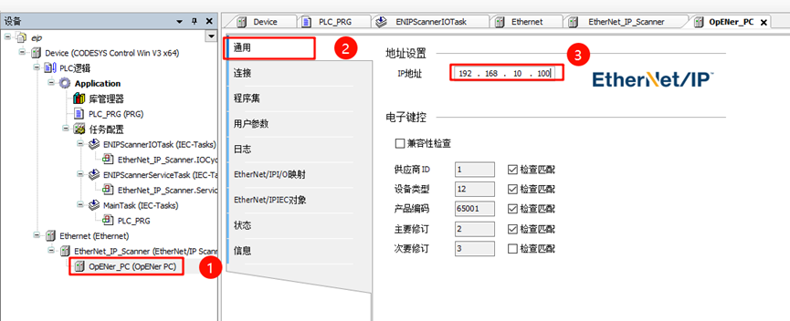

### EtherNet/IP线程应用启动

开发板端上电后，一旦检测到网卡 link up，则会自动启动 OpENer线程：

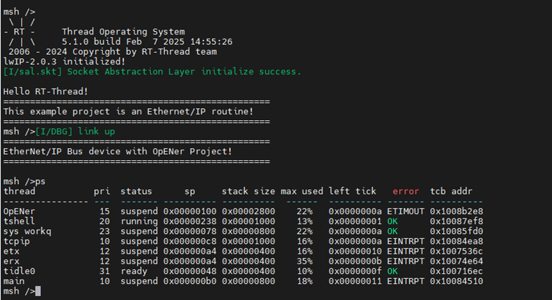

### 工程编译并启动调试

- step1：工程上方导航栏选择 编译-> 生成代码
- step2：选择 在线 -> 登录
- step3：点击 调试 -> 启动

此时就可以看到 EtherNet/IP Scanner已经正常运行了：

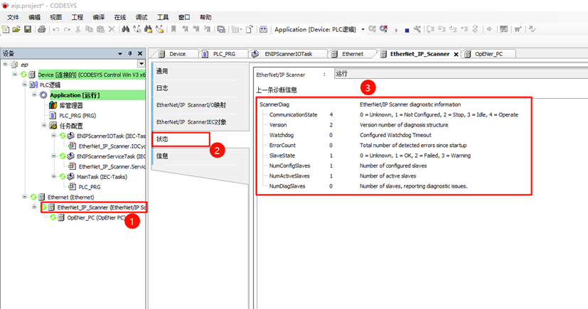

## PLC编程及CIP IO控制

首先我们点击左侧面板的Device->PLC逻辑->Application->PLC_PRG(PRG)，使用ST语言编程，编写变量及程序代码：

* 变量定义：下面这段变量中包含两个关键变量：Board_SW_Input（按Bit位标识控制器板载按键阵列）和Board_LED_Output（按Bit位标识控制器板载LED）。

```st
PROGRAM PLC_PRG
VAR
    Board_SW_Input: BYTE;
    Board_LED_Output: BYTE;
    Mask: BYTE;
    Shift: INT;
    i: INT;
END_VAR
```

* 程序定义：这段代码的功能是：根据Board_SW_Input的每一位的状态，设置Board_LED_Output的相应位。具体来说：
  * 如果Board_SW_Input的某一位为1，则对应的Board_LED_Output的该位为1。
  * 如果Board_SW_Input的某一位为0，则对应的Board_LED_Output的该位为0。

通过循环遍历所有8个位，实现了将输入的每一位状态映射到输出的每一位。

```st
FOR i := 0 TO 7 DO
    Shift := i;
    Mask := SHL(1, Shift);
    
    IF (Board_SW_Input AND Mask) = Mask THEN
        Board_LED_Output := Board_LED_Output OR Mask;
    ELSE
        Board_LED_Output := Board_LED_Output AND NOT Mask;
    END_IF
END_FOR
```

工程中的配置位置如下图所示：

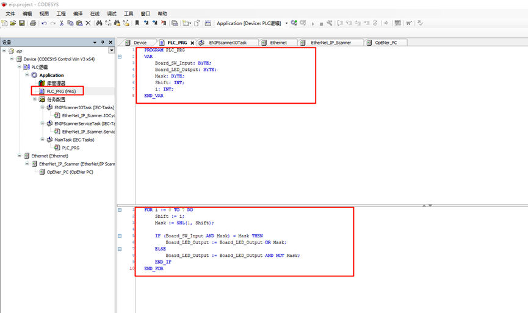

由于加载eds文件后默认只会显示一个连接配置（Board LED Exclusive Owner），我们还需要将eds内置的另外一个配置加载出来，点击左侧菜单栏选择OpENer_PC(OpENer PC)->连接，点击添加连接…，并选择Board SW Input Only。

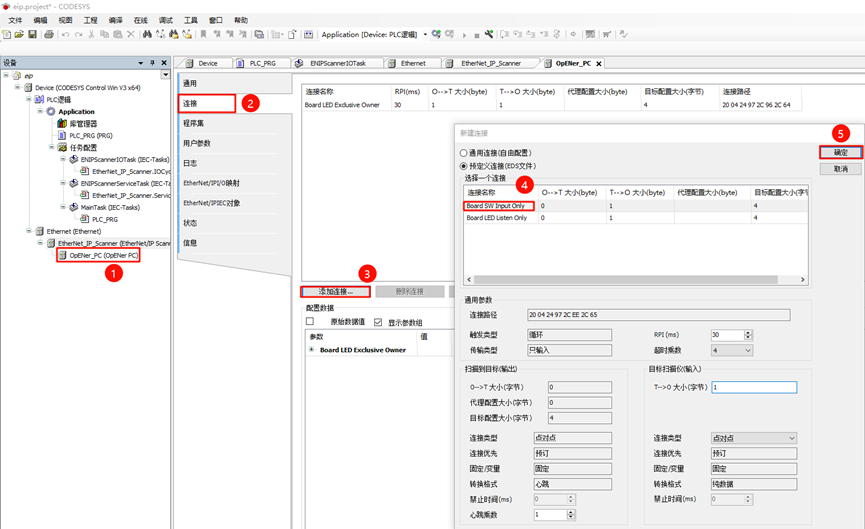

接下来点击Ethernet/IPI/O映射，这里我们需要把前面定义的ST变量映射到此处的变量中，将Board_LED_Output映射到通道：Board LED Output Data；Board_SW_Input映射到通道：Board SE Input Data。

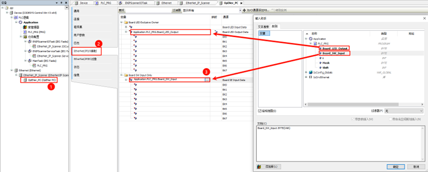

接着我们点击上方导航栏的编译->生成代码，然后选择在线->登录，此时便可动态观察程序运行状态，例如我们按住etherkit开发板上的KEY1，可以发现板载LED0（红灯）处于灭灯状态，当我们松开KEY1，LED0保持常亮；按住开发板的KEY2，板载LED2（绿灯）处于灭灯状态，松开KEY2，LED2保持常亮。

同时在OpENer_PC(OpENer PC)->EtherNet/IPI/O映射也可以观察Bit位的当前值，当对应按键的Bit位为TRUE时，即代表按键按下，同时对应的Bit位LED亮起，并显示当前值为TRUE：

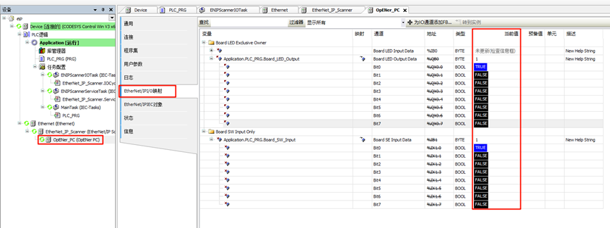

