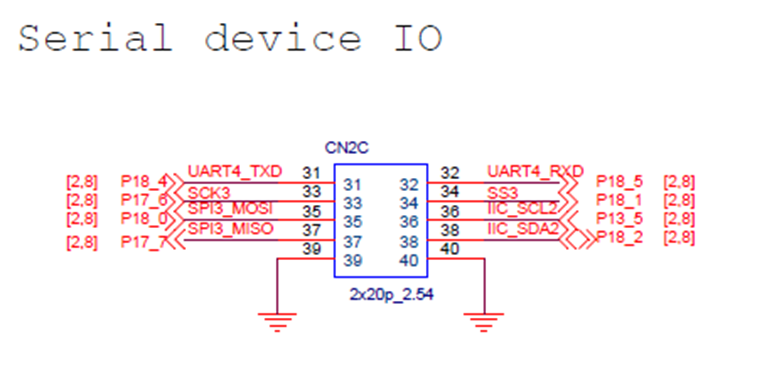
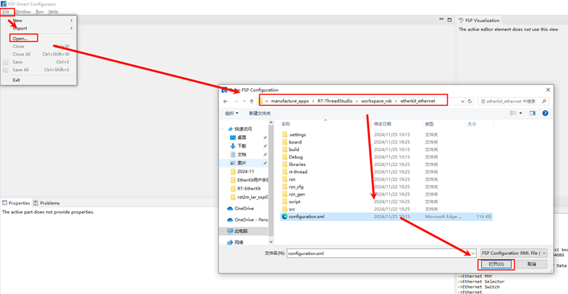
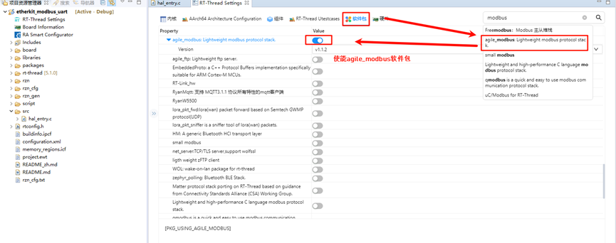
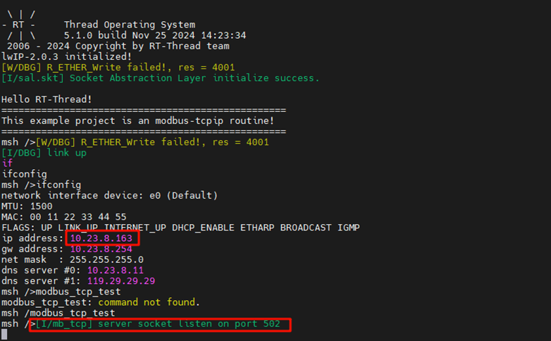
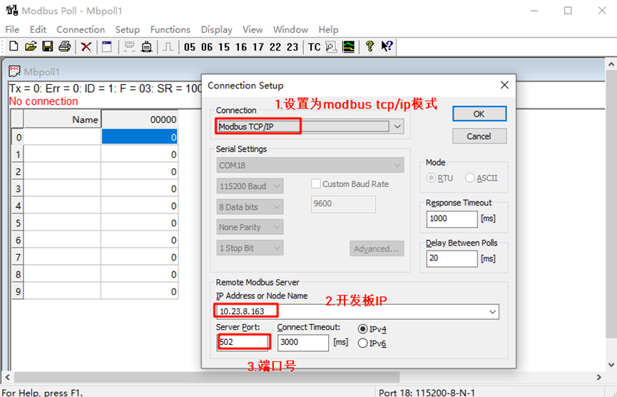
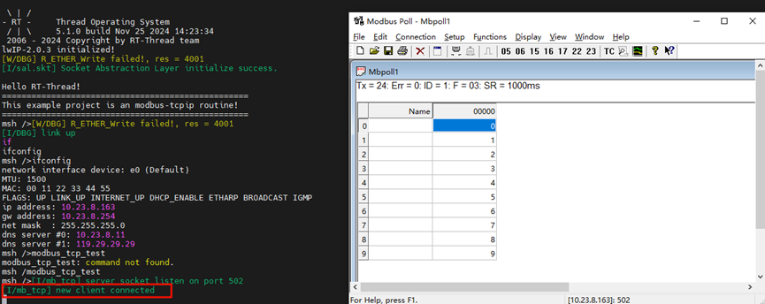
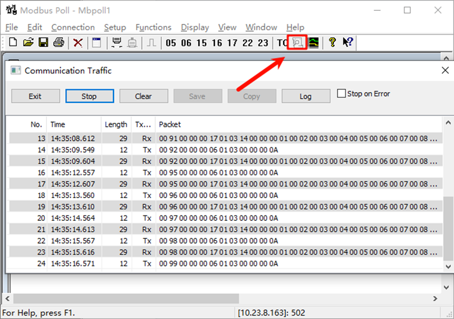

# Modbus-TCP/IP Usage Instructions

**English** | [**中文**](./README_zh.md)

## Introduction

This example is based on the agile_modbus package and demonstrates Modbus protocol communication over TCP/IP.

## Hardware Requirements

## FSP Configuration Instructions

* Open the project configuration file `configuration.xml`:

* Add the `r_gamc` stack:

* Click on `g_ether0` Ethernet and configure the interrupt callback function as `user_ether0_callback`:

* Next, configure the PHY information. Select `g_ether_phy0`, set the Common configuration to "User Own Target," change the PHY LSI address to 1 (refer to the schematic for the exact address), and set the PHY initialization callback function to `ether_phy_targets_initialize_rtl8211_rgmii()`. Also, set MDIO to GMAC.

* Configure `g_ether_selector0`, set the Ethernet mode to **Switch mode**, set the PHY link to default **active-low**, and configure the PHY interface mode to **RGMII**.

Configure the network card pin parameters, setting the operation mode to RGMII:

* ETHER_GMAC configuration:

## RT-Thread Settings Configuration

Return to the Studio project, configure **RT-Thread Settings**, select hardware options, and enable Ethernet by finding the chip device driver:

In the software package interface, search for "modbus," select the `agile_modbus` package, and enable it:

## Compilation & Download

* **RT-Thread Studio**: Download the EtherKit resource package in the RT-Thread Studio package manager, create a new project, and compile it.
* **IAR**: First, double-click `mklinks.bat` to create the link between the rt-thread and libraries folders. Then, use Env to generate the IAR project. Finally, double-click `project.eww` to open the IAR project and compile it.

Once the compilation is complete, connect the Jlink interface of the development board to the PC and download the firmware to the board.

## Running Results

First, use an Ethernet cable to connect the development board's network port to a switch (if your computer has an extra Ethernet port, you can also use a shared adapter). Then, enter the command `modbus_tcp_test` in the serial tool to start the Modbus-TCP example:

Open the **Modbus Poll** software, connect to the development board, set the mode to **Modbus TCP/IP**, set the IP to the development board's IP address, and the port number to 502:

After a successful connection, the development board's terminal will display that the Modbus client is connected:

Return to the **Modbus Poll** software, and you will see that the read and write coil functions are working correctly:

