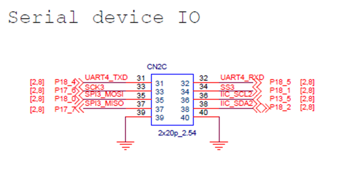
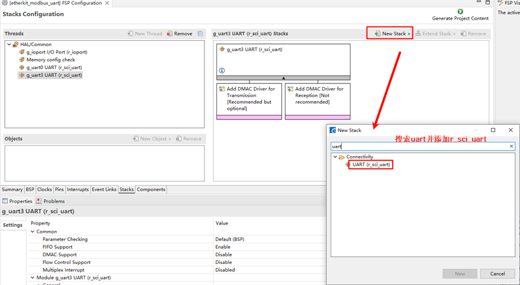
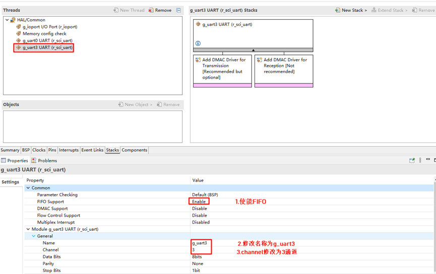
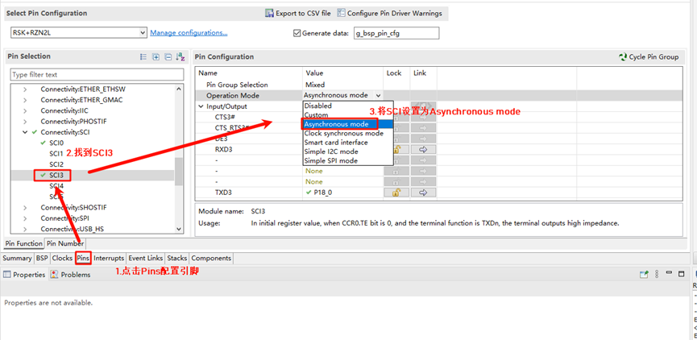
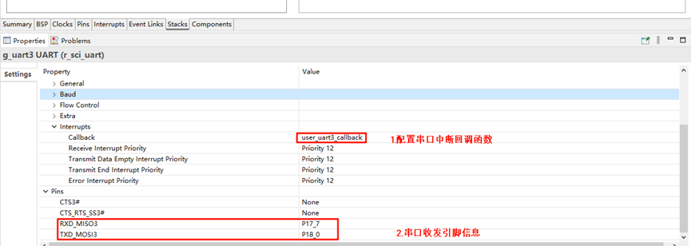
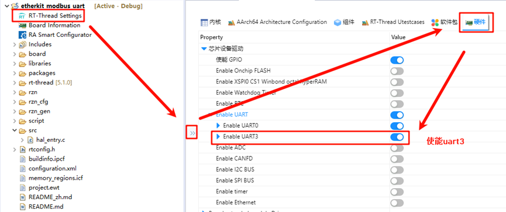
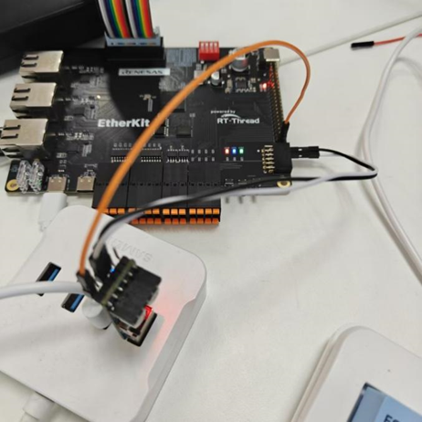
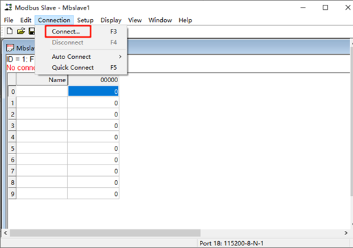
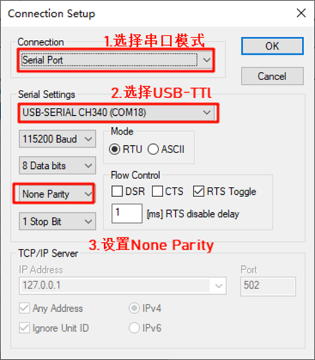
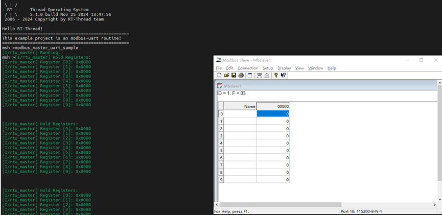

# Modbus-UART 例程

**中文** | [**English**](./README.md)

## 简介

本例程基于agile_modbus软件包，展示了通过串口方式实现modbus协议通信的示例。Modbus UART 是一种通过串口通信实现的 Modbus 协议版本，广泛应用于工业自动化和控制系统中。Modbus 是一种开放的通信协议，用于在控制设备之间传输数据，支持多种物理层，如 UART、TCP/IP 和 RS-485/232。

## 硬件说明

如上图所示，我们本次要使用到的外设为SCI，其中复用SCI3为串口模式，因对应的TX引脚为P18_0，RX引脚为P17_7。

## FSP配置

打开工程下的configuration.xml文件，我们添加一个新的stack：

打开r_sci_uart配置，使能FIFO支持，同时设置通道数为3；

点击选择Pins，设置SCI3，将SCI mode修改为Asynchronous mode，同时可以对应看到相关引脚被使能；

回到stack界面，展开并设置中断回调函数为user_uart3_callback，同时在下方可以知道对应的串口引脚信息；

## RT-Thread Settings配置

回到studio，点击RT-Thread Settings，先配置串口，使能UART3；

找到软件包界面，在搜索框搜索modbus，并选择agile_modbus软件包后使能；

## 编译&下载

* RT-Thread Studio：在RT-Thread Studio 的包管理器中下载EtherKit 资源包，然后创建新工程，执行编译。
* IAR：首先双击mklinks.bat，生成rt-thread与libraries 文件夹链接；再使用Env 生成IAR工程；最后双击project.eww打开IAR工程，执行编译。

编译完成后，将开发板的Jlink接口与PC 机连接，然后将固件下载至开发板。

## 运行效果

首先我们需要使用一个USB转TTL模块，将其收发引脚与开发板串口3的收发引脚反接（RX-TX(P18_0)，TX-RX(P17_7)），如下图所示：

接着我们打开modbus slaver软件，点击连接：

配置modbus slaver信息，首先选择连接为串口模式，串口设备为连接到开发板的USB转TTL模块，并设置None Parity；

接着我们回到串口工具，输入命令modbus_master_uart_sample开启modbus 主站示例；

开发板的串口3作为主机，电脑作为从机，向站号写线圈，串口终端会同步显示寄存器的修改；

