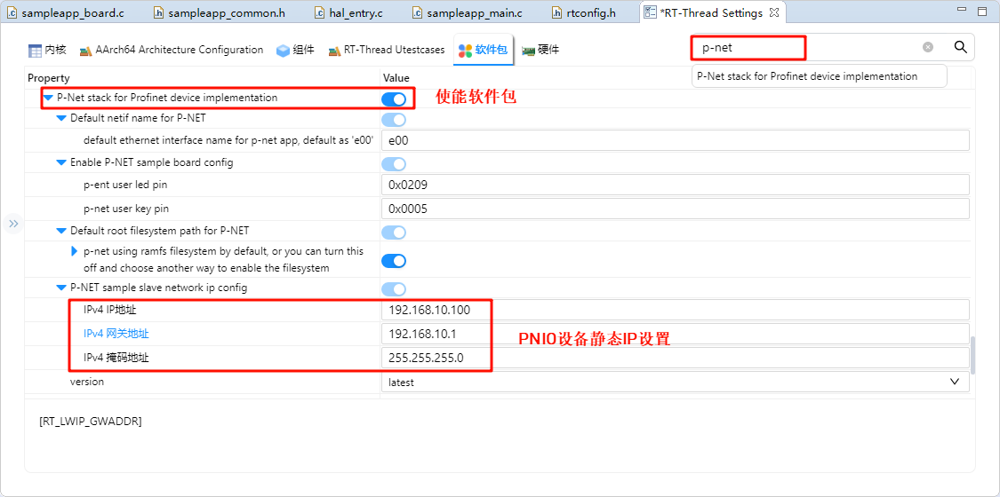
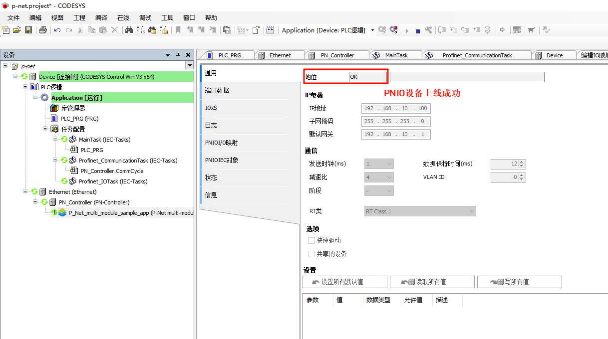

# EtherKit Development Board BSP Documentation

**English** | [**中文**](./README_zh.md)

## Introduction

PROFINET is an industrial Ethernet standard developed and promoted by PI (PROFIBUS and PROFINET International) and is widely used in the industrial automation field.

P-Net is an open-source PROFINET implementation, specifically designed for real-time network communication in embedded devices. It is a lightweight PROFINET protocol stack aimed at providing developers with a quick and efficient way to integrate PROFINET functionality into embedded platforms.

In this example, we will use the P-Net software package to implement PROFINET master-slave communication.

## Prerequisites

**Software Environment**:

- [CODESYS](https://us.store.codesys.com/) (PROFINET master simulation)
    - CODESYS
    - CODESYS Gateway (Gateway device)
    - CODESYS Control Win SysTray (Soft PLC device)
- [Npcap](https://npcap.com/dist/npcap-1.80.exe)(The software is running CODESYS must, need installed in advance!)

**Hardware Environment**:

- EtherKit development board

## FSP Configuration Instructions

Open the project configuration file `configuration.xml` and add the `r_gamc` stack:


Next, click on `g_ether0 Ethernet`, and configure the interrupt callback function to `user_ether0_callback`:


Now configure the PHY settings. Select `g_ether_phy0`, set the common configuration to "User Own Target", change the PHY LSI address to `1` (refer to the schematic for the exact address), and set the PHY initialization callback function to `ether_phy_targets_initialize_rtl8211_rgmii()`. Also, set the MDIO to GMAC.


Next, configure `g_ether_selector0`, set the Ethernet mode to "Switch Mode", set the PHY link to "Default Active-Low", and choose "RGMII" for the PHY interface mode.


Configure the Ethernet pin parameters and select the operating mode to RGMII:


Finally, configure `ETHER_GMAC`:


## RT-Thread Settings Configuration

Double-click to open RT-Thread Settings, search for the p-net package in the search bar and enable it. Below are the related user configuration details:



- **Default netif name for p-net**: The interface name for the p-net network card device, default is e00.
- **Enable pnet sample board config**: Configuration for user LED and button on the p-net application.
- **Default root filesystem path for p-net**: Configuration for the p-net filesystem, default is using ramfs, with 8K of memory space allocated by default.
- **P-NET sample slave network ip config**: Static IP configuration for the p-net slave device (**Please disable RT_LWIP_DHCP functionality and use static IP**).

Next, we need to configure the system to disable DHCP and use a static IP. Click on the component -> enable the lwip stack, and select to disable DHCP:


After completing the above configurations, compile the program and download it to the development board.

## Network Configuration

Connect the development board to the PC using an Ethernet cable, and configure a static IP on the PC:


Check the IP information on the development board and test connectivity:


## Soft PLC Startup

**CODESYS Overview**: CODESYS is a PLC software developed by 3S (Germany), integrating PLC logic, motion control, configuration, display, and other functions. CODESYS, short for **Controller Development System**, is an industrial automation programming tool based on the IEC 61131-3 standard. It supports various programming languages (e.g., Ladder Diagram, Structured Text, Function Block Diagram) and provides libraries and function modules, making it a widely used platform in industrial automation for developing and debugging PLCs and control systems.

### Creating a Standard Project in CODESYS

Ensure that you have CODESYS installed. After installation, the following three software components are required:

- **CODESYS V3.5 SP20 Patch 3**: PROFINET master simulation
- **CODESYS Gateway V3**: Gateway device
- **CODESYS Control Win V3 -x64 SysTray**: Soft PLC device

First, open **CODESYS V3.5 SP20 Patch 3**, choose **New Project** -> **Projects** -> **Standard project**, configure the project name and location, and click **OK**:


After the following popup, keep the default Settings (CODESYS Control Win V3 (CODESYS)/x64 (CODESYS)) and click OK:


> **Note**: If you have purchased **CODESYS Control RTE SL**, select the device: **CODESYS Control RTE V3 (CODESYS) / x64 (CODESYS)**. For evaluation purposes, you can choose **CODESYS Control Win V3 (CODESYS) / x64** to create the project.

After creation, you will see the main interface:


### Starting Gateway and Soft PLC

Open the following two software components:

- **CODESYS Gateway V3** (right-click **Start Gateway**)
- **CODESYS Control Win V3 -x64 SysTray** (right-click **Start PLC**)


Back in CODESYS, double-click **Device(CODESYS Control Win V3 x64)** -> **Communication Settings** -> **Scan Network**:


In the user login window, configure the username and password (customizable):


Check if the gateway and soft PLC devices are online:


### Adding PROFINET GSDML Files

**GSD** (Generic Station Description) files are used for PROFIBUS DP and PROFINET IO communication, describing parameters, diagnostic data, and user-defined data between the PLC and I/O modules.

The GSDML file for this project is located at:

- `..\src\ports\rtthread\pn_dev`

Install the GSDML file from the above path: **GSDML-V2.4-RT-Labs-P-Net-Sample-App-20220324.xml**.


After installation, you should see the **P-Net slave description file**:


### Adding Devices

- **Adding Ethernet**: Right-click **Device** in the left navigation bar and select **Ethernet Adapter**:


- **Adding PROFINET IO Master**: Right-click **Ethernet** in the left navigation bar and select **PN-Controller**:


- **Adding PROFINET IO Slave**: Right-click **PN-Controller** in the left navigation bar and select **P-Net-multiple-module sample app**:


### Configuring Tasks

- **Main Tasks Configuration**: Select **Application** -> **Task Configuration** in the left navigation bar, double-click **MainTask (IEC-Tasks)**, set the priority to 1, type to **Cyclic**, and cycle time to 4ms:


- **Profinet_CommunicationTask Configuration**: Double-click **Profinet_CommunicationTask (IEC-Tasks)**, set the priority to 14, type to **Cyclic**, and cycle time to 10ms:


### Network Configuration

- **Ethernet Configuration**: Double-click **Ethernet (Ethernet)** in the left navigation bar -> **General**, and modify the network interface to the one connected to the development board.


- **PN_Controller Configuration**: Double-click **PN_Controller (PN-Controller)** -> **General**, and modify the default slave IP parameters as needed.

- **P-Net Slave Network Configuration**: Double-click **P-Net-multiple-module sample app** -> **General**, and modify the IP parameters to match the development board’s IP:


### Compile and Debug the Project

- Step 1: From the navigation bar, select **Compile** -> **Generate Code**
- Step 2: Select **Online** -> **Login**
- Step 3: Click **Debug** -> **Start**

You should see the PN master successfully online:


## profinet starts from the station application

After the development board is powered on, once the NIC link up is detected, the secondary PN station is automatically started:




## PROFINET Slave Application Startup

Here we use the CODESYS software to test the interaction between the PN master and slave stations.

### LED Blinking

Back in the CODESYS software, in the left navigation panel, select `PN_Controller`, right-click and scan the devices. After clicking on the device name, click on "Blink LED":


At this point, the development board (PN slave I/O) will display log outputs, accompanied by the onboard User LED blinking:


### Modifying Slave I&M (Identification and Maintenance) Data

In the same device scanning interface, click on the I&M section in the lower left corner, modify the information, and write it to the I&M:


At the same time, PNIO will update the slave station configuration:


We can click to view the I&M again, and we will see that the I&M data has been successfully modified!

### PLC Programming and PNIO Control

First, we click on the left panel under Device -> PLC Logic -> Application -> PLC_PRG (PRG), and use ST language to program the variable and program code:

* **Variable Definition**: These variables define the input state of the button (in_pin_button_LED), the output state of the LED (out_pin_LED), and the state variable controlling whether the LED should blink (flashing). The oscillator state (oscillator_state) and oscillator cycle counter (oscillator_cycles) are used to achieve a timed blinking effect.

```st
PROGRAM PLC_PRG
VAR
    in_pin_button_LED: BOOL;
    out_pin_LED: BOOL;
    in_pin_button_LED_previous: BOOL;
    flashing: BOOL := TRUE;
    oscillator_state: BOOL := FALSE;
    oscillator_cycles: UINT := 0;
END_VAR
```

* **Program Definition**:
  1. First, in each cycle, the `oscillator_cycles` increases by 1. When the counter exceeds 200, the counter is reset, and the `oscillator_state` is toggled (TRUE or FALSE), achieving a periodic change.
  2. If the button is pressed (in_pin_button_LED is TRUE), and the button state in the previous cycle was FALSE, the `flashing` state is toggled. That is, every time the button is pressed, the LED blinking state is toggled.
  3. If `flashing` is TRUE, the LED will blink according to the oscillator state (`oscillator_state`). If `flashing` is FALSE, the LED will turn off directly.
  4. At the end of each cycle, the current button state is saved in `in_pin_button_LED_previous` to check the button press event in the next cycle.

```st
oscillator_cycles := oscillator_cycles + 1;
IF oscillator_cycles > 200 THEN 
    oscillator_cycles := 0;
    oscillator_state := NOT oscillator_state;
END_IF
IF in_pin_button_LED = TRUE THEN 
    IF in_pin_button_LED_previous = FALSE THEN 
        flashing := NOT flashing; 
    END_IF
    out_pin_LED := TRUE;
ELSIF flashing = TRUE THEN 
    out_pin_LED := oscillator_state;
ELSE 
    out_pin_LED := FALSE;
END_IF
in_pin_button_LED_previous := in_pin_button_LED;
```

The configuration in the project is shown in the image below:


Next, we need to add a built-in IO module. Right-click on `P_Net_multi_module_sample_app` and add an IO module (DIO 8xLogicLevel), as shown in the image below:


Then, double-click on the `DIO_8xLogicLevel` node, select the `PNIO Module I/O Mapping`, edit Input Bit 7 and Output Bit 7, and bind the PLC variables:


Next, click on the **Build -> Generate Code** in the navigation bar, then select **Online -> Login**, and run to observe the behavior:


Next, go back to CODESYS, double-click **Device -> PLC Logic -> Application** and open the `PLC_PRG (PRG)`. At this point, you can dynamically observe the program's running state. For example, if you press and hold the KEY0 on the EtherKit development board, you will find that both `in_pin_button_LED` and `in_pin_button_LED_previous` are FALSE. When you release KEY0, you will see that the `flashing` value toggles once.

