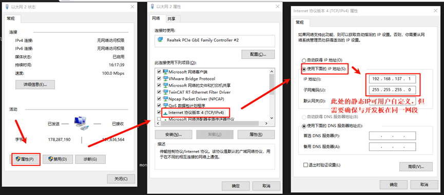
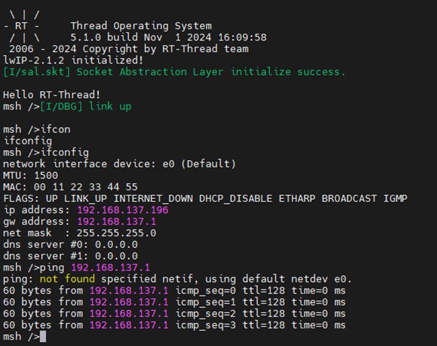
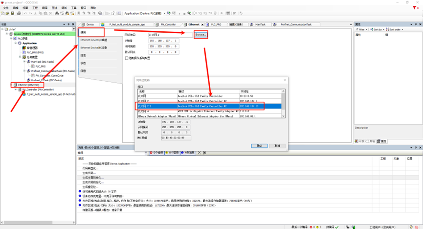
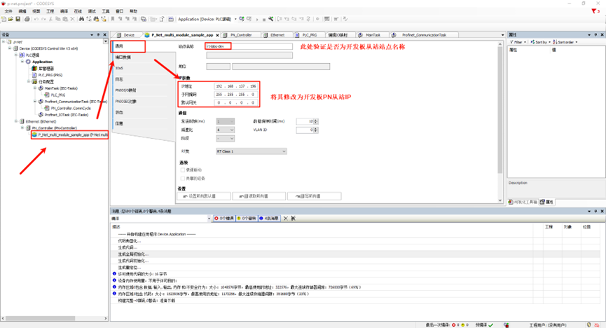
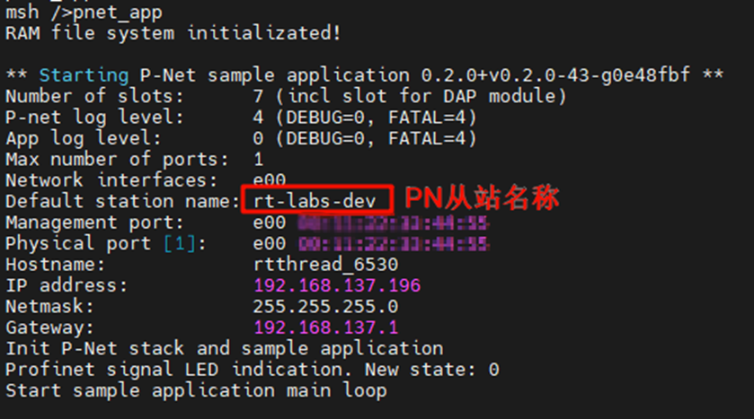
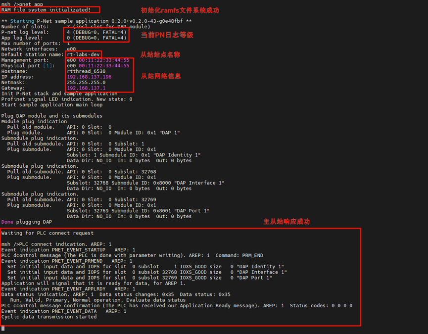
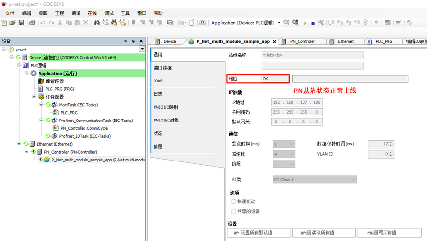

# EtherKit PROFINET例程

**中文** | [**English**](./README.md)

## 简介

PROFINET是由PI（PROFIBUS和PROFINET International）组织开发和推广的工业以太网标准，广泛应用于工业自动化领域。

P-Net协议是一个开源的PROFINET实现，专门用于嵌入式设备的实时网络通信。它是一个开源项目（p-net），目标是提供一个轻量级的PROFINET协议栈实现，使得开发者能够在嵌入式平台上快速集成PROFINET功能。

在本示例中将使用P-Net软件包来实现PROFINET主从站通信。

## 前期准备

软件环境：

- [CODESYS](https://us.store.codesys.com/)（profinet主站模拟）

- - CODESYS
  - CODESYS Gateway（网关设备）
  - CODESYS Control Win SysTray（PLC设备）

硬件环境：

- EtherKit开发板

## 软件包配置

双击打开 RT-Thread Settings，进入 **->RT-Thread online packages->IoT**，找到 **[\*] P-Net stack for Profinet device implementation --->** 使能，下面是相关用户配置信息说明：

```c
-*- Default netif name for P-NET  --->
    -> (e00) default ethernet interface name for p-net app, default as 'e00
-*- Enable P-NET sample board config  --->
    -> (0x0209) p-ent user led pin
    -> (0x0005) p-net user key pin
-*- Default root filesystem path for P-NET  --->
    -> [*] p-net using ramfs filesystem by default, or you can turn this off and choose another way to enable the filesystem
    -> (8192)  default memory size for ramfs
-*- P-NET sample slave network ip config  --->
    -> (192.168.137.196) set static ip address for profinet slaver
    -> (192.168.137.1) set static gateway address for profinet slaver
    -> (255.255.255.0) set static mask address for profinet slaver
    version (latest)  --->
```

- **Default netif name for p-net**：p-net 网卡设备接口名称，默认为 e00 ；
- **Enable pnet sample board config**：p-net app 用户LED及按键配置；
- **Default root filesystem path for p-net**：p-net 文件系统配置，默认使用 ramfs ，默认分配 8K 内存空间；
- **P-NET sample slave network ip config**：p-net 从站设备静态IP配置（**请关闭 RT_LWIP_DHCP 功能，使用静态IP**）

完成上述配置后，将程序编译下载至开发板。

## 网络配置

我们使用一根网线连接开发板与PC，同时在PC端配置静态IP：



检查开发板端的 IP 信息，并测试联通性：



## 软PLC启动

CODESYS简介：CODESYS是德国3S公司开发的PLC软件，集成了PLC逻辑、运动控制、组态显示等功能。CODESYS，全称为“Controller Development System”，是一种基于 IEC 61131-3 标准的工业自动化编程工具。它不仅支持多种编程语言（如梯形图、结构化文本、功能块图等），还提供了丰富的库和功能模块，帮助工程师快速开发和调试 PLC（可编程逻辑控制器）和工业控制系统。CODESYS 的灵活性和强大功能使其成为工业自动化领域广泛使用的开发平台。

### CODESYS创建标准工程

请确保已安装CODESYS软件，安装之后下面这三个是我们需要用到的软件：


- CODESYS V3.5 SP20 Patch 3：Profinet 主站模拟
- CODESYS Gateway V3：网关设备
- CODESYS Control Win V3 -x64 SysTray：软PLC设备

首先打开 **CODESYS V3.5 SP20 Patch 3**，依次选择 -> 新建工程 -> Projects -> Standard project ，配置工程名称及位置后点击确定：


弹出下面这个弹窗后保持默认配置点击确定：


> 注意：如果您购买了[**CODESYS Control RTE SL**](http://store.codesys.cn/codesys/store/detail.html?productId=58)，可选择设备：CODESYS Control RTE V3 (CODESYS) / x64 (CODESYS)，正常评估用途可选择不安装此扩展包，选择 CODESYS Control Win V3 (CODESYS) / x64 (CODESYS) 设备创建即可。

创建成功后就可以看到主界面了：


### Gateway 及 软PLC 启动

依次打开下面两个软件：

- CODESYS Gateway V3（右键 Start Gateway）
- CODESYS Control Win V3 -x64 SysTray（右键 Start PLC）


回到 CODESYS 主站软件，双击 Device(CODESYS Control Win V3 x64) -> 通信设置 -> 扫描网络：


弹出设备用户登录窗口后，配置用户名和密码（用户自定义）：


检查网关设备及软PLC设备是否在线：


### profinet GSDML文件添加

GSD(Generic Station Description file)：即通用站点描述文件，主要用于PROFIBUS DP（GSD文件）和PROFINET IO（GSDML文件）通信，作为描述文件，是PLC系统中CPU模块和IO模块之间的桥梁，通常包括通道数据、参数数据、诊断数据以及用户自定义数据。

本项目的 GSDML文件位于如下路径：

- ..\src\ports\rtthread\pn_dev

选择设备存储库安装描述文件，选择上述路径下的 **GSDML-V2.4-RT-Labs-P-Net-Sample-App-20220324.xml** 文件。


安装成功后可以看到 p-net 从站描述文件：


### 20.5.4 设备添

- Ethernet添加：左侧导航栏点击Device并右键添加设备，选择以太网适配器；


图20-13 Ethernet添加

- PROFINET IO主站添加：右键左侧导航栏中的Ethernet，选择PN-Controller


- PROFINET IO从站添加：右键左侧导航栏中的 PN-Controller，选择 P-Net-multiple-module sample app


### 20.5.5 任务响应

- Main Tasks 配置：左侧导航栏选择 Application -> 任务配置 -> 双击MainTask(IEC-Tasks)，优先级设置为1，类型选择循环，周期选择 4ms；


- Profinet_CommunicationTask 配置：双击 Profinet_CommunicationTask(IEC-Tasks)，优先级设置为14，类型选择循环，周期设置为 10ms。


### 网络配置

- Ethernet 配置：双击左侧导航栏中的Ethernet(Ethernet) -> 通用，修改网络接口为连接到开发板的以太网端口（这里由于我开启了PRONETA，所以在同一网段下分配了两个主站IP，这里需要注意选择正确的那一个）



- PN_Controller 配置：双击左侧导航栏     PN_Controller(PN-Controller) -> 通用，并正确修改默认从站IP参数的区间，根据提示修改即可。
- P-Net 从站网络配置：双击左侧导航栏 P-Net-multiple-module sample app ->     通用， 修改IP参数为开发板IP





### 工程编译并启动调试

- step1：工程上方导航栏选择 编译-> 生成代码
- step2：选择 在线 -> 登录
- step3：点击 调试 -> 启动

此时就可以看到 PN 主站已经上线成功


## profinet 从站应用启动

开发板端启动 PN 从站，执行命令：pnet_app：





## PN协议栈运行demo

这里我们使用 CODESYS软件来测试 PN 的主从站交互。

### LED闪烁

回到 CODESYS 软件，左侧导航栏选择 PN_Controller，右键点击扫描设备，单击设备名后点击闪烁LED：


此时的开发板端（PN从站IO）可以看到日志输出，并伴随板载User LED闪烁：


### 从站 I&M(标识和维护) 数据修改

依然是扫描设备界面，我们点击左下角的 I&M，修改信息并写入 I&M：


同时 PNIO 会更新从站配置信息：


我们再次点击查看 I&M，即可发现 I&M 修改成功！