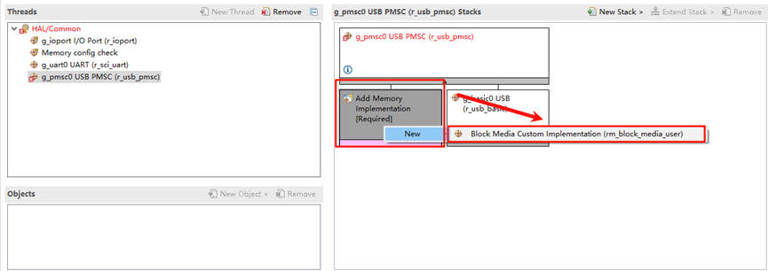
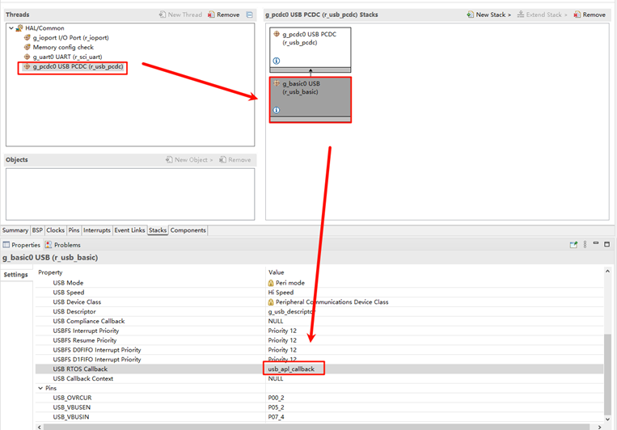
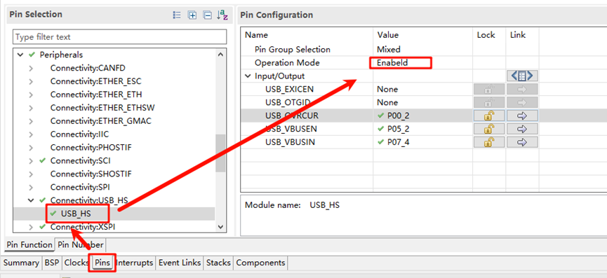
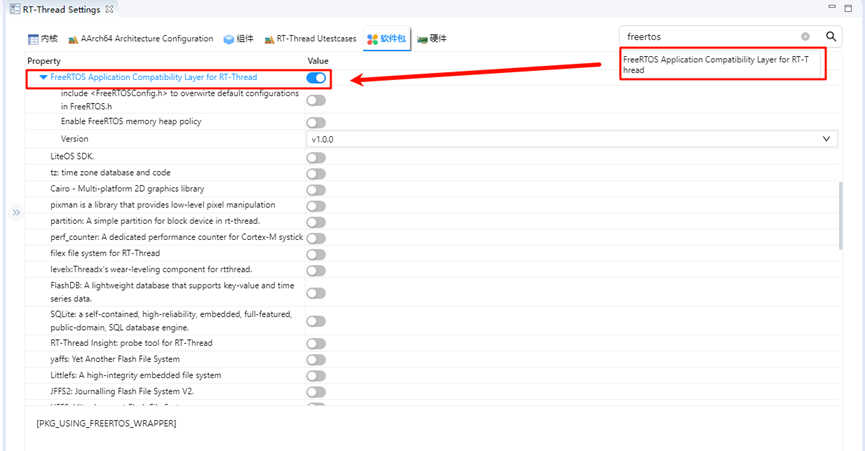
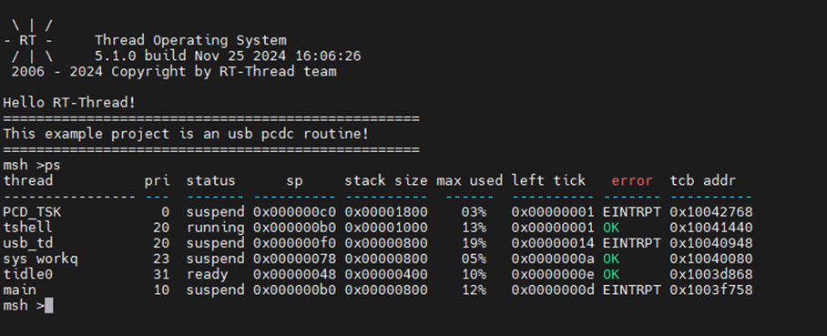
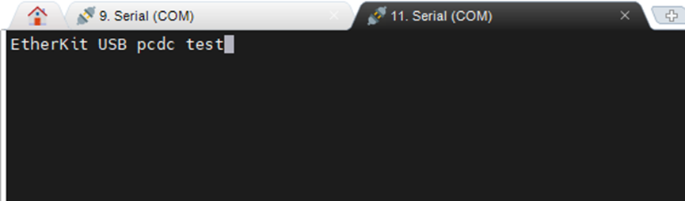

# EtherKit USB-PCDC Example

**English** | [**中文**](./README_zh.md)

## Introduction

This example demonstrates how to implement a virtual serial port over USB. USB PCDC (USB Communication Device Class) is a subclass of the USB communication device class (CDC) that is commonly used to implement virtual serial communication functionality. In embedded device development, USB PCDC is often used to simulate a serial communication port (such as a COM port) over a USB interface, allowing data interaction with a host.

## Hardware Requirements


EtherKit provides a USB-Device peripheral, located on the development board as shown below:


## FSP Configuration Instructions

* Open the project’s `configuration.xml` file using FSP and add the `usb_pmcs` stack:


* Add `g_rm_block_media0`:



* Select `g_basic0_usb` and set the interrupt callback function to `usb_apl_callback`:



* Next, configure the USB pins. Find `USB_HS` and enable it:



## Build Configuration

Locate the file at the specified path in the project: `.\rzn\SConscript`, and replace its content with the following:

```c
Import('RTT_ROOT')
Import('rtconfig')
from building import *
from gcc import *

cwd = GetCurrentDir()
src = []
group = []
CPPPATH = []

if rtconfig.PLATFORM in ['iccarm']:
    Return('group')
elif rtconfig.PLATFORM in GetGCCLikePLATFORM():
    if GetOption('target') != 'mdk5':
        src += Glob('./fsp/src/bsp/mcu/all/*.c')
        src += Glob('./fsp/src/bsp/mcu/all/cr/*.c')
        src += Glob('./fsp/src/bsp/mcu/r*/*.c')
        src += Glob('./fsp/src/bsp/cmsis/Device/RENESAS/Source/*.c')
        src += Glob('./fsp/src/bsp/cmsis/Device/RENESAS/Source/cr/*.c')
        src += Glob('./fsp/src/r_*/*.c')
        src += Glob('./fsp/src/r_usb_basic/src/driver/*.c')
        src += Glob('./fsp/src/r_usb_basic/src/hw/*.c')
        src += Glob('./fsp/src/r_usb_pcdc/src/*.c')
        CPPPATH = [ cwd + '/arm/CMSIS_5/CMSIS/Core_R/Include',
                    cwd + '/fsp/inc',
                    cwd + '/fsp/src/inc',
                    cwd + '/fsp/inc/api',
                    cwd + '/fsp/inc/instances',
                    cwd + '/fsp/src/r_usb_basic/src/driver/inc',
                    cwd + '/fsp/src/r_usb_basic/src/hw/inc',
                    cwd + '/fsp/src/r_usb_pcdc/src/inc',]

group = DefineGroup('rzn', src, depend = [''], CPPPATH = CPPPATH)
Return('group')
```

If you are using Studio for development, right-click on the project and select **Sync SCons Configuration to Project**.
 For IAR development, right-click within the current project to open the environment, and run the following command to regenerate the configuration:
 `scons --target=iar`

## RT-Thread Settings Configuration

The USB example currently uses the FreeRTOS interface driver, so we also need to enable the FreeRTOS compatibility layer package:



## Compilation & Download

* **RT-Thread Studio**: Download the EtherKit resource package in the RT-Thread Studio package manager, create a new project, and compile it.
* **IAR**: First, double-click `mklinks.bat` to create the link between the rt-thread and libraries folders. Then, use Env to generate the IAR project. Finally, double-click `project.eww` to open the IAR project and compile it.

Once the compilation is complete, connect the Jlink interface of the development board to the PC and download the firmware to the board.

## Running Results

After generating the FSP configuration, compile and download the firmware to the development board. The example will automatically start, and you will see an additional USB device in the file manager:



Next, open the virtual serial port device and test character input:

